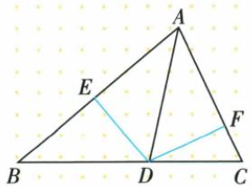
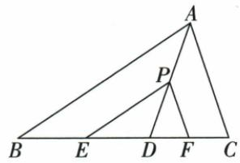
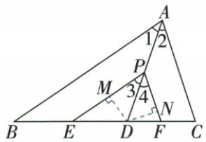
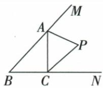
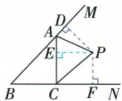
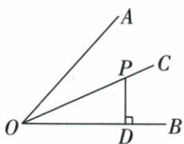
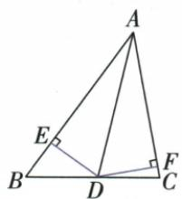

## 讲解

### 是什么

在非退化角内部的角平分线上取点D，分别向两边所在直线作垂线DE、DF，则DE=DF。说的是到两边的垂直距离，不是D到角的两边上任意选点的斜距离。原A是角顶点，D≠A。

### 怎么来的

△AED与△AFD共有AD，两垂足使AED=AFD=90°，角平分使EAD=DAF；两角及公共非夹边对应相等，AAS全等，得到DE=DF。这个证明说明距离相等来自半角、共同AD与两直角三项，不能仅凭两条线段都出自D就判等。原面积题给DE=2，立即得到DF=2；再分别作为底AB、AC的高，才能把7写成4+AC。

### 什么时候能用

用于角平分线附近的面积、垂距问题，必须确定两垂线对应同一个角的两边。内部角范围通常0°<角<180°；点在顶点时两距为0，可直接说明退化而不套非退化全等。没有平分条件只有一个垂距，不能推出另一个相等。

原本章距离性质与逆判分开：内部平分线上P的两垂距等，由半角、两直角、共斜边AAS全等；反向等距还需内部条件，可用HL另证。平行搬角例先证PD平分新EPF，再对点D转成两垂距；原E到AD不是原D到AB/AC，必须另用13斜边与同面积算60/13。性质绝非图中任意两条线段相等。

## 例题

### 角平分线等距离配两小三角面积

> 来源ID Q18-11；第18章命题的证明；201-250/full.md 第1184–1192行。原答案与解析定位：201-250/full.md 第1194–1204行。

例3 如图, AD 平分 $\angle BAC, DE \perp AB$ 于点 E, $DF \perp AC$ 于点 F, $S_{\triangle ABC} = 7, DE = 2, AB = 4$ , 则 AC 的长是 \_\_\_\_.

**原资料答案与解析：**

解析 由题意得 DE = DF = 2,

$$
\therefore S _ {\triangle A B C} = \frac {1}{2} \times 4 \times 2 + \frac {1}{2} A C \cdot 2 = 7,
$$

$$
\therefore A C = 3.
$$

答案 3

**展开解析（依据原详解补足理由与步骤）：**

AD平分BAC，DE、DF分别垂直两边，D在角平分线上，所以到两边距离相等，DE=DF=2。这一结论的依据是△AED和△AFD均直角，共斜边AD且∠EAD=DAF，另一锐角也相等，由AAS全等得DE=DF。D在BC上，所以△ABC由△ABD与△ACD不重叠组成，面积相加。

$$7=\frac12\,AB\cdot DE+\frac12\,AC\cdot DF=\frac12\cdot4\cdot2+\frac12\cdot AC\cdot2=4+AC.$$

两边同减4，AC=3。所给2是到各自底边的垂直高，不是两条斜边；没有给单位时沿原题量纲使用，不擅补厘米。不能把D到BC的距离当这两个小三角形的高，因为D就在BC上。

### 平行搬角使PD平分后两垂距等

> 来源ID Q20-20；第20章全等三角形；201-250/full.md 第3286–3294行。原答案与解析定位：201-250/full.md 第3296–3320行。

例1 如图, 在 $\triangle ABC$ 中, $AD$ 是角平分线, $P$ 是 $AD$ 上一点, $PE \parallel AB$ , 交 $BC$ 于点 $E$ , $PF \parallel AC$ , 交 $BC$ 于点 $F$ . 求证: 点 $D$ 到 $PE$ 和 $PF$ 的距离相等.

**原资料答案与解析：**

证明 如图,作 $DM \perp PE$ 于点 M, $DN \perp PF$ 于点 N.

∵ AD 是 $\angle BAC$ 的平分线, ∴ $\angle1 = \angle2$ .

$$
\because P E \parallel A B, P F \parallel A C, \therefore \angle 1 = \angle 3, \angle 2 = \angle 4,
$$

$\therefore \angle3=\angle4,\therefore PD$ 平分 $\angle EPF.$

又∵ $DM \perp PE, DN \perp PF, \therefore DM = DN,$ 即点 D 到 PE 和 PF 的距离相等.

**展开解析（依据原详解补足理由与步骤）：**

AD为BAC内部平分，BAD=DAC。PE∥AB，以AD为截线把BAD移成EPD；PF∥AC把DAC移成DPF，所以EPD=DPF，PD平分EPF。过D作DM⊥PE、DN⊥PF，D在这个角的内部平分线上，距离性质给DM=DN，即到两直线距离相等。先移角建立新角平分，再调用距离，不是点P在原平分线上就让任意点D到任意两线距离相等。

### 两条外角平分先三垂距传递再判第三平分

> 来源ID Q20-21；第20章全等三角形；201-250/full.md 第3326–3328行。原答案与解析定位：201-250/full.md 第3330–3340行。

例2 如图, $AP 、 CP$ 分别平分 $\angle MAC 、 \angle ACN$ . 求证: 点 $P$ 在 $\angle MBN$ 的平分线上.

**原资料答案与解析：**

证明 如图, 过点 P 分别作 $PD \perp MB$ 于 D, $PE \perp AC$ 于 E, $PF \perp BN$ 于 F.

∵ AP、CP 分别平分 ∠MAC、∠NCA，

$$
\therefore P D = P E, P E = P F, \therefore P D = P F.
$$

又∵ $PD \perp MB, PF \perp BN, \therefore$ 点 P 在 $\angle MBN$ 的平分线上.

**展开解析（依据原详解补足理由与步骤）：**

过P作PD⊥MB、PE⊥AC、PF⊥BN，垂足可在原三角边延长线上。AP平分MAC给PD=PE；CP平分ACN给PE=PF；等量传递得PD=PF。原P位于MBN内部，两垂距相等，按角平分线判定，BP平分MBN。必须补“在角内部”才能定位这一内平分射线；若只比较三边所在直线，外部旁心也可能等距，不能统一叫内心。

### 点在角平分线上已给垂距2逐项选

> 来源ID Q20-22；第20章全等三角形；201-250/full.md 第3346–3367行。原答案与解析定位：201-250/full.md 第3381–3383行。

例1 (2024 青海)如图, OC 平分 $\angle AOB$ , 点 P 在 OC 上, $PD \perp OB$ , PD = 2, 则点 P 到 OA 的距离是 ()

A.4

B.3

C.2

D.1

**原资料答案与解析：**

例1 解析 过点 P 作 $PE \perp OA$ 于点 E，因为 OC 平分 $\angle AOB, PD \perp OB$ ，所以 PE = PD = 2，即点 P 到 OA 的距离是 2.

答案 C

**展开解析（依据原详解补足理由与步骤）：**

过P向OA作PE⊥OA。原OC平分AOB、P在OC，距离性质PE=PD=2。A4把距离误加两边和；B3没有给定关系；C2正确；D1错误地把垂距再减半，平分的是角不是两条相等距离中的一条长度。选C。PD端点在OB，不能把OP或OD当原距离2。

### 原角平分等距5配12勾股再等面积求60比13

> 来源ID Q20-23；第20章全等三角形；201-250/full.md 第3369–3377行。原答案与解析定位：201-250/full.md 第3385–3388行。

例2（2023 广东广州）如图, 已知 AD 是 $\triangle ABC$ 的角平分线, DE, DF 分别是 $\triangle ABD$ 和 $\triangle ACD$ 的高, AE = 12, DF = 5, 则点 E 到直线 AD 的距离为 \_\_\_\_.

**原资料答案与解析：**

例2 解析 过 E 作 $EH \perp AD$ 于 H. 由题意得 DE = DF = 5，又∵ AE = 12，∴ 由勾股定理得 AD = 13，
∵ $S_{\triangle ADE} = \frac{1}{2} AD \cdot EH = \frac{1}{2} AE \cdot DE, \therefore 13EH = 12 \times 5, \therefore EH = \frac{60}{13}$ ，即点 E 到直线 AD 的距离为 $\frac{60}{13}$ .

答案 $\frac{60}{13}$

**展开解析（依据原详解补足理由与步骤）：**

DE、DF分别为ABD与ACD的高，即DE⊥AB、DF⊥AC；AD内部平分BAC，所以DE=DF=5。AE12、ADE90°，AD²=AE²+DE²=144+25=169，AD=13。过E作EH⊥AD，目标为EH长度。同一ADE面积两底高：

$$\frac12 AE\cdot DE=\frac12 AD\cdot EH\Rightarrow12\cdot5=13EH\Rightarrow EH=\frac{60}{13}.$$

5是D到AB、AC的垂距，不是E到AD距离；角平分的等距性质不能把目标也说5。原无单位不补厘米。

## 易错

原DE和DF是高，AD是角平分线兼分割边，它通常不是AB或AC的垂高；拿AD=2是错读原DE=2。
