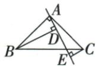
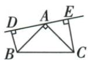
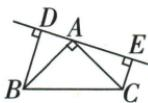
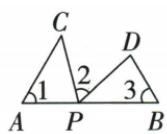
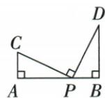
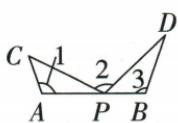
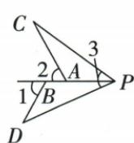
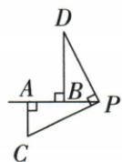
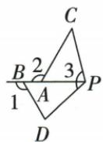

## 讲解

### 判据

等腰直角两腰相等，共顶点转出一条线，对两端作垂线，两个小直角三角可配等斜边与余角。

### 流程

1.列两个90°，共同原顶角BAC90°给同角余角相等。2.原AB=AC是实际尺寸条件，配AAS得到ABD≌CAE。3.取对应BD=AE、AD=CE。4.逐图核A-D-E则AE=AD+DE；D-A-E则AE=DE−AD，替回后得目标和差。5.转线改变位置时重读点序，原BD<CE或>CE不单独决定式子。6.若只原概述三等角没有等边，停在相似并注明缺条件。

## 例题

### 等腰直角转线三图同AAS与点序和差

> 来源ID Q20-14；第20章全等三角形；201-250/full.md 第2944–2957行。原答案与解析定位：201-250/full.md 第2959–2983行。

例3 如图1, 在 $\triangle ABC$ 中, $\angle BAC=90^{\circ}$ , $AB=AC$ , $AE$ 是过点 $A$ 的一条直线, 且 $B$ 、 $C$ 在 $AE$ 的异侧, $BD\perp AE$ 于 $D$ , $CE\perp AE$ 于 $E$ .

(1) 求证: $BD = DE + CE$ .   
(2) 若直线 AE 绕 A 点旋转到如图 2 所示的位置 (BD<CE)，其余条件不变，则 BD 与 DE, CE 满足什么数量关系？并证明.  
(3) 若直线 AE 绕 A 点旋转到如图 3 所示的位置 (BD > CE)，其余条件不变，则 BD 与 DE，CE 满足什么数量关系？请直接写出结果，不需证明.

  
图 1

  
图 2

  
图3

**原资料答案与解析：**

解析（1）证明：∵ $BD \perp AE, CE \perp AE, \therefore \angle ADB = \angle AEC = 90^{\circ}$

$$
\because \angle B A C = 9 0 ^ {\circ}, \angle A D B = 9 0 ^ {\circ}, \therefore \angle A B D + \angle B A D = \angle C A E + \angle B A D = 9 0 ^ {\circ}, \therefore \angle A B D = \angle C A E.
$$

在 $\triangle ABD$ 和 $\triangle CAE$ 中， $\left\{\begin{aligned}\angle ADB&=\angle CEA,\\ \angle ABD&=\angle CAE,\\ AB&=CA,\end{aligned}\right.$

$$
\therefore \triangle A B D \cong \triangle C A E (\text { AAS }), \therefore B D = A E, A D = C E. \because A E = D E + A D, \therefore B D = D E + C E.
$$

(2) $BD = DE - CE$ . 证明: $\because BD \perp AE, CE \perp AE, \therefore \angle ADB = \angle AEC = 90^{\circ}$ .

$$
\text { 又 } \angle B A C = 9 0 ^ {\circ}, \therefore \angle A B D + \angle B A D = \angle C A E + \angle B A D = 9 0 ^ {\circ}, \therefore \angle A B D = \angle C A E.
$$

在 $\triangle ABD$ 和 $\triangle CAE$ 中， $\left\{\begin{aligned}\angle ADB&=\angle CEA,\\ \angle ABD&=\angle CAE,\\ AB&=CA,\end{aligned}\right.$

$$
\therefore \triangle A B D \cong \triangle C A E (\text { AAS }) \therefore B D = E A, A D = C E \therefore B D = E A = D E - A D = D E - C E.
$$

(3) $BD = DE - CE$ .

**展开解析（依据原详解补足理由与步骤）：**

每图ADB、AEC均90°，AB=AC，另由BAC90°及同角余角相等得到ABD=CAE。于是△ABD≌△CAE（AAS），对应A-C、B-A、D-E，得到BD=AE、AD=CE。再逐图看共线次序：图1A-D-E，AE=AD+DE，故BD=CE+DE；图2D-A-E，AE=DE−AD，故BD=DE−CE；图3同样D-A-E，即BD=DE−CE。图2给BD<CE、图3给BD>CE只是两种长度分布，未改变D-A-E次序，所以同一差式均适用。第三问原不要求证明，仍说明来自同AAS与点序，不省掉关键理由。退化D=A或E=A需另讨论零段，本题原三图均非退化。

### 原一线三等角概述与等边条件勘误

> 来源ID Q20-34；第20章全等三角形；201-250/full.md 第2924–2942行。原答案与解析定位：201-250/full.md 第2926–2928行。

# 方法 3 一线三等角模型的应用

“一线三等角”即在一条直线上有三个等角顶点,这是此类问题的图形中的关键要素.在相对位置变化的过程中,始终存在一对全等三角形,据此可推出某三条线段之间的数量关系.

如图,AB为“一线”,∠1、∠2、∠3为“三等角”,则△APC≌△BDP.

  
同侧型

  
异侧型

**原资料答案与解析：**

“一线三等角”即在一条直线上有三个等角顶点,这是此类问题的图形中的关键要素.在相对位置变化的过程中,始终存在一对全等三角形,据此可推出某三条线段之间的数量关系.

如图,AB为“一线”,∠1、∠2、∠3为“三等角”,则△APC≌△BDP.

**展开解析（依据原详解补足理由与步骤）：**

原概述说仅A-P-B共线、角1=角2=角3就有△APC≌△BDP，实际PDF第30页也没有额外边等条件。纠正：令共同等角为θ，CPA为φ，DPB为ψ，共线给φ+θ+ψ=180°。△APC的C角=180°−θ−φ=ψ，△BDP的D角=180°−θ−ψ=φ，所以只能得到两三角形对应角相等，即△APC∽△BDP；不能仅靠AAA判全等，原同章AAA反例正说明此点。若另有CP=DP等一对对应边相等，才可用AAS判全等。紧随的原数值与旋转例有AB=AC这条等斜边，因而其AAS结论有效。原件与原概述保留，纠正内容单独标识，未把补足条件偷偷写入原题。

## 易错

原三个角等不能自动全等；图2/3虽BD大小不同，均D-A-E，故同差式。
