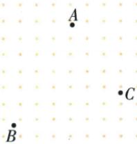
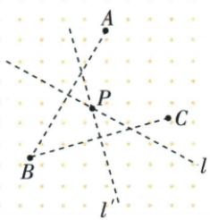

## 讲解

### 判据

要求一个位置到三个非共线给定点的直线距离相等。把“三个距离相等”拆成两组端点等距，就能用两条线段的垂直平分线找交点；这里不是到三条边的距离相等，也不是求路程总和最短。

### 流程

1. 连接AB、BC，分别作这两条线段的垂直平分线。到A、B等距的点必须在AB的中垂线上，到B、C等距的点必须在BC的中垂线上，所以候选点必须同时满足这两条位置条件。
2. 取两中垂线交点P。由第一条中垂线的性质，$PA=PB$；由第二条，$PB=PC$；等量传递得到$PA=PB=PC$，说明交点确实合格。
3. 说明唯一性：任一合格位置也必须同时落在这两中垂线上，不能另选一个点。原三个点非共线，使两中垂线有唯一交点，故此模型有唯一解。
4. 按实际图形画出交点，不预设它在三角形内部。锐角三角形的外心在内部，直角三角形在斜边中点，钝角三角形在外部，位置不同不影响三距相等。
5. 最后核对距离含义。题设若加入道路、可建设区域等限制，直线等距交点未必是可选方案；原题仅给直线距离，不能自行混入交通路线或地价条件。

## 例题

### 三个村庄等距学校两中垂唯一交点

> 来源ID Q21-02；第21章等腰三角形；201-250/full.md 第3845–3855行。原答案与解析定位：201-250/full.md 第3857–3870行。

例2 为了解决三个村庄孩子的就近入学问题,计划新建一所小学,使学校到三个村庄的距离相等.若三个村庄A,B,C的位置如图所示,请你在图中确定小学的位置(用点P表示).

**原资料答案与解析：**

解析 如图所示, 连接 AB, BC. 分别作线段 AB, BC 的垂直平分线 $l, l'$ , 交于点 P, 则点 P 就是所要确定的学校的位置.

**展开解析（依据原详解补足理由与步骤）：**

连接AB、BC并分别尺规作其中垂线，相交P。PA=PB、PB=PC来自各自中垂性质，等量传递得三距相等；反之任一合格P都在这两中垂线上，所以交点唯一。原三点非共线，保证两中垂有唯一交点；不凭原图把点选为三边中点或角平分交点。这里只按直线距离选址，题未给道路、地价或最近总路程条件。

## 易错

与到三边线等距的内心区分；三点共线通常不满足唯一有限外心。原题直线距不等交通路程。
