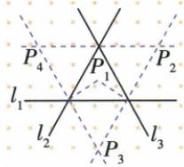

## 讲解

### 判据

已知两个内外角平分线交点，目标另一角平分线，作三垂线让两性质共享中间距。

### 流程

1.分别向三边所在直线作PD、PE、PF并标垂足，图外足仍合法。2.AP给PD=PE，CP给PE=PF，同一中间PE传递PD=PF。3.核P在MBN内部，才由到MB/BN等垂距判BP内部平分。4.若问三角内部等距点，只内心；若三整边线等距，原四图包括旁心。5.明确性质由角到距、判定由距到角两个方向，不能混用题设。

## 例题

### 两条外角平分先三垂距传递再判第三平分

> 来源ID Q20-21；第20章全等三角形；201-250/full.md 第3326–3328行。原答案与解析定位：201-250/full.md 第3330–3340行。

例2 如图, $AP 、 CP$ 分别平分 $\angle MAC 、 \angle ACN$ . 求证: 点 $P$ 在 $\angle MBN$ 的平分线上.

**原资料答案与解析：**

证明 如图, 过点 P 分别作 $PD \perp MB$ 于 D, $PE \perp AC$ 于 E, $PF \perp BN$ 于 F.

∵ AP、CP 分别平分 ∠MAC、∠NCA，

$$
\therefore P D = P E, P E = P F, \therefore P D = P F.
$$

又∵ $PD \perp MB, PF \perp BN, \therefore$ 点 P 在 $\angle MBN$ 的平分线上.

**展开解析（依据原详解补足理由与步骤）：**

过P作PD⊥MB、PE⊥AC、PF⊥BN，垂足可在原三角边延长线上。AP平分MAC给PD=PE；CP平分ACN给PE=PF；等量传递得PD=PF。原P位于MBN内部，两垂距相等，按角平分线判定，BP平分MBN。必须补“在角内部”才能定位这一内平分射线；若只比较三边所在直线，外部旁心也可能等距，不能统一叫内心。

### 原三边所在直线等距四交点图

> 来源ID Q20-36；第20章全等三角形；201-250/full.md 第3225–3241行。原答案与解析定位：201-250/full.md 第3225–3241行。

1. 在三角形内部，到三角形三边的距离相等的点只有 1 个，就是三角形的三条角平分线的交点.

2. 到三角形三边所在直线的距离相等的点共有 4 个，是这个三角形的内角或外角的平分线的交点（如图）.

**原资料答案与解析：**

1. 在三角形内部，到三角形三边的距离相等的点只有 1 个，就是三角形的三条角平分线的交点.

2. 到三角形三边所在直线的距离相等的点共有 4 个，是这个三角形的内角或外角的平分线的交点（如图）.

**展开解析（依据原详解补足理由与步骤）：**

原图三个顶点角的内外平分线产生P₁内部内心和P₂、P₃、P₄三个外部旁心。任意一个点由两组平分线距离性质得到到两对边线等距，公共边线一传递便到第三边线也等距。内部到三边等距只有内心；允许三边所在整直线则另外三旁心也合法。角内部判定的范围在各相应内角或外角中重新核，不把每个外部点都说在原内角内部。图只提供定性四点示意，无额外数值练习。

## 易错

若省角内部，外角平分点也等距；不是所有四点都叫原三角内心。
