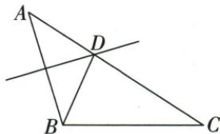

## 讲解

### 判据

点在某线段的垂直平分线上，而要求它到该线段另一端点的距离。先用中垂线把目标距离转成到已知端点的距离，再根据图中的点序，用线段和或差算出这个距离。

### 流程

1. 先确认中垂线属于哪条线段。原是AB的垂直平分线，D在其上，所以$DA=DB$；等距对象是A、B，不是D、C，也不是整条AC与AB。
2. 判断D在AC上的位置。原A、D、C依次排列且D在AC内部，因此$AC=AD+DC$，求AD要从整段中减去DC。
3. 代入原$AC=8$、$DC=5$，$AD=8-5=3$。再用$DA=DB$传递，得到所求$BD=3$；线段相减与中垂等距是两条不同依据，各自交代。
4. 若D改在AC延长线上，原减段式就不能照搬。应先重写整段由哪些子段组成，再选择AC+CD或CD−AC等正确关系，中垂线给出的$DA=DB$仍可使用。
5. 最后回看答案表示哪条线段，核对长度为正、单位一致。图上画得长短近似并不能决定点序，必须以题干和原图明确的位置条件为准。

## 例题

### AC8 CD5 中垂移AD得BD3

> 来源ID Q21-06；第21章等腰三角形；201-250/full.md 第3954–3962行。原答案与解析定位：201-250/full.md 第3944–3950行。

例（2024 江苏镇江）如图, $\triangle ABC$ 的边 AB 的垂直平分线交 AC 于点 D, 连接 BD. 若 AC=8, CD=5, 则 BD= \_\_\_\_.

**原资料答案与解析：**

例 解析∵点D在线段AB的垂直平分线上，

$$
\therefore B D = A D = A C - C D = 8 - 5 = 3.
$$

答案 3

**展开解析（依据原详解补足理由与步骤）：**

原A-D-C按序，AD=AC−DC=8−5=3；D在AB中垂线上，DA=DB，故BD=3。减法由D在AC内部，换边由中垂到两端等距，二者分别说明，不把原给AC当AB。来源年份地点仅按原材料标记，没有独立真题认证。

## 易错

中垂AB的端点是A/B，不是D/C；原给AC≠直接给AB。
