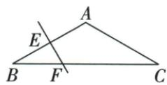
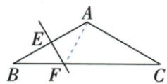

## 讲解

### 判据

等腰三角形顶角120°，一条腰的垂直平分线与底边相交，已知交点到某个端点的距离。目标长度所在三角形暂未给直角时，先连到另一个端点，利用中垂等距造等腰，再用角差找出直角。

### 流程

1. 原$AB=AC$、$\angle A=120^{\circ}$，两个底角相等且总和为60°，所以$\angle B=\angle C=30^{\circ}$。
2. F位于AB的垂直平分线上，连接AF后有$AF=BF$。原$BF=5$，因此$AF=5$；△ABF为等腰，$\angle BAF=\angle ABF=30^{\circ}$，其中$\angle ABF$就是原底角B。
3. 根据原图，AF在$\angle BAC$内部，所以$\angle FAC=\angle BAC-\angle BAF=120^{\circ}-30^{\circ}=90^{\circ}$。直角由这两个角的差得到，不能因为图上接近垂直就直接认定。
4. 在直角△AFC中，$\angle C=30^{\circ}$，它所对的AF是直角边，CF是斜边。30°对边等于斜边一半，因此$CF=2AF=10$ cm。
5. 检查使用性质的三项条件：已确认直角、已确认30°角、已辨明其对边和斜边。原F并非BC中点，不能把$BF=5$直接改成$BC=10$。

## 例题

### 120等腰中垂给AF5造30直角转CF10厘米

> 来源ID Q22-06；第22章勾股定理；201-250/full.md 第4605–4605行。原答案与解析定位：201-250/full.md 第4607–4619行。

例2 如图, 已知在 $\triangle ABC$ 中, $AB = AC$ , $\angle BAC = 120^{\circ}$ , $E, F$ 分别在 $AB, BC$ 上, 且直线 $EF$ 为 $AB$ 的垂直平分线, $BF = 5 \mathrm{~cm}$ , 求 $CF$ 的长.

**原资料答案与解析：**

解析 连接 $AF$ . $\because AB = AC, \angle BAC = 120^{\circ}, \therefore \angle B = \angle C = 30^{\circ}$ .

∵ 直线 EF 为 AB 的垂直平分线, ∴ AF = BF = 5 cm.

$$
\therefore \angle B A F = \angle B = 3 0 ^ {\circ}, \therefore \angle F A C = 9 0 ^ {\circ}.
$$

在 Rt△AFC 中，∠FAC=90°，∠C=30°，∴ CF=2AF，∴ CF=10 cm.

**展开解析（依据原详解补足理由与步骤）：**

AB=AC、A120使B=C30。F在AB中垂线上，AF=BF5，ABF等腰得BAF=B30。原AF在BAC内部，FAC=120−30=90°。AFC直角、C30，AF是30所对腿，CF=2AF=10 cm。注意BF5不是整BC，也不是AC；先中垂移等边再角差造直角，才用30性质。

## 易错

不是BC=2BF，原F非BC中点。
