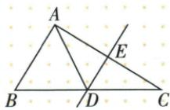
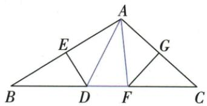

## 讲解

### 判据

看到中垂线上点和周长，把到两端的两段等长，寻找能沿原底边拼接的段。

### 流程

1.中垂点D给DA=DB，另一中垂点F给FA=FC，不反过来把任意垂线都称中垂。2.写目标完整三边和。3.每个未知段逐个换为同长可拼段。4.按原B-D-F-C或B-D-C点序合底边；若是小周长给定，先保小周长整体，再加剩余AC。5.原AE为半AC，先AC=2AE6；13+6=19。

## 例题

### 中垂等边把小周长13加底段6得19

> 来源ID Q21-01；第21章等腰三角形；201-250/full.md 第3837–3839行。原答案与解析定位：201-250/full.md 第3841–3841行。

例1 如图, 在 $\triangle ABC$ 中, DE 是 AC 的垂直平分线, AE = 3, $\triangle ABD$ 的周长为 13, 则 $\triangle ABC$ 的周长为 \_\_\_\_.

**原资料答案与解析：**

答案 19

**展开解析（依据原详解补足理由与步骤）：**

DE垂直平分AC，E中点使AC=2AE=6，D在中垂线上使DA=DC。原B-D-C共线且D内部，ABC周长AB+BD+DC+AC=AB+BD+DA+AC=13+6=19。13是ABD三边和，不能把AC也已算在13中。原仅给答案，以上为规范补解析。

### 两中垂将DAF三边转成原底边10厘米

> 来源ID Q21-03；第21章等腰三角形；201-250/full.md 第3885–3885行。原答案与解析定位：201-250/full.md 第3887–3903行。

例1 如图, 在 $\triangle ABC$ 中, $BC=10\ \text{cm}$ , $DE$ 、 $FG$ 分别垂直平分 $AB$ 、 $AC$ , $E$ 、 $G$ 为垂足, 求 $\triangle DAF$ 的周长.

**原资料答案与解析：**

解析 $\because DE,FG$ 分别垂直平分 $AB,AC,\therefore DA = BD,FA = FC,$

∴ $\triangle DAF$ 的周长为 $DA + DF + FA = BD + DF + FC = BC = 10 \, cm$ .

**展开解析（依据原详解补足理由与步骤）：**

D在AB中垂线上得DA=DB，F在AC中垂线上得FA=FC。原B-D-F-C依次在BC上，所以DA+DF+FA=DB+DF+FC=BC=10 cm。前两步是换同长边，最后一步是按点序合段；若D或F在延长线，不能照搬同一个三项全加式。

## 易错

原两中垂题目标10 cm，不把DF在DA中重复扣；原一点题13不是全ABC周长。点在延长线须重读加减。
