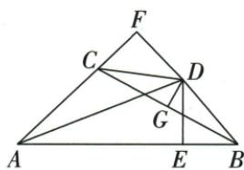

## 讲解

### 判据

图中同时有垂直平分线、内部角平分线和到两边的垂线。中垂线提供“到两个端点的距离相等”，角平分线提供“到两边所在直线的垂直距离相等”。若这两类距离分别是两个直角三角形的斜边与直角边，就可用HL。

### 流程

1. 先找直角。原DF垂直AC、DE垂直AB，△CDF与△BDE的直角分别在F、E，因此CD、BD分别是这两个三角形的斜边，DF、DE是直角边。
2. D在BC的垂直平分线上，故$DC=DB$。这条性质比较到B、C两个端点的距离，恰好提供HL所需的等斜边。
3. D在$\angle BAC$内部角平分线上，F、E是到两边所在直线的垂足，故$DF=DE$。这条性质必须配上垂直条件，不能把到边上任意一点的斜距称为垂直距离。
4. 两个三角形均为直角三角形，且有等斜边、等一条直角边，所以△CDF与△BDE由HL全等；对应顶点为C与B、D与D、F与E，后续边角结论按这个对应读取。
5. 原F落在AC的延长线上，仍是到直线AC的垂足，不破坏垂直距离性质。中垂与角平分提供的是不同类型的距离，不能交换它们各自的依据。

## 例题

### 中垂给斜边角平分给腿以HL全等

> 来源ID Q21-05；第21章等腰三角形；201-250/full.md 第3924–3924行。原答案与解析定位：201-250/full.md 第3926–3934行。

例3 如图, $\angle BAC$ 的平分线与BC的垂直平分线DG相交于点D, $DE\perp AB$ , $DF\perp AC$ ,垂足分别为E、F.连接CD、BD,求证: $\triangle CDF\cong\triangle BDE$ .

**原资料答案与解析：**

证明 $\because AD$ 平分 $\angle BAC, DE \perp AB, DF \perp AC, \therefore DE = DF, \because DG$ 垂直平分 $BC, \therefore CD = BD$ , 在 Rt $\triangle CDF$ 和 Rt $\triangle BDE$ 中, $\left\{ \begin{array}{l} CD = BD, \\ DF = DE, \end{array} \right.$ $\therefore$ Rt $\triangle CDF \cong$ Rt $\triangle BDE$ (HL).

**展开解析（依据原详解补足理由与步骤）：**

D在BC中垂线上给DC=DB，AD内部平分BAC与两垂线给DF=DE。CDF、BDE的直角在F、E，DC/DB分别斜边，DF/DE为腿，故HL全等，对应C-B、D-D、F-E。原F在AC延长线上也仍是到该直线的垂足，不影响直角和距离性质。不能把DF=DE误称斜边条件。

## 易错

中垂提供的是到端点斜距，角平分提供的是到边线垂距，两种距离不可串换。
