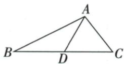
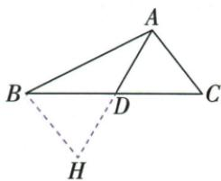

## 讲解

### 判据

给两侧边和一条中线求范围，可把中线倍长作为新三角边。

### 流程

1.延AD到H使DH=AD，连BH；用中点两段、倍长两段及对顶SAS证明BH=AC。2.AH=2AD，新ABH中已知边12、8，写绝对差4<AH<和20。3.替AH为2AD，两端同除正2，得2<AD<10。4.原图非退化，端点2/10不能取。5.回验任一允许AD对应非退化构造，不凭图估极值或把上界叫可取最大值。

## 例题

### 倍长原中线将12与8转三边范围

> 来源ID Q20-15；第20章全等三角形；201-250/full.md 第2989–2991行。原答案与解析定位：201-250/full.md 第2993–3015行。

例4 如图, 在 $\triangle ABC$ 中, $AB = 12$ , $AC = 8$ , $AD$ 是 $BC$ 边上的中线, 求 $AD$ 的取值范围.

**原资料答案与解析：**

解析 延长 AD 到 H, 使 DH = AD, 连接 BH. ∴ AD 是 BC 边上的中线, ∴ BD = CD.

在 $\triangle BDH$ 和 $\triangle CDA$ 中， $\left\{\begin{aligned}DH&=DA,\\ \angle BDH&=\angle CDA,\\ BD&=CD,\end{aligned}\right.$ $\therefore\triangle BDH\cong\triangle CDA(SAS),$

$$
\therefore B H = A C = 8.
$$

$$
\because 1 2 - 8 <   A H <   1 2 + 8, \therefore 4 <   A H <   2 0, \therefore 4 <   2 A D <   2 0, \therefore 2 <   A D <   1 0.
$$

**展开解析（依据原详解补足理由与步骤）：**

D为BC中点，延长AD到H使DH=AD，连BH。BD=CD、DH=DA、BDH=CDA对顶，两边及夹角，△BDH≌△CDA（SAS），所以BH=CA=8。原A-D-H按序，AH=2AD。△ABH三边有AB12、BH8，严格三边范围12−8<AH<12+8即4<2AD<20，两侧同除正2，得2<AD<10。边界等号会让原三角形退化，不是允许的最大最小值。范围每个内部值可由对应非退化ABH与其中线对称构造实现，原题不求具体AD数值。

## 易错

4与20先是倍长AH界，若直接当中线界就多一倍；不等号保持严格。
