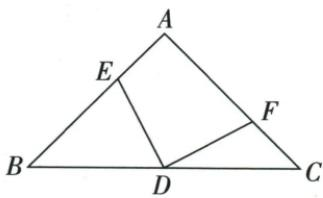

## 讲解

### 判据

等腰直角图边长6、对边中点及两截段等，跨图四边形可沿中线分两块并用全等替换一块。

### 流程

1.连AD，用等腰三线合一及45°得到AD=CD、DAE=DCF45°。2.原AE=CF配两边夹角SAS，DAE≌DCF，面积等。3.目标AEDF分DAE、DAF，共保DAF，把DAE换DCF，合成ACD。4.AD中线使ACD为ABC一半，ABC面积6×6/2=18，目标9。5.逐项辨原18整图、6√2斜边等误量，面积单位与长度分开。

## 例题

### 边6等腰直角截取等边全等转面积9

> 来源ID Q20-19；第20章全等三角形；201-250/full.md 第3168–3189行。原答案与解析定位：201-250/full.md 第3199–3205行。

例2 (2024 广东广州) 如图, 在 $\triangle ABC$ 中, $\angle A = 90^{\circ}$ , AB = AC = 6, D 为边 BC 的中点, 点 E, F 分别在边 AB, AC 上, AE = CF, 则四边形 AEDF 的面积为 ( )

A.18

B. $9\sqrt{2}$

C.9

D. $6\sqrt{2}$

**原资料答案与解析：**

例2 解析 连接 AD, 由题意得 $\angle DAE = \angle C = 45^{\circ}, AD = CD$ , 又 AE = CF, 所以 $\triangle DAE \cong \triangle DCF$ , 所以 $S_{四边形AEDF}=S_{\triangle DAE}+S_{\triangle DAF}=S_{\triangle DCF}+$

$$
S _ {\triangle D A F} = \frac {1}{2} S _ {\triangle A B C} = \frac {1}{2} \times \frac {1}{2} \times 6 \times 6 = 9.
$$

答案 C

**展开解析（依据原详解补足理由与步骤）：**

AB=AC6、A90°，原等腰直角，B=C45°。D为BC中点，等腰三线合一使AD⊥BC且平分A，DAE45°；斜边中点D到A、C等距，也可用△ADC两锐角均45°得到AD=CD。AE=CF，DAE=DCF45°，AD=CD，SAS使△DAE≌△DCF。目标AEDF由DAE、DAF两块构成，替DAE为DCF后成为ACD；AD中线分ABC为两等面积，面积=半×(6×6/2)=9。A18是整个ABC，错；B9√2把斜线长度误入面积，错；C9正确；D6√2是原斜边BC的长度数值，量纲和图形均不是所求面积，错。选C。边上E/F在端点时四边形可能退化，原按非退化图讨论全等，极端面积仍可按同底高直接核为9，不假装退化三角形满足通常判据。

## 易错

AE=CF不说明E/F是边中点；面积恒9来自割补，不需求截段数值。
