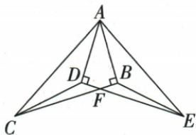
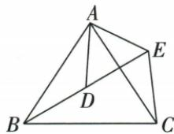
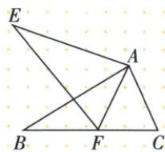

## 讲解

### 判据

原两个全等图形重叠在同一顶点，整体角相等但目标需另一夹角，可扣共同部分。

### 流程

1.先提原全等对应两边与整体角。2.按真实射线次序写两整体各含同一小角，等式同减得到新的夹角。3.以新两边夹角SAS建立第二对全等，得对应角或边。4.若还需第三对，全等角再减已有直角、配对顶与对应边AAS。5.另一法可补公共斜边用HL，再将等边同减得到余段。

## 例题

### 两个原直角全等引出另两对与CF等EF双证

> 来源ID Q20-12；第20章全等三角形；201-250/full.md 第2856–2860行。原答案与解析定位：201-250/full.md 第2861–2896行。

例1 如图, 已知 Rt△ABC≌Rt△ADE, ∠ABC = ∠ADE = 90°, 连接 CD、EB.

(1) 图中还有几对全等三角形？请你一一列举.  
(2) 求证: CF = EF.

**原资料答案与解析：**

解析（1）还有2对全等三角形. $\triangle ADC\cong \triangle ABE,\triangle CDF\cong \triangle EBF.$

(2) 证法一: $\because \mathrm{Rt} \triangle ABC \cong \mathrm{Rt} \triangle ADE, \therefore AC = AE, \angle CAB = \angle EAD, AB = AD,$

$$
\therefore \angle C A B - \angle D A B = \angle E A D - \angle D A B, \text { 即 } \angle C A D = \angle E A B, \therefore \triangle A C D \cong \triangle A E B (\mathrm{SAS}),
$$

$$
\therefore C D = E B, \angle A D C = \angle A B E. \text {又} \because \angle A D E = \angle A B C, \therefore \angle C D F = \angle E B F.
$$

$$
\text { 又 } \because \angle D F C = \angle B F E, \therefore \triangle C D F \cong \triangle E B F (\mathrm{AAS}), \therefore C F = E F.
$$

证法二: 连接 $AF$ . ∵ Rt△ABC ≅ Rt△ADE, ∴ AB = AD, BC = DE.

在 Rt△ABF 和 Rt△ADF 中, AF = AF, AB = AD, ∴ Rt△ABF ≅ Rt△ADF(HL),

$$
\therefore B F = D F. \text {   又   } \because B C = D E, \therefore B C - B F = D E - D F, \text {   即   } C F = E F.
$$

**展开解析（依据原详解补足理由与步骤）：**

原Rt△ABC≌Rt△ADE，得AC=AE、AB=AD、BC=DE、CAB=EAD。原两整体角都含DAB，同减得CAD=EAB；所以△ACD与△AEB有两边及夹角对应等，SAS全等，CD=EB、ADC=ABE。原ADE=ABC90°，从ADC与ABE对应相等的整体中扣去90°，得CDF=EBF；DFC与BFE对顶，结合CD=EB得△CDF≌△EBF（AAS），故CF=EF。原除给定一对外还有这两对，三角形次序按对应可倒写。

原法二连AF，ABF、ADF的直角分别在B、D，AF共同斜边、AB=AD一腿，HL全等得BF=DF。原B-F-C、D-F-E点序与BC=DE，再同减相等小段BF/DF，得CF=BC−BF=DE−DF=EF。两方法的两组辅助三角形不同，均列真实条件，未用目标CF=EF作判据。

### 双等腰手拉手同减公共角造SAS

> 来源ID Q20-13；第20章全等三角形；201-250/full.md 第2910–2918行。原答案与解析定位：201-250/full.md 第2920–2922行。

例2 如图, $AB = AC$ , $AD = AE$ , $\angle BAC = \angle DAE$ . 求证: $\triangle ABD \cong \triangle ACE$ .

**原资料答案与解析：**

证明 $\because \angle BAC = \angle DAE, \therefore \angle BAD = \angle EAC,$

在 $\triangle ABD$ 和 $\triangle ACE$ 中， $\left\{\begin{aligned}AB&=AC,\\ \angle BAD&=\angle EAC,\\ AD&=AE,\end{aligned}\right.$ $\therefore\triangle ABD\cong\triangle ACE(SAS).$

**展开解析（依据原详解补足理由与步骤）：**

原射线次序AB、AD、AC、AE，BAC=DAE，分别写BAC=BAD+DAC、DAE=DAC+CAE，共减DAC得BAD=CAE。再用AB=AC、AD=AE，两边及夹角，△ABD≌△ACE（SAS）。D不一定在BE的中点，只因图中D连到共顶点A不能加中点条件。模型的关键是两组同顶点等腰边以及相等旋转角，不是任意两个等腰都能连成这对全等。

### 共顶点全等对应及角差四句辨析

> 来源ID Q20-01；第20章全等三角形；201-250/full.md 第2457–2472行。原答案与解析定位：201-250/full.md 第2474–2480行。

例 如图所示, $\triangle ABC\cong\triangle AEF$ ,
AB=AE, $\angle B=\angle E$ ,下列结论正确
的是\_\_\_\_.(填序号)

①AC = AF;   
② $\angle FAB = \angle EAB;$   
③EF=BC;   
④ $\angle EAB = \angle FAC.$

**原资料答案与解析：**

解析 由题意得 AC 与 AF, EF 与 BC 是对应边, 所以 AC = AF, EF = BC, 所以①③正确.

由题意得 $\angle BAC$ 和 $\angle EAF$ 是对应角,所以 $\angle BAC=\angle EAF$ ,所以 $\angle EAB=\angle FAC$ ,所以④正确.

根据已知条件无法确定∠FAB与∠EAB是否相等,所以②不一定正确.

答案 ①③④

**展开解析（依据原详解补足理由与步骤）：**

由△ABC≌△AEF，对应A-A、B-E、C-F。①AC=AF是对应边，真；③BC=EF也真。A处对应角BAC=EAF，原射线依次AE、AB、AF、AC；两个整体都包含BAF，共减BAF得EAB=FAC，④真。②FAB即公共小角BAF，已知并未给它等于EAB，不能从两个整体角等便断每个相邻小块都相等，故不一定真。答①③④。全等字母顺序是主要对应依据，不能只因两线共顶点A就任意匹配。

## 易错

原第一对SAS只给CD=EB，中间还需CDF=EBF与对顶AAS才到CF=EF；直接写三个全等而不配条件不可。
