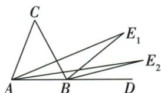

## 讲解

### 判据

原指定内角、外角各取靠基准射线的三分之一，在同一基准AB/BD上形成新的三角形，适合用外角差逐层递推。

### 流程

1.原CBD为外角，C=CBD−CAB，先写两个原整角的差。2.第一层E₁BD是ABE₁的外角，E₁=E₁BD−E₁AB；原两项各是整角三分之一，同减得E₁=C/3。3.下一层重复同一三角外角差，E₂=E₁/3。4.第n层乘(1/3)^n，给m/3ⁿ，n正整数。5.核n1和n2与原两层图对应，不能把角平分二分之一套到三等分。

## 例题

### 内外三等分交角递乘三分之一

> 来源ID Q19-18；第19章三角形；201-250/full.md 第2357–2372行。原答案与解析定位：201-250/full.md 第2323–2329行。

例3（2024 四川达州）如图, 在 $\triangle ABC$ 中, $AE_{1}$ , $BE_{1}$ 分别是内角 $\angle CAB$ , 外角 $\angle CBD$ 的三等分线, 且 $\angle E_{1}AD = \frac{1}{3} \angle CAB$ , $\angle E_{1}BD = \frac{1}{3} \angle CBD$ , 在

$\triangle ABE_{1}$ 中, $AE_{2}, BE_{2}$ 分别是内角 $\angle E_{1}AB$ , 外角 $\angle E_{1}BD$ 的三等分线, 且 $\angle E_{2}AD = \frac{1}{3} \angle E_{1}AB, \angle E_{2}BD = \frac{1}{3} \angle E_{1}BD, \cdots$ , 以此规律作下去, 若 $\angle C = m^{\circ}$ , 则 $\angle E_{n} =$ \_\_\_\_度.

**原资料答案与解析：**

例3 解析 $\because \angle E_{1} = \angle E_{1}BD - \angle E_{1}AD, \angle C = \angle CBD - \angle CAB,$

且 $\angle E_{1}AD = \frac{1}{3}\angle CAB,\angle E_{1}BD =$ $\frac{1}{3}\angle CBD,\therefore \angle E_1 = \frac{1}{3}\angle C,$

同理 $\angle E_{2} = \frac{1}{3}\angle E_{1} = \left(\frac{1}{3}\right)^{2}\angle C,$ $\therefore \angle E_n = \left(\frac{1}{3}\right)^n\angle C = \frac{m}{3^n}$ 度.

答案 $\frac{m}{3^n}$

**展开解析（依据原详解补足理由与步骤）：**

BD是BC延长射线，CBD为ABC的外角，CBD=CAB+C。故C=CBD−CAB。对△ABE₁，E₁BD是B处外角，E₁=E₁BD−E₁AB；AD与AB同向，所以E₁AB=E₁AD。原三等分选择给E₁BD=CBD/3、E₁AB=CAB/3，二差得E₁=C/3=m/3。下一次共同背景A、B、D仍共线，E₂BD为新外角，E₂=E₂BD−E₂AB=(E₁BD−E₁AB)/3=E₁/3=m/9。重复n次：

$$\angle E_n=\left(\frac13\right)^n\angle C=\frac{m}{3^n}\text{度},\qquad n\in\mathbb Z_{>0}.$$

不是所有任意三等分线交点都满足此式，必须采用题中分别靠AD、BD的指定射线；层数n1对应E₁、n2对应E₂，不能指数少一次。

## 易错

必须原选择的AD、BD侧三等分射线，任选另一条三等分线可能改变交点和角关系；不是模型三种二分线公式。
