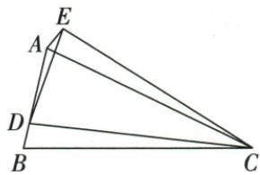
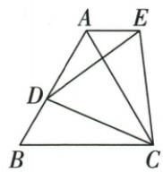

## 讲解

### 判据

两个等腰共C、CD/CE等且两整体C角等，SAS先得全等；等边特例再用60移角。

### 流程

1.两整体角共含DCA，同减得BCD=ACE。2.BC=AC、CD=CE，SAS得DBC≌EAC。3.等边特例保原条件，所以仍全等。4.B60，经对应CAE60，又ACB60，AC为截线的内错角等，推出AE∥BC。

## 例题

### 共顶点双等腰SAS及等边特例推出AE平行BC

> 来源ID Q21-15；第21章等腰三角形；201-250/full.md 第4245–4262行。原答案与解析定位：201-250/full.md 第4264–4273行。

例7 如图 1, $\triangle ABC$ 是等腰三角形, AC = BC, D 是 AB 边上一点, 以 CD 为边作等腰三角形 CDE, 使点 E, A 在直线 DC 的同侧, $\angle BCA = \angle DCE$ , CD = CE, 连接 AE.

(1) 求证: $\triangle DBC \cong \triangle EAC.$   
(2)如图2,若 $\triangle ABC$ 、 $\triangle CDE$ 都是等边三角形,(1)中结论是否仍然成立?请直接写出你的判断,无需证明.  
(3)在(2)的条件下,AE与BC有怎样的位置关系?请写出理由.

图1

  
图2

**原资料答案与解析：**

解析 (1) 证明: $\because \angle BCA = \angle DCE, \therefore \angle BCD = \angle ACE.$

在 $\triangle DBC$ 和 $\triangle EAC$ 中， $\left\{ \begin{array}{l} BC = AC, \\ \angle BCD = \angle ACE, \therefore \triangle DBC \cong \triangle EAC. \\ CD = CE, \end{array} \right.$

(2)(1)中结论仍然成立.   
(3) $AE \parallel BC.$

理由：∵ $\triangle ABC$ 是等边三角形，∴ $\angle B = \angle ACB = 60^{\circ}$ ,

由(2)中结论知 $\triangle DBC \cong \triangle EAC, \therefore \angle CAE = \angle B = 60^{\circ} = \angle ACB, \therefore AE // BC.$

**展开解析（依据原详解补足理由与步骤）：**

(1)BC=AC、CD=CE；原BCD+DCA=BCA，ACE+DCA=DCE，给BCA=DCE共减DCA得BCD=ACE。这恰是两等边之间夹角，故DBC≌EAC（SAS），对应D-E、B-A、C-C。(2)两三角改等边时原等腰两对边及等角前提仍满足，结论仍成立，不需要新加已知。(3)原等边B=ACB60，第一结论对应给CAE=B60；CAE与ACB为AC截AE、BC的内错角，因此AE∥BC。不只凭图的水平外观判平行。

## 易错

普通双等腰全等不一定AE∥BC，平行还用了等边60；共顶点不必然共角对应。
