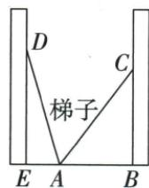
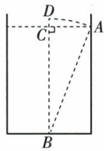

## 讲解

### 判据

同梯翻到两墙长不变或草直立/拉向岸长不变，设一个长度便表达另边差/和。

### 流程

1. 找到保持不变的长度。梯子翻向另一墙时仍是同一架梯子，因此两次斜边相等；草拉直到岸边时，原题以同一段草长建模，不能另加伸长量。
2. 梯子题设$AE=x$ m，点$A$在两墙底$E,B$之间，故$AB=2.2-x$且$0<x<2.2$。两墙垂直地面，两个直角三角形的斜边相等，所以$x^2+2.4^2=(2.2-x)^2+2^2$。
3. 展开得$x^2+5.76=4.84-4.4x+x^2+4$。两边同减$x^2$，得$5.76=8.84-4.4x$；再两边同加$4.4x$、同减5.76，得$4.4x=3.08$，同除4.4得$x=0.7$ m。回验另一水平段$AB=1.5$ m，两斜边平方均为6.25，且$x$满足位置范围。
4. 原草题设水深$x$，露出水面1，故草全长$x+1$；拉直后水平距离5，水深仍为$x$。勾股给$x^2+25=(x+1)^2$。展开右边为$x^2+2x+1$，两边减$x^2$、再减1，得$24=2x$，故$x=12$。核对原选项时把各候选深度代入同一等式，只有原C对应12符合。
5. 数值方程必须建立在两次斜边确实相等及水平、竖直腿对应正确的基础上。若梯子底端移动或草未拉直，这个方程就不能直接使用。

## 例题

### 梯子两墙同斜边2点4和2列方程得0点7米

> 来源ID Q22-07；第22章勾股定理；201-250/full.md 第4625–4627行。原答案与解析定位：201-250/full.md 第4629–4639行。

例3 某小区两面直立的墙壁之间为安全通道,一架梯子的底端 A 在两面墙壁的底端 B,E 之间,BE=2.2 m,当这架梯子斜靠在左墙时,梯子顶端 D 到地面的距离 DE 为 2.4 m,保持梯子底端 A 不动,将梯子斜靠在右墙上,梯子顶端 C 到地面的距离 CB 为 2 m,则梯子底端 A 到左墙的距离 AE 为 \_\_\_\_ m.

**原资料答案与解析：**

解析 设 AE = x m，则 $AB = (2.2 - x)$ m.

在 Rt△ADE 中, $AE^{2}+DE^{2}=AD^{2}$ ,

在 Rt△ABC 中, $AB^{2}+BC^{2}=AC^{2}$ ,

由题意知 $AD = AC, \therefore AE^2 + DE^2 = AB^2 + BC^2$ ，即 $x^2 + 2.4^2 = (2.2 - x)^2 + 2^2$ ，解得 $x = 0.7$ .

故梯子底端 A 到左墙的距离 AE 为 0.7 m.

答案 0.7

**展开解析（依据原详解补足理由与步骤）：**

设$AE=x$ m。原$A$在$E,B$之间，所以$AB=2.2-x$且$0<x<2.2$。同一架梯子的长度不变，$AD=AC$；墙面与地面垂直，勾股给$AD^2=x^2+2.4^2$、$AC^2=(2.2-x)^2+2^2$。两斜边相等，因此

$$x^2+5.76=4.84-4.4x+x^2+4.$$

两边同减$x^2$，得$5.76=8.84-4.4x$；两边同加$4.4x$、同减5.76，得$4.4x=3.08$；同除4.4，得到$x=0.7$。所以$AE=0.7$ m，$AB=2.2-0.7=1.5$ m。回验两斜边平方分别为$0.7^2+2.4^2=6.25$、$1.5^2+2^2=6.25$，相等且位置条件成立。

### 葭生池中露1半池5总长不变深12四选项

> 来源ID Q22-15；第22章勾股定理；251-300/full.md 第112–131行。原答案与解析定位：251-300/full.md 第96–98行。

例3（2024四川巴中）“今有方池一丈，葭生其中央，出水一尺，引葭赴岸，适与岸齐.问：水深几何？”这是我国数学史上的“葭生池中”问题，即 $AC = 5, DC = 1, BD = BA$ ，则 $BC =$ （

A.8

B.10

C.12

D.13

**原资料答案与解析：**

例3 解析 设 BC = x，则 BA = BD = x + 1，在 Rt△ABC 中， $BC^{2} + AC^{2} = AB^{2}$ ，即 $x^{2} + 5^{2} = (x + 1)^{2}$ ，解得 x = 12，即 BC = 12.

答案 C

**展开解析（依据原详解补足理由与步骤）：**

设水深BC=x>0，露水DC1，直立BD=x+1；拉到岸边A仍同长BA=BD。C处直角、AC5，故x²+25=(x+1)²=x²+2x+1；同减x²、减1得24=2x，x12，C正确。回验斜长13、5²+12²13²。A8代左89右81不等，B10代125/121不等，D13代194/196不等。古文原一丈一尺不在此另外编单位历史考证，数值按原给AC5、DC1。

## 易错

梯底保持不动和梯长不变是模型依据；草假定拉直不伸缩，原题已用BA=BD，不能擅用弯曲路径。
