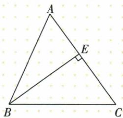
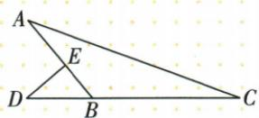
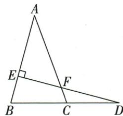
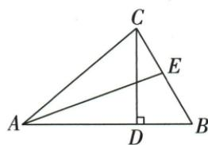

## 讲解

### 判据

图有直角、延长线和目标外角，先从有90°的最小三角形求角，再追到目标所属三角形。

### 流程

1.由垂直写实际90°顶点，选已知另角的小三角形求第三角。2.若目标在交点另一侧，用对顶角相等移到需要区域。3.识目标外角属于哪个三角形，只有两个不相邻内角可相加。4.或用反向边邻补将小角换成大图内角，再用180°和。5.每步写角名，源35/15题先F55，再C70，飞镖题先B50、补130再C20。

## 例题

### 原66与54度高求30度

> 来源ID Q19-11；第19章三角形；201-250/full.md 第2017–2028行。原答案与解析定位：201-250/full.md 第2030–2030行。

例2 如图, 在 $\triangle ABC$ 中, $\angle ABC=66^{\circ}$ , $\angle ACB=54^{\circ}$ , $BE$ 是边 $AC$ 上的高, 则 $\angle ABE$ 的度数为\_.

**原资料答案与解析：**

答案 $30^{\circ}$

**展开解析（依据原详解补足理由与步骤）：**

ABC内角和给A=180°−66°−54°=60°。E在AC上，BE⊥AC，使AEB90°。在ABE中ABE=180°−90°−A60°=30°。不是直接用90°−B66°，那个24°对应另一部分EBC，而目标ABE的远端是A；用30+24=66回验可核角名。

### 原飞镖图借两三角与补角求20度

> 来源ID Q19-12；第19章三角形；201-250/full.md 第2195–2207行。原答案与解析定位：201-250/full.md 第2209–2219行。

例3 如图, $\triangle ABC$ 中, $\angle A = 30^{\circ}$ , $D$ 是 $CB$ 延长线上的一点, $\angle AED = 90^{\circ}, \angle D = 40^{\circ}$ , 则 $\angle C$ 的度数为

**原资料答案与解析：**

解析 由“飞镖”模型的结论得

$$
\angle A E D = \angle A + \angle D + \angle C,
$$

$$
\therefore \angle C = \angle A E D - \angle A - \angle D = 2 0 ^ {\circ}.
$$

答案 $20^{\circ}$

**展开解析（依据原详解补足理由与步骤）：**

原D-B-C共线，A-E-B共线。AED90°，EA与EB反向，所以DEB90°。△DEB中DBE=180°−90°−D40°=50°；DB与BC反向，ABC=180°−DBE50°=130°。△ABC内角和给C=180°−A30°−B130°=20°。合并这些式子也得AED=A+D+C，即原飞镖模型。先找到两个三角形与反向边，说明为什么三个原角可相加；不能只引用模型名称跳过推理。

### 垂线与对顶再外角和求70度

> 来源ID Q19-15；第19章三角形；201-250/full.md 第2268–2268行。原答案与解析定位：201-250/full.md 第2270–2289行。

例3 如图, 点 D 在 BC 的延长线上, $DE \perp AB$ 于点 E, 交 AC 于点 F. 若 $\angle A = 35^{\circ}$ , $\angle D = 15^{\circ}$ , 则 $\angle ACB$ 的度数为 \_\_\_\_.

**原资料答案与解析：**

解析 $\because DE \perp AB, \angle A = 35^{\circ}, \therefore \angle AFE = 55^{\circ}, \therefore \angle CFD = \angle AFE = 55^{\circ}$ ,

$$
\therefore \angle A C B = \angle D + \angle C F D = 1 5 ^ {\circ} + 5 5 ^ {\circ} = 7 0 ^ {\circ}.
$$

答案 $70^{\circ}$

**展开解析（依据原详解补足理由与步骤）：**

DE⊥AB、A35°，直角△AFE中AFE=90°−35°=55°。AC与DE交F，CFD与AFE对顶，所以CFD55°。D在BC延长线上，ACB是△CFD在C处外角，因此ACB=CFD+D=55°+15°=70°。外角要加的是该三角形的两个不相邻内角，不能再把A35°直接加D15°。原图F在AC、E在AB，先追踪这两个三角形。

### 高分80再角平分得20最后求100

> 来源ID Q19-17；第19章三角形；201-250/full.md 第2345–2353行。原答案与解析定位：201-250/full.md 第2307–2321行。

例2 (2024 四川凉山州) 如图, $\triangle ABC$ 中, $\angle BCD = 30^{\circ}$ , $\angle ACB = 80^{\circ}$ , $CD$ 是边 $AB$ 上的高, $AE$ 是 $\angle CAB$ 的平分线, 则 $\angle AEB$ 的度数是 \_\_\_\_.

**原资料答案与解析：**

例2 解析 $\because \angle ACB = 80^{\circ},$ $\angle BCD = 30^{\circ},\therefore \angle ACD = 50^{\circ}.$

又∵CD是边AB上的高，

$$
\therefore \angle C A D = 4 0 ^ {\circ}, \angle B = 6 0 ^ {\circ}.
$$

∵ AE 是 $\angle CAB$ 的平分线，

$$
\therefore \angle B A E = 2 0 ^ {\circ}, \therefore \angle A E B = 1 0 0 ^ {\circ}.
$$

答案 $100^{\circ}$

**展开解析（依据原详解补足理由与步骤）：**

原CD在ACB80°内部，BCD30°，ACD=80°−30°=50°。CD⊥AB，在ACD中CAD=90°−50°=40°；A-D-B共线，CAB40°。AE内部平分CAB，BAE20°。在BCD中B=90°−30°=60°，即ABE60°。△ABE内角和给AEB=180°−20°−60°=100°。中间50是C处、40是A处、20是A半角，目标是E处100，不能拿首个差当答案。

## 易错

不能把任何图上两个已知角直接相加；原高66/54题目标ABE30不是90−66的24。
