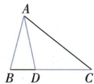
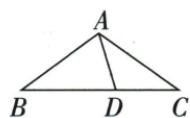

## 讲解

### 判据

图有AB=AD=DC或三组边等，角跨三角传递，给每对等边找各自对角。

### 流程

1.26题在ABD先两底角均77，D在BC内部才使ADB成为ADC外角。2.AD=DC使C/DAC等，二者和77所以各38.5。3.多组题设C=x，DA=DC得DAC=x，外角ADB=2x，BD=BA得BAD=2x，AB=AC使B=x。4.大A三份、大B/C各一份，5x180得36。

## 例题

### 两个等腰外角77再二分38点5

> 来源ID Q21-09；第21章等腰三角形；201-250/full.md 第4121–4121行。原答案与解析定位：201-250/full.md 第4123–4131行。

例1 如图, 在 $\triangle ABC$ 中, $AB=AD=DC$ , $\angle BAD=26^{\circ}$ , 求 $\angle B$ 和 $\angle C$ 的度数.

**原资料答案与解析：**

解析 $\because AB = AD, \therefore \angle B = \angle ADB. \because \angle B + \angle ADB = 180^{\circ} - \angle BAD = 180^{\circ} - 26^{\circ} = 154^{\circ},$

$$
\therefore \angle B = \angle A D B = \frac {1}{2} \times 1 5 4 ^ {\circ} = 7 7 ^ {\circ} \therefore \angle C + \angle D A C = \angle A D B = 7 7 ^ {\circ}.
$$

又∵AD=DC,∴∠C=∠DAC= $\frac{1}{2}\times77^{\circ}=38.5^{\circ}$ .

**展开解析（依据原详解补足理由与步骤）：**

AB=AD，等腰ABD底角B=ADB，内角和使两底角和180−26=154，所以B=77°。D在BC内部，ADB是ADC在D的外角，C+DAC=ADB=77°。又AD=DC，ADC等腰底角C=DAC，所以C=77/2=38.5°。77不是ADC的内角ADC，不能再180−77求目标。

### 三组等边将五份角和解36

> 来源ID Q21-10；第21章等腰三角形；201-250/full.md 第4133–4133行。原答案与解析定位：201-250/full.md 第4135–4143行。

例2 如图, 在 $\triangle ABC$ 中, AB = AC, D 为 BC 上的一点, 且 DA = DC, BD = BA, 求 $\angle B$ 的度数.

**原资料答案与解析：**

解析 设 $\angle C = x^{\circ}$ , 由 $DA = DC$ 可得 $\angle DAC = \angle C = x^{\circ}$ ,

$$
\therefore \angle A D B = \angle C + \angle D A C = 2 x ^ {\circ} \because B D = B A, \therefore \angle B A D = \angle A D B = 2 x ^ {\circ}.
$$

由 $AB = AC$ 可得 $\angle B = \angle C = x^{\circ}$ . 根据三角形内角和定理, 得 $x + x + 3x = 180$ , 解得 $x = 36$ . $\therefore \angle B = 36^{\circ}$ .

**展开解析（依据原详解补足理由与步骤）：**

设C=x°。DA=DC使DAC=x；D在BC内部，ADB为ADC外角给ADB=2x。BD=BA使ABD的底角BAD=ADB=2x。AB=AC使B=C=x。大角A=BAD+DAC=3x，大三角内角和x+x+3x=180，5x=180，x=36，B36°。每组等边先在自己的三角形配对边所对角，不能从不同三角形等边直接配同名角。

## 易错

不能把所有等边一气对应全图所有角；外角77不是原ADC内角。方程每份要写来源。
