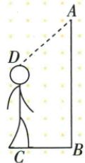

## 讲解

### 判据

实际高度题给总竖直高度、传感器到头顶的斜距离和水平距离。所求身高与斜距方向不同，不能直接相减；先补水平辅助线，求出传感器与头顶之间的竖直高度差。

### 流程

1. 过头顶D向竖直门框AB作水平线DE。水平与竖直互相垂直，原BC也水平、CD也竖直，所以BEDC为矩形，$DE=BC$、$BE=CD$。辅助线把未知身高转成门框上的同方向线段BE。
2. 在直角△ADE中，直角位于E，斜边$AD=1.5$ m，水平直角边$DE=1.2$ m。勾股定理给$AE^{2}=AD^{2}-DE^{2}=2.25-1.44=0.81$，长度取正，$AE=0.9$ m。
3. 按原A、E、B点序，$AB=AE+EB$，因此身高$CD=BE=AB-AE=2.5-0.9=1.6$ m。这里减的是两条竖直线段，方向和对象一致。
4. 最后核对问题所求。0.9 m是感应器与头顶的高度差，1.6 m才是身高；1.5 m是斜距，不能直接从2.5 m中减去。
5. 若实际图中头顶高于传感器，线段和差要随点序改变。先判位置、再写和差，比记住某一种减法更可靠。

## 例题

### 感应门高度2点5斜距1点5水平1点2求身高1点6

> 来源ID Q22-04；第22章勾股定理；201-250/full.md 第4449–4451行。原答案与解析定位：201-250/full.md 第4453–4455行。

例4 如图,某自动感应门的正上方A处装着一个感应器,离地面的高度AB为2.5米,一名学生站在C处时,感应门自动打开了,此时这名学生离感应门的距离BC为1.2米,他的头顶离感应器的距离AD为1.5米,则这名学生的身高CD为\_\_\_\_米.

**原资料答案与解析：**

解析 过点 D 作 $DE \perp AB$ 于 E，则 DE = BC = 1.2 米。在 Rt $\triangle ADE$ 中， $AE = \sqrt{AD^{2} - DE^{2}} = 0.9$ 米，∴ CD = BE = AB - AE = 1.6 米。

答案 1.6

**展开解析（依据原详解补足理由与步骤）：**

过头顶D向竖门AB作水平DE，DE∥BC、CD∥AB，B-E-D-C是矩形，DE=BC1.2、BE=CD。ADE直角在E、AD1.5是斜边，AE²=1.5²−1.2²=2.25−1.44=0.81，AE0.9。A-E-B按序，CD=BE=AB−AE=2.5−0.9=1.6 m。0.9是头顶到感应器的竖直差，不是身高；不能用斜距1.5直接减总高。

## 易错

斜距不能直接从竖高减；原点序决定身高低于感应器。
