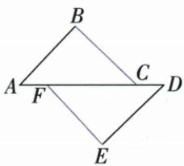
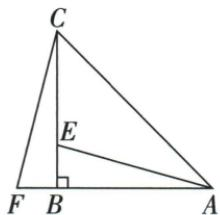

## 讲解

### 判据

已经两边对应相等，补条件前查其共同顶点，选夹角、第三边或确有直角的HL，不任选一个角。

### 流程

1.固定顶点对应并标已有元素。2.两边需要夹角SAS或第三边SSS；若两个已证直角三角且两边为斜边/一腿，可HL。3.两角已等时配夹边ASA或非夹边AAS，至少一边决定大小。4.补隐含条件只能来源公共边、对顶、同加减、平分或已知平行。5.开放原题选择AD=CE，完整列AC=CB、CD=BE、AD=CE，SSS。6.不能以待证边作补条件循环证明。

## 例题

### SSS原书重叠段先同加EF

> 来源ID Q20-07；第20章全等三角形；201-250/full.md 第2712–2716行。原答案与解析定位：201-250/full.md 第2714–2714行。

书写示例:如图,点 E、F 在 BC 上,AB=DC,AF=DE,$BE = CF$ ，求证 $\triangle ABF\cong \triangle DCE.$

证明：∵ BE = CF, ∴ $BE + EF = CF + EF$ , 即 BF = CE,在 $\triangle ABF$ 和 $\triangle DCE$ 中， $\left\{\begin{aligned}AB&=DC,\\ AF&=DE,\therefore\triangle ABF\cong\triangle DCE(SSS).\\ BF&=CE,\end{aligned}\right.$

**原资料答案与解析：**

证明：∵ BE = CF, ∴ $BE + EF = CF + EF$ , 即 BF = CE,在 $\triangle ABF$ 和 $\triangle DCE$ 中， $\left\{\begin{aligned}AB&=DC,\\ AF&=DE,\therefore\triangle ABF\cong\triangle DCE(SSS).\\ BF&=CE,\end{aligned}\right.$

**展开解析（依据原详解补足理由与步骤）：**

原B-E-F-C依次在BC上，BE=CF，两边同加EF得BF=CE。△ABF与△DCE有AB=DC、AF=DE、BF=CE，三边分别对应相等，SSS全等。对应A-D、B-C、F-E。原表格将结论插入条件行中，正文按三项先列完整再给结论，不漏共用EF及点序。

### SAS原书同加FC与平行内错

> 来源ID Q20-08；第20章全等三角形；201-250/full.md 第2730–2744行。原答案与解析定位：201-250/full.md 第2732–2748行。

书写示例: 如图, 点 A、F、C、D 在一条直线上, $AB \parallel DE$ , AB = DE, AF = DC, 求证 $BC \parallel EF$ .

证明：∵ $AB \parallel DE, \therefore \angle A = \angle D, \because AF = DC, \therefore AC = DF,$

在 $\triangle ABC$ 和 $\triangle DEF$ 中， $\left\{\begin{aligned}AB&=DE,\\ \angle A&=\angle D,\\ AC&=DF,\end{aligned}\right.$ ②

**原资料答案与解析：**

证明：∵ $AB \parallel DE, \therefore \angle A = \angle D, \because AF = DC, \therefore AC = DF,$

在 $\triangle ABC$ 和 $\triangle DEF$ 中， $\left\{\begin{aligned}AB&=DE,\\ \angle A&=\angle D,\\ AC&=DF,\end{aligned}\right.$ ②

$$
\therefore \triangle A B C \cong \triangle D E F (\text { SAS }), \therefore \angle A C B = \angle D F E, \therefore B C / / E F.
$$

**展开解析（依据原详解补足理由与步骤）：**

原A-F-C-D按序，AF=DC，两边同加FC得AC=DF。AB∥DE、AD为截线，BAC=EDF；再有AB=DE，两边及夹角对应相等，△ABC≌△DEF（SAS）。得到ACB=DFE；它们为BC、EF被AD截的内错角，所以BC∥EF。先角判定全等，再由全等对应角判平行，不可先用待证BC∥EF来配角。

### ASA原书平行给夹边两端角

> 来源ID Q20-09；第20章全等三角形；201-250/full.md 第2756–2758行。原答案与解析定位：201-250/full.md 第2760–2766行。

书写示例: 如图, 已知 D 是 AC 上一点, $AB = DA$ , $DE \parallel AB$ , $\angle B = \angle DAE$ , 求证 BC = AE.

**原资料答案与解析：**

证明：∵ $DE \parallel AB, \therefore \angle CAB = \angle ADE.$

在 $\triangle ABC$ 和 $\triangle DAE$ 中， $\left\{\begin{aligned}\angle CAB&=\angle ADE,\\ AB&=DA,\\ \angle B&=\angle DAE,\end{aligned}\right.$

$$
\therefore \triangle A B C \cong \triangle D A E (\mathrm{ASA}), \therefore B C = A E.
$$

**展开解析（依据原详解补足理由与步骤）：**

D在AC上，DE∥AB，AC截两线给CAB=ADE。原给AB=DA以及B=DAE，边AB夹在CAB、ABC之间，DA夹在ADE、DAE之间，所以△ABC≌△DAE（ASA），B对应A、C对应E，得到BC=AE。两角不是随便配，夹边两端顶点顺序分别A-B与D-A。

### AAS原书同减EF补DE等CF

> 来源ID Q20-10；第20章全等三角形；201-250/full.md 第2772–2781行。原答案与解析定位：201-250/full.md 第2783–2789行。

书写示例:如图,已知 DF=CE, $\angle DAE=\angle CBF$ , $\angle D=\angle C$ , 求证 $\triangle AED\cong\triangle BFC$ .

**原资料答案与解析：**

证明：∵ DF=CE, ∴ DF-EF=CE-EF, 即 DE=CF,

在 $\triangle AED$ 和 $\triangle BFC$ 中， $\left\{\begin{aligned}\angle DAE&=\angle CBF,\\ \angle D&=\angle C,\\ DE&=CF,\end{aligned}\right.$

$$
\therefore \triangle A E D \cong \triangle B F C (\mathrm{AAS}).
$$

**展开解析（依据原详解补足理由与步骤）：**

原D-E-F-C共线，DF=CE，同减EF得DE=CF。△AED与△BFC有DAE=CBF、D=C、DE=CF。给边DE、CF不夹在两给角之间，但分别是A、B角的对边，所以AAS全等。若需化ASA，两三角第三角E、F由180°减两给角也相等，再用DE/CF与其端点两角即可。

### HL原书先证明两个直角再列斜边和腿

> 来源ID Q20-11；第20章全等三角形；201-250/full.md 第2797–2810行。原答案与解析定位：201-250/full.md 第2799–2816行。

书写示例:如图,在 $\triangle ABC$ 中, $AB=CB,\angle ABC=90^{\circ},F$ 为AB延长线上一点,点E在BC上,且AE=CF.求证 $\triangle ABE\cong\triangle CBF$ .

证明：∵ $\angle ABC = 90^{\circ}$ , $\angle ABC + \angle CBF = 180^{\circ}$ ,
∴ $\angle CBF = 90^{\circ}$ .

**原资料答案与解析：**

证明：∵ $\angle ABC = 90^{\circ}$ , $\angle ABC + \angle CBF = 180^{\circ}$ ,
∴ $\angle CBF = 90^{\circ}$ .

在 Rt△ABE 和 Rt△CBF 中， $\left\{\begin{aligned}AE&=CF,\\ AB&=CB,\end{aligned}\right.$

$$
\therefore \mathrm{Rt} \triangle A B E \cong \mathrm{Rt} \triangle C B F (\mathrm{HL}).
$$

**展开解析（依据原详解补足理由与步骤）：**

ABC90°，F在AB反向延长线上，CBF=180°−ABC=90°，所以ABE与CBF确为两个直角三角形。AE、CF分别是其斜边，原给AE=CF；AB、CB为对应一条直角边，原给AB=CB。由HL得Rt△ABE≌Rt△CBF。不能只看两边等便用HL，首先必须核两个直角和哪边是斜边。

### 给两边添加夹角或第三边判全等

> 来源ID Q20-18；第20章全等三角形；201-250/full.md 第3152–3164行。原答案与解析定位：201-250/full.md 第3195–3197行。

例1（2024 山东德州）如图，C 是 AB 的中点，CD = BE，请添加一个条件：\_\_\_\_，使 $\triangle ACD \cong \triangle CBE$ .

**原资料答案与解析：**

例1 解析 在有两边分别相等的基础上,添加这两边的夹角相等或第三边相等均可判定两三角形全等.

答案 $AD = CE$ （答案不唯一）

**展开解析（依据原详解补足理由与步骤）：**

C是AB中点，AC=CB；原CD=BE。△ACD与△CBE对应A-C、C-B、D-E，已有两边。原答案AD=CE补第三边，SSS成立。另一合法选项需写它们的夹角ACD=CBE，配AC/CB、CD/BE形成SAS。原题开放只需一种，保原AD=CE完整证明。若添一个不夹在两已知边之间的角，一般SSA不能保证；不能因三项数量足够便任添角。

### 原SSA与AAA两组反例图明确缺失判据

> 来源ID Q20-33；第20章全等三角形；201-250/full.md 第2698–2702；2820–2824行。原答案与解析定位：201-250/full.md 第2698–2702行；201-250/full.md 第2820–2824行。

“边边角”（或“SSA”）：两边和其中一边的对角分别相等的两个三角形全等. （×）

解读：如图，在 $\triangle ABP$ 和 $\triangle ACP$ 中， $\angle A = \angle A, AP = AP, BP = CP$ ，满足“SSA”，但它们不全等.

“角角角”（或 “AAA”）：三个角分别相等的两个三角形全等. （×）

解读：如图，在 $\triangle ABC$ 和 $\triangle ADE$ 中， $\angle A = \angle A, \angle ADE = \angle B, \angle AED = \angle C$ ，满足 “AAA”，但它们不全等（形状相同但大小不相等）.

**原资料答案与解析：**

“边边角”（或“SSA”）：两边和其中一边的对角分别相等的两个三角形全等. （×）

解读：如图，在 $\triangle ABP$ 和 $\triangle ACP$ 中， $\angle A = \angle A, AP = AP, BP = CP$ ，满足“SSA”，但它们不全等.

“角角角”（或 “AAA”）：三个角分别相等的两个三角形全等. （×）

解读：如图，在 $\triangle ABC$ 和 $\triangle ADE$ 中， $\angle A = \angle A, \angle ADE = \angle B, \angle AED = \angle C$ ，满足 “AAA”，但它们不全等（形状相同但大小不相等）.

**展开解析（依据原详解补足理由与步骤）：**

原SSA图ABP与ACP共有AP及A角，BP=CP，但给定角A不夹在已给AP、BP之间，另一侧交点B、C可在同一射线上不同位置，不能固定第三边，原两三角不全等。原AAA图ABC与ADE三个对应角等，却一个是另一个放大或缩小，边未等，不能全等。原后段AAA图另接完整原文，结论只是相似或缺尺寸，不新增数值反例。直角三角形若等的是斜边与一腿，可以用HL；这是一组额外直角前提，不能当一般SSA合法。

## 易错

原SSA、AAA均不保证；“有三个元素”还须位置与至少一边条件合法，并不是三项任凑。
