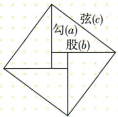
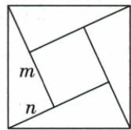
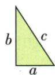
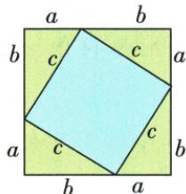
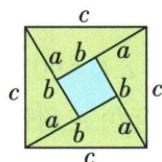
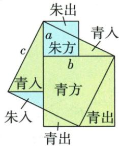
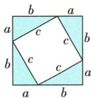
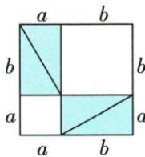
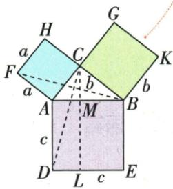

## 讲解

### 判据

原“赵爽弦图”由四个全等直角三角形围成外正方形，中间留下小正方形。外正方形的边是每个三角形的斜边，中心正方形的边是两条直角边长度之差。先识别题目问“每个三角形”还是“外正方形”，再利用平方和、差平方或和平方消去暂时不需要的量。

### 流程

1. 给两直角边$a,b$及斜边$c$时，外正方形面积为$c^2=a^2+b^2$，中心面积为$(b-a)^2$，每个三角形面积为$ab/2$。外面积减中心面积留下四个三角形，总面积为$4\times ab/2=2ab$，先把对象写清。
2. 原第一题$c=20$、$b-a=4$，外面积$20^2=400$，中心面积$4^2=16$，所以四块合计$400-16=384$。问每一块就除4，得到$384/4=96$；等价地，$2ab=384$先得$ab=192$，再求$ab/2=96$。两个除法分别从总量到乘积、从乘积到面积，不能漏掉一半。
3. 原第二题两腿$m>n$，中心面积5给$(m-n)^2=5$，另给$(m+n)^2=21$。外方边仍为斜边，所以目标是$m^2+n^2$，不是$(m+n)^2$。
4. 展开差平方得$m^2-2mn+n^2=5$，展开和平方得$m^2+2mn+n^2=21$。两式相加，交叉项$-2mn$与$+2mn$抵消，得$2m^2+2n^2=26$；提取2并除2，外面积$m^2+n^2=13$。
5. 选项B为13，满足两式相加后的约束；A、C、D代入外面积后分别使两倍面积为24、28、30，均不等于26。最后再次核题问对象：第一题求单块96，第二题求外方13，不能互用“除4”或把两腿和平方21当外方。

## 例题

### 弦图差4斜边20不解两边先求积和面积96

> 来源ID Q22-03；第22章勾股定理；201-250/full.md 第4429–4439行。原答案与解析定位：201-250/full.md 第4441–4445行。

例3 我国汉代数学家赵爽证明勾股定理时创制了一幅“弦图”，后人称之为“赵爽弦图”，它是由4个全等的直角三角形和一个小正方形组成的。如图，直角三角形的直角边长为 $a, b$ ，斜边长为 $c$ ，若 $b - a = 4, c = 20$ ，则每个直角三角形的面积为 \_\_\_\_。

**原资料答案与解析：**

解析 根据题意可得 $a^{2}+b^{2}=c^{2}=$ $20^{2},\because b-a=4,$

∴ $2ab = a^{2} + b^{2} - (b - a)^{2} = 20^{2} - 4^{2} = 384$ , ∴ 每个直角三角形的面积为 $\frac{1}{2}ab = \frac{1}{2} \times \frac{1}{2} \times 384 = 96$ .

答案 96

**展开解析（依据原详解补足理由与步骤）：**

原斜边$c=20$，勾股关系给$a^2+b^2=c^2=400$。原$b-a=4$，两边平方并用完全平方公式展开，得到$(b-a)^2=b^2-2ab+a^2=16$。

用第一式减去第二式，$a^2$与$b^2$分别抵消：$2ab=400-16=384$。两边除2，得$ab=192$；每个直角三角形面积为$ab/2=192/2=96$。

也可直接看原图：外正方形边为$c$，面积400；中心正方形边为$b-a$，面积16。二者相减的384是四个全等直角三角形总面积，求单块再除4，$384/4=96$。两种方法结果一致，均未要求先分别求出$a,b$。

### 弦图小面积5两腿和平方21求大面积13

> 来源ID Q22-14；第22章勾股定理；251-300/full.md 第100–110行。原答案与解析定位：251-300/full.md 第92–94行。

例2（2024 江苏南通）“赵爽弦图”巧妙利用面积关系证明了勾股定理.如图所示的“赵爽弦图”是由四个全等直角三角形和中间的小正方形拼成的一个大正方形.设直角三角形的两条直角边长分别为 $m, n (m > n)$ . 若小正方形面积为5，$(m+n)^2=21$， 则大正方形面积为

A.12

B.13

C.14

D.15

**原资料答案与解析：**

例2 解析 ∵ 小正方形面积为 $5, \therefore (m-n)^{2}=5$ , 即 $m^{2}-2mn+n^{2}=5$ , 又 $\because (m+n)^{2}=21$ , 即 $m^{2}+2mn+n^{2}=21$ , $\therefore m^{2}+n^{2}=13$ , ∴ 大正方形面积为 13.

答案B

**展开解析（依据原详解补足理由与步骤）：**

原扫描实际分段第2页题干给出中心小正方形面积5，以及$(m+n)^2=21$；OCR漏掉的这一条件已据原页恢复。图中两直角边$m>n$，中心边长$m-n$，所以$(m-n)^2=5$；外正方形边是斜边，所求面积由勾股定理为$m^2+n^2$。

按完全平方公式展开两个已知式：$m^2-2mn+n^2=5$，$m^2+2mn+n^2=21$。逐项相加，$-2mn$与$+2mn$抵消，得$2m^2+2n^2=26$；提取2得$2(m^2+n^2)=26$，两边除2，$m^2+n^2=13$，选B。

选项A的12使两倍面积为24，C的14使其为28，D的15使其为30，均不等于两个原已知式相加所得26，因此都不满足条件。不能把21直接当作外面积，21只是两直角边和的平方。

独立回验还可用两式相减：$4mn=21-5=16$，所以$mn=4$。四块三角形总面积为$4\times mn/2=2mn=8$，加中心面积5，外面积仍为$8+5=13$。

### 原勾股两拼图与青朱欧几里得面积证明

> 来源ID Q22-20；第22章勾股定理；201-250/full.md 第4457–4502行。原答案与解析定位：201-250/full.md 第4457–4502行。

原理:运用拼图的方式,即利用两种不同的方法计算同一个图形的面积来验证勾股定理.

验证过程:图②是由4个全等的直角三角形(如图①所示)和1个以直角三角形的斜边长c为边长的小正方形拼成的一个以 $(a+b)$ 为边长的大正方形,则大正方形的面积可表示为 $(a+b)^{2}$ ,又可表示为 $\frac{1}{2}ab\cdot4+c^{2}$ ,所以 $(a+b)^{2}=\frac{1}{2}ab\cdot4+c^{2}$ ,整理得 $a^{2}+b^{2}=c^{2}$ .

用 4 个与图①完全相同的直角三角形, 还可以拼成如图③所示的图形, 与上面的方法类似, 也能证明勾股定理. ④

  
图①

图②

  
图③

# 知识解读 常见的验证勾股定理的其他方法

1. 刘徽“青朱出入图”：

如图1, 设大正方形的面积为 S, 则 $S = c^{2}$ . 根据“出入相补(又称以盈补虚)”的原理, 又有 $S = a^{2} + b^{2}$ , 所以 $a^{2} + b^{2} = c^{2}$ .

2. 毕达哥拉斯拼图：

由图2得大正方形的面积 $=c^{2}+4\times\frac{1}{2}ab$ ，由图3得大正方形的面积 $=a^{2}+b^{2}+4\times\frac{1}{2}ab$ ，比较两式易得 $a^{2}+b^{2}=c^{2}$ 。
可推出 $S_{正方形ACHF}+S_{正方形BCGK}=S_{正方形ADEB}$ ，当分别以AC，BC，AB为边（或直径）作等边三角形（或圆）时，面积分别记为S。

3. 欧几里得证法：

图4中 $S_{\triangle CAD} = S_{\triangle FAB}, \because S_{\triangle CAD} = \frac{1}{2} \cdot c \cdot DL = \frac{1}{2} \cdot S_{\text{矩形}ADLM}, S_{\triangle FAB} = \frac{1}{2} a^2,$ $\therefore S_{\text{矩形}ADLM} = a^2$ ，同理可得 $S_{\text{矩形}MLEB} = b^2, \therefore S_{\text{正方形}ADEB} = a^2 + b^2$ ，即 $a^2 + b^2 = c^2.$

**原资料答案与解析：**

原理:运用拼图的方式,即利用两种不同的方法计算同一个图形的面积来验证勾股定理.

验证过程:图②是由4个全等的直角三角形(如图①所示)和1个以直角三角形的斜边长c为边长的小正方形拼成的一个以 $(a+b)$ 为边长的大正方形,则大正方形的面积可表示为 $(a+b)^{2}$ ,又可表示为 $\frac{1}{2}ab\cdot4+c^{2}$ ,所以 $(a+b)^{2}=\frac{1}{2}ab\cdot4+c^{2}$ ,整理得 $a^{2}+b^{2}=c^{2}$ .

用 4 个与图①完全相同的直角三角形, 还可以拼成如图③所示的图形, 与上面的方法类似, 也能证明勾股定理. ④

  
图①

图②

  
图③

# 知识解读 常见的验证勾股定理的其他方法

1. 刘徽“青朱出入图”：

如图1, 设大正方形的面积为 S, 则 $S = c^{2}$ . 根据“出入相补(又称以盈补虚)”的原理, 又有 $S = a^{2} + b^{2}$ , 所以 $a^{2} + b^{2} = c^{2}$ .

2. 毕达哥拉斯拼图：

由图2得大正方形的面积 $=c^{2}+4\times\frac{1}{2}ab$ ，由图3得大正方形的面积 $=a^{2}+b^{2}+4\times\frac{1}{2}ab$ ，比较两式易得 $a^{2}+b^{2}=c^{2}$ 。
可推出 $S_{正方形ACHF}+S_{正方形BCGK}=S_{正方形ADEB}$ ，当分别以AC，BC，AB为边（或直径）作等边三角形（或圆）时，面积分别记为S。

3. 欧几里得证法：

图4中 $S_{\triangle CAD} = S_{\triangle FAB}, \because S_{\triangle CAD} = \frac{1}{2} \cdot c \cdot DL = \frac{1}{2} \cdot S_{\text{矩形}ADLM}, S_{\triangle FAB} = \frac{1}{2} a^2,$ $\therefore S_{\text{矩形}ADLM} = a^2$ ，同理可得 $S_{\text{矩形}MLEB} = b^2, \therefore S_{\text{正方形}ADEB} = a^2 + b^2$ ，即 $a^2 + b^2 = c^2.$

**展开解析（依据原详解补足理由与步骤）：**

**四角拼图。** 原外正方形边为$a+b$，四个相同直角三角形各面积$ab/2$。中间四条边都是斜边$c$；每个中间角等于180°减去两个互余锐角，故为90°，中心确为边$c$的正方形。面积相加得到$(a+b)^2=4\times ab/2+c^2$。展开左边、合并右边，$a^2+2ab+b^2=2ab+c^2$；两边减$2ab$，得$a^2+b^2=c^2$。

**弦图。** 原外正方形边为$c$，四块三角形总面积$2ab$，中心方边为$|b-a|$。因此$c^2=2ab+(b-a)^2$。按完全平方展开，$c^2=2ab+b^2-2ab+a^2$，两项交叉积相消，得$c^2=a^2+b^2$。若两腿相等，中心区域面积为0，面积等式仍成立，不把它叫非退化的小正方形。

**青朱出入图。** 原图把边$a$、$b$的两个正方形按标线分割，把同色的“出”部分移到相应“入”部分。这是搬移原色块而非缩放，色块面积与总面积保持；拼补后的外形是边$c$的正方形。因此搬移前总面积$a^2+b^2$等于搬移后的$c^2$。图中标线与同色对应是割补依据，不能把不同大小的图形仅凭颜色相同就说等面积。

**等面积双拼图。** 原两图的外正方形边都为$a+b$，又都放入相同的四个直角三角形。第一图余下边$c$的正方形，第二图余下边$a$与边$b$的两个正方形。两幅总面积相等，扣掉同样的四块三角形，余下面积相等，所以$c^2=a^2+b^2$。

**欧几里得图。** 原图在AC、BC、AB外侧分别作正方形。比较△CAD与△FAB：$CA=FA=a$、$AD=AB=c$，且∠CAD与∠FAB均由同一个∠CAB再加90°组成。因此两边及其夹角对应相等，按SAS全等，两三角形面积相等。

△CAD以AD为底，C到直线AD的高为DL，故其面积为矩形ADLM的一半。△FAB以FA为底；原$BC\parallel FA$，且$CA\perp FA$，所以B到直线FA的高与C到FA的高相同，均为CA，面积为$FA\times CA/2=a^2/2$。由两三角形面积相等，矩形ADLM面积为$a^2$。这里使用的是$BC\parallel FA$，不是$BC\parallel FH$。

另一侧按同样的正方形垂直、等边与SAS对应，得矩形MLEB面积为$b^2$。两个矩形不重叠并组成边AB长$c$的正方形ADEB，所以$c^2=a^2+b^2$。原材料的历史名称照原文保留，未额外认证历史“最早”身份。

## 易错

中心边|b−a|，不因方向差负就负面积。若腿等中心0，直接原面积式仍可极限核，不称非退化中心正方形。
