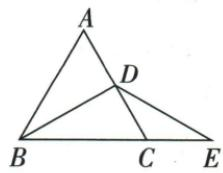

## 讲解

### 判据

等边三角形中，一个边中点与对面顶点相连，又给中线与外侧线段等长。先把中线转为顶角的平分线得到30°，再借外侧等腰三角形与外角关系，在目标小三角形内形成第二组等角对边。

### 流程

1. 原D为AC中点，BD是从顶点B到对边AC的中线。等边三角形也满足$AB=BC$，因此对顶角B使用三线合一，BD平分60°的$\angle ABC$，每个半角为30°。
2. 原B、C、E依次共线，射线BE与BC同向，所以$\angle DBE=30^{\circ}$。给定$DB=DE$，△BDE的这两边所对的$\angle BED$与$\angle DBE$相等，故$\angle BED=30^{\circ}$。
3. 在△CDE里，$\angle ACB=60^{\circ}$是C处外角。外角等于两个不相邻内角的和，所以$\angle CDE+\angle CED=60^{\circ}$；$\angle CED$就是刚求出的30°，得$\angle CDE=30^{\circ}$。
4. 同一个△CDE中，$\angle CDE=\angle CED$，所对的CE与CD相等。D为AC中点且原$AC=3$，因此$CD=3/2$，所求CE也为$3/2$。
5. 每次等角对等边都要指明所在三角形与对边。D在哪条边上决定哪一条线是中线，不能看到“等边、中点”便随意平分另一个角。

## 例题

### 等边边3中点等腰两层30得CE三比二

> 来源ID Q21-14；第21章等腰三角形；201-250/full.md 第4221–4221行。原答案与解析定位：201-250/full.md 第4223–4243行。

例6 如图,等边三角形 ABC 的边长为 3,D 是 AC 的中点,点 E 在 BC 的延长线上,若 DE=DB,求 CE 的长.

**原资料答案与解析：**

解析 $\because \triangle ABC$ 是等边三角形, $D$ 是 $AC$ 的中点,

$\therefore \angle ABC = \angle ACB = 60^{\circ}, BD$ 为 $\angle ABC$ 的平分线，

$\therefore \angle DBE = \frac{1}{2}\angle ABC = 30^{\circ}.$ 又 $DE = DB,\therefore \angle E = \angle DBE = 30^{\circ}.$

$\because \angle ACB = \angle CDE + \angle E, \therefore \angle CDE = \angle ACB - \angle E = 30^{\circ} \therefore \angle CDE = \angle E, \therefore CE = CD.$

∵ 等边三角形 ABC 的边长为 3, D 是 AC 的中点, ∴ $CE = CD = \frac{1}{2} AC = \frac{3}{2}$ .

**展开解析（依据原详解补足理由与步骤）：**

ABC等边，B=C60°；D为AC中点，等腰ABC顶B三线合一使BD平分B，DBE30°（B-C-E同向）。DB=DE使DBE=BED30°。ACB60°是CDE在C的外角，CDE+E=60，CDE30°。CDE同三角两角30相等，CE=CD=AC/2=3/2。原D在AC中点而不是BC中点，不把BD当对应另一底边的中线。

## 易错

D是哪边中点决定哪个顶角被平分；不能把三线合一套给任意腰上的中线。
