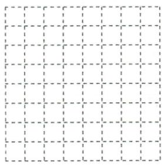
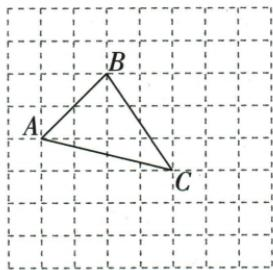

## 讲解

### 判据

格边1、三边2√2/√13/√17，平方8/13/17拆成两整格偏移。

### 流程

1.8=2²+2²，13=2²+3²，17=4²+1²。2.按原答案图从A到B右2上2、到C右4下1。3.B到C自然右2下3，三边全部回验。4.仅给一种满足即够，原网格有限，要所有顶点落其内；三段各自能画不保证一个三角同时满足。

## 例题

### 网格三边根号8根号13根号17同步选三点

> 来源ID Q22-08；第22章勾股定理；201-250/full.md 第4645–4653行。原答案与解析定位：201-250/full.md 第4655–4669行。

例4 在如图所示的正方形网格中,已知每个小正方形的边长都是1.请在网格中画出格点三角形 $ABC$ , 使 $AB = 2\sqrt{2}, BC = \sqrt{13}, AC = \sqrt{17}$ . (格点三角形的顶点均为网格线的交点)

**原资料答案与解析：**

解析 $\because (2\sqrt{2})^2 = 2^2 + 2^2, \therefore AB$ 可以看作是以 2 为直角边长的等腰直角三角形的斜边.

$\because (\sqrt{13})^2 = 2^2 + 3^2, \therefore BC$ 可以看作是以2、3为直角边长的直角三角形的斜边.

$\because (\sqrt{17})^{2}=4^{2}+1^{2},\therefore AC$ 可以看作是以4、1为直角边长的直角三角形的斜边.

所求作的 $\triangle ABC$ 如图所示.

**展开解析（依据原详解补足理由与步骤）：**

原答案图以A为相对原点，B比A右2上2，C比A右4下1；不是新作数字题，而是读原图格点偏移。AB²=2²+2²=8，AB2√2；BC从B右2下3，BC²=2²+3²=13；AC²=4²+1²=17。三组共用同一A/B/C才同时满足，不可三个长度各画一段却端点不相连。格宽1，水平垂直偏移计“格”不是计格线根数。

## 易错

数格线间隔不数线数，偏移上下符号影响第三边但平方本身消符号。
