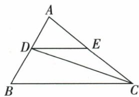
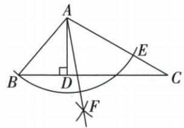

## 讲解

### 判据

同图有平分线与高或平行线，先求被平分的具体整角，再把半角移到目标所在小三角形。

### 流程

1.由原角和、直角差或平行同旁性质求整角。2.确认是哪条内部平分线，把该整角除2，记清顶点。3.由原线的位置用整角减半角或三角和求目标；平行移角时写截线。4.原20/100题先C40半20、D整120差100；原80/30题先C差50、A40半20、E目标100。5.回验所求目标角名，不把中间数直接交答案。

## 例题

### 角平分与平行先20度再整角差100度

> 来源ID Q19-05；第19章三角形；201-250/full.md 第1868–1868行。原答案与解析定位：201-250/full.md 第1870–1892行。

例2 如图, $DE \parallel BC$ , $CD$ 是 $\triangle ACB$ 的角平分线, $\angle B = 60^{\circ}$ , $\angle ACB = 40^{\circ}$ , 求 $\angle EDC$ 与 $\angle BDC$ 的度数.

**原资料答案与解析：**

解析 $\because CD$ 是 $\triangle ACB$ 的角平分线, $\angle ACB = 40^{\circ}$ , $\therefore \angle DCB = \frac{1}{2} \angle ACB = 20^{\circ}$ ,

$$
\because D E \parallel B C, \therefore \angle E D C = \angle D C B = 2 0 ^ {\circ}, \angle B D E + \angle B = 1 8 0 ^ {\circ},
$$

又∵ $\angle B=60^{\circ},\therefore \angle BDE=180^{\circ}-60^{\circ}=120^{\circ},$

$$
\therefore \angle B D C = \angle B D E - \angle E D C = 1 2 0 ^ {\circ} - 2 0 ^ {\circ} = 1 0 0 ^ {\circ}.
$$

**展开解析（依据原详解补足理由与步骤）：**

CD平分ACB40°，DCB20°。DE∥BC，以DC为截线得EDC=DCB=20°。再以AB为截线，BDE与B同旁互补，BDE=180°−60°=120°。原DC在BDE内部，所以BDC=BDE−EDC=120°−20°=100°。也可在△BCD用B60°、C20°求D100°，这是回验，不把图上E的位置或DC内部关系当可随便改变。两目标分别20°、100°。

### 原尺规角平分作图结合高求10度

> 来源ID Q19-08；第19章三角形；201-250/full.md 第1938–1946行。原答案与解析定位：201-250/full.md 第1960–1967行。

例1 (2024 江苏宿迁) 如图, 在 $\triangle ABC$ 中, $\angle B = 50^{\circ}$ , $\angle C = 30^{\circ}$ , $AD$ 是高, 以点 $A$ 为圆心, $AB$ 长为半径画弧, 交 $AC$ 于点 $E$ , 再分别以 $B, E$ 为圆心, 大于 $\frac{1}{2} BE$ 的长为半径画弧, 两弧在 $\angle BAC$ 的内部交于点 $F$ , 作射线 $AF$ , 则 $\angle DAF =$ \_\_\_\_°.

**原资料答案与解析：**

例1 解析∵AD是△ABC的高，
∴∠BDA=90°，又∵∠B=50°，
∠C=30°，∴∠BAD=40°，∠BAC
=100°.由作图可知AF是∠BAC
的平分线，∴∠BAF=50°，
∴∠DAF=10°.

答案 10

**展开解析（依据原详解补足理由与步骤）：**

以A圆心AB长取AC上的E，保证AB=AE；以B、E作两段同半径弧，内部交点F满足BF=EF；AF共同，△ABF与△AEF三边对应相等，SSS全等给BAF=FAE。因此AF是BAC内部平分射线。原B50°、C30°给BAC=180°−50°−30°=100°，BAF50°。AD高给BAD=90°−B50°=40°。原AF在BAC内且位于AD右侧，DAF=BAF−BAD=50°−40°=10°。作图并非量出50°；角平分来源是等半径与全等。F画在三角形外仍在角的内部区域，射线AF的三角形内部段需另止于BC。

### 高分80再角平分得20最后求100

> 来源ID Q19-17；第19章三角形；201-250/full.md 第2345–2353行。原答案与解析定位：201-250/full.md 第2307–2321行。

例2 (2024 四川凉山州) 如图, $\triangle ABC$ 中, $\angle BCD = 30^{\circ}$ , $\angle ACB = 80^{\circ}$ , $CD$ 是边 $AB$ 上的高, $AE$ 是 $\angle CAB$ 的平分线, 则 $\angle AEB$ 的度数是 \_\_\_\_.

**原资料答案与解析：**

例2 解析 $\because \angle ACB = 80^{\circ},$ $\angle BCD = 30^{\circ},\therefore \angle ACD = 50^{\circ}.$

又∵CD是边AB上的高，

$$
\therefore \angle C A D = 4 0 ^ {\circ}, \angle B = 6 0 ^ {\circ}.
$$

∵ AE 是 $\angle CAB$ 的平分线，

$$
\therefore \angle B A E = 2 0 ^ {\circ}, \therefore \angle A E B = 1 0 0 ^ {\circ}.
$$

答案 $100^{\circ}$

**展开解析（依据原详解补足理由与步骤）：**

原CD在ACB80°内部，BCD30°，ACD=80°−30°=50°。CD⊥AB，在ACD中CAD=90°−50°=40°；A-D-B共线，CAB40°。AE内部平分CAB，BAE20°。在BCD中B=90°−30°=60°，即ABE60°。△ABE内角和给AEB=180°−20°−60°=100°。中间50是C处、40是A处、20是A半角，目标是E处100，不能拿首个差当答案。

## 易错

平分的不一定题给某个角，例如AE分A40而非C80；两次差产生的50/40分别属不同顶点。
