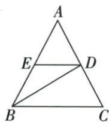
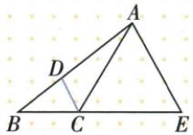

## 讲解

### 判据

图中有角平分线，又有经过其交点的直线平行于原角的一边。先找小三角形的两个角能否分别等于同一个半角；若能够，再用等角对等边认定小三角形等腰，不能直接把“角平分”当成“线段平分”。

### 流程

1. 原E在AB上，BD平分$\angle ABC$，因此$\angle EBD=\angle DBC$。E在原角边上保证了$\angle EBD$就是这个半角，不能省略点的位置条件。
2. 原DE平行BC，用BD作为截线可得$\angle EDB=\angle DBC$。这里必须按射线方向找对应的内错角，不是把图中所有带D的角都当相等。
3. 两个等式具有同一个$\angle DBC$，故$\angle EBD=\angle EDB$。在△BED中，两角的对边分别是DE、BE，由等角对等边得到$DE=BE$。
4. 若后续题要求等边，还需继续证明第三个角也是60°，或第三条边也相等。原120°角平分题先得两个60°，再由内角和得第三个60°，才可判等边。
5. 全程先转角、后转边。平行条件负责搬角，角平分条件负责给相等半角，三角形的等角对等边负责长度相等，三条依据不能互换。

## 例题

### 角平分与平行搬一半角判BED等腰

> 来源ID Q21-13；第21章等腰三角形；201-250/full.md 第4197–4199行。原答案与解析定位：201-250/full.md 第4201–4213行。

例5 如图,在 $\triangle ABC$ 中,已知 $BD$ 是 $\angle ABC$ 的平分线,且 $DE \parallel BC$ .

求证: $\triangle BED$ 是等腰三角形.

**原资料答案与解析：**

证明 $\because BD$ 是 $\angle ABC$ 的平分线, $\therefore \angle EBD = \angle DBC$ . $\because DE \parallel BC$ , $\therefore \angle EDB = \angle DBC$ .

$\therefore \angle EBD = \angle EDB, \therefore BE = DE, \therefore \triangle BED$ 是等腰三角形.

**展开解析（依据原详解补足理由与步骤）：**

原E在AB、D在AC。BD平分ABC给EBD=DBC；DE∥BC用BD截得EDB=DBC；两角共同等于DBC，EBD=EDB。BED同一三角形中这两角的对边DE、BE相等，故等腰。已知夹角平分不直接给BE=DE，必须借平行搬角再用等角对等边。

### 120外延和平行半角60判等边

> 来源ID Q21-08；第21章等腰三角形；201-250/full.md 第4063–4065行。原答案与解析定位：201-250/full.md 第4067–4077行。

例2 如图, 在 $\triangle ABC$ 中, $\angle ACB=120^{\circ}$ , $CD$ 平分 $\angle ACB$ , $AE \parallel DC$ , $AE$ 交 $BC$ 的延长线于点 $E$ , 证明 $\triangle ACE$ 是等边三角形.

**原资料答案与解析：**

证明 $\because \angle ACB = 120^{\circ}, CD$ 平分 $\angle ACB, \therefore \angle ACE = 60^{\circ}, \angle ACD = \angle BCD = \frac{1}{2} \angle ACB = 60^{\circ}$ .

$$
\begin{array}{r l} & \because A E \parallel D C, \therefore \angle A C D = \angle C A E, \\ & \angle B C D = \angle E, \end{array}
$$

$$
\therefore \angle C A E = \angle E = \angle A C E = 6 0 ^ {\circ},
$$

∴ $\triangle ACE$ 是等边三角形.

**展开解析（依据原详解补足理由与步骤）：**

原B-C-E共线，ACE与ACB邻补，ACE=180−120=60°。CD平分120给ACD=BCD=60°。AE∥DC，以AC截得CAE=ACD=60°，以BCE截得E=BCD=60°。ACE三内角60，等角对等边得三边相等，故等边。每个60来源不同，不把原大三角ABC称为等边。

## 易错

必须核E位于原角边上、截线角对正确，不能看到平行和角平分便任意选两边相等。
