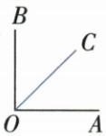
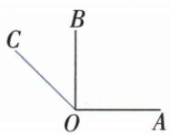

## 错法

原OC从AOB顶点O引出便默认内部，用90−45得45，没看题未写“内”。同顶点只说明起点相同，外部方向仍合法；给与OB夹角45能在OB两侧形成两支。

## 正解

先由AOB90=2BOC得到BOC45。OB朝OA一侧的OC在原直角内部，AOC45；背OA一侧则从OA先过OB再到OC，AOC90+45=135。固定OB与普通夹角45的两侧各一支，分类完备。原两图均保留，若以后新增内部限制才只留第一支，不借自己草图删除另一支。半角数值也不能单独判平分，必须内部划分条件同时成立。

## 例题

### 三句平分线辨析核射线和内部位置

> 来源ID Q16-27；第16章图形的初步认识；151-200/full.md 第3670–3675行。原答案与解析定位：151-200/full.md 第3670–3675行。

1.从一个角的顶点出发，把这个角分成两个相等的角的直线，叫作这个角的平分线。（×）

2.角的平分线一定在角的内部.
(√)

3. 若 $\angle BOC = \frac{1}{2} \angle BOA$ ，则 $OC$ 是 $\angle BOA$ 的平分线。（×）

**原资料答案与解析：**

1.从一个角的顶点出发，把这个角分成两个相等的角的直线，叫作这个角的平分线。（×）

2.角的平分线一定在角的内部.
(√)

3. 若 $\angle BOC = \frac{1}{2} \angle BOA$ ，则 $OC$ 是 $\angle BOA$ 的平分线。（×）

**展开解析（依据原详解补足理由与步骤）：**

①原定义用了“直线”，错；角平分线从顶点朝角内部伸出，是射线，反向另一半直线不属于它。②按本章小于180°的通常角及平角内部选定的一半，平分射线在所分角内部，原√；特殊动态角需先指定所分角的转动区域，不能只凭边重合。③仅∠BOC是∠BOA一半未给OC在角内，OC可能在OB另一侧外部同样与OB成该半角，未能把原角分两相等部分，故×。正确需OC在∠BOA内部，并有∠BOC=∠COA；或结合内部与一半关系推出另一半。

### 未定OC内外位置的角度分类两解

> 来源ID Q16-33；第16章图形的初步认识；151-200/full.md 第3860–3860行。原答案与解析定位：151-200/full.md 第3862–3874行。

例5 已知 $\angle AOB = 90^{\circ}$ , OC 是从 $\angle AOB$ 的顶点 O 引出的一条射线, 若 $\angle AOB = 2\angle BOC$ , 求 $\angle AOC$ 的度数.

**原资料答案与解析：**

解析 因为 $\angle AOB = 90^{\circ}, \angle AOB = 2\angle BOC$ ，所以 $\angle BOC = 45^{\circ}$ .

分以下两种情况:(1)当 OC 在 $\angle AOB$ 的内部时(如图 1), $\angle AOC = \angle AOB - \angle BOC = 90^{\circ} - 45^{\circ} = 45^{\circ}$ ;

(2) 当 OC 在 $\angle AOB$ 的外部时 (如图 2), $\angle AOC = \angle AOB + \angle BOC = 90^{\circ} + 45^{\circ} = 135^{\circ}$ .

综上, $\angle AOC$ 的度数为 $45^{\circ}$ 或 $135^{\circ}$ .

  
图1

  
图 2

**展开解析（依据原详解补足理由与步骤）：**

AOB90°又为BOC两倍，BOC=90/2=45°。OC可在OB朝OA的一侧，位于AOB内部，AOC=AOB−BOC=45°；也可在OB背离OA一侧，位于外部，AOC=AOB+BOC=135°。固定OB与它夹45°的射线在平面两侧各一条，正好这两种，不再漏第三类。原未说OC在AOB内部，不能只画内侧答45。两结果都是通常小于180°的角，若题另指定有向旋转角则要按其定义重新读。
