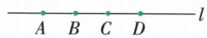
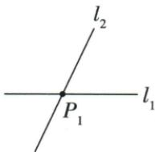
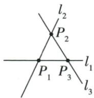
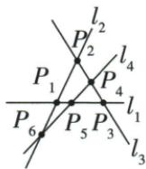

## 讲解

### 是什么

经过两个不同点有一条直线，并且只有一条，这叫两点确定一条直线。前半说存在，后半说唯一。它是本章几何的基本事实，作为进一步推理起点，不将其伪装成由画得像直线证明的定理。

### 怎么来的

一个点只能定位经过哪里，方向仍可转成无数条线；再固定另一个不同点，穿过两点的方向和位置都被锁定，所以引入这一存在与唯一的起点。原砌墙两个墙脚桩位置固定，拉直参照绳穿过两处，就给砖的唯一直线位置，选B。三点若共线，各两点确定的AB、AC、BC只是同一直线多个名称；若三点不共线，则三对点确定三条不同直线。两不同直线不能有两个不同公共点，否则它们都穿过相同两点而应由唯一性成为同一条，故平面两不同直线一旦相交最多一个交点。

### 什么时候能用

两点必须不同；重合点仍只给一个位置。计n条直线交点需原线两两相交且各线不同，同一点可为多对线的交点，所以最多n(n−1)/2在无三线共点时达到，最少全共一点为1，不能不核共点就固定最大。本文没有与该n线交点极值匹配的独立例题，仅依原理论说明边界。两点间距离最短是另一基本事实，不直接代替唯一线的定位判据。

本章最大交点题补充使用“两点定线”的反向约束：两条不同直线若有两个公共点，就应是过这两点的唯一同一直线，与不同矛盾，因此至多交一次。它提供每对线至多一个交点的依据；最大n(n−1)/2还需无平行、无三线共点，不能仅凭两点定线便说任意n线都达到最大。

## 例题

### 四共线点不重复数端点对得六线段

> 来源ID Q16-18；第16章图形的初步认识；151-200/full.md 第3352–3354行。原答案与解析定位：151-200/full.md 第3356–3358行。

例2 如图, $A, B, C, D$ 是直线 $l$ 上的四个点, 则图中共有几条线段?

**原资料答案与解析：**

解析 解法一(端点确定法):以点A为左端点的线段有3条(线段AB,线段AC,线段AD),以点B为左端点的线段有2条(线段BC和线段BD),以点C为左端点的线段有1条(线段CD),因此共有 $3+2+1=6$ 条线段.

解法二(公式法):由公式可得题图中共有 $\frac{4\times(4-1)}{2}=6$ 条线段.

**展开解析（依据原详解补足理由与步骤）：**

原点依次A、B、C、D。先以A为最左端数AB、AC、AD3条；再以B为最左端数BC、BD2条；再以C数CD1条，总3+2+1=6。反向BA、CA等与已计段相同，不再加。公式法四点每点可配其他三点给4×3次有向选择，每条无向线段被两端各数一次，因此除2得4×3/2=6。原画直线l意味着四点所有两点间的线段都包含在原直线上，非只数三个相邻短段。

### 砌墙两桩定位选两点定直线而非最短

> 来源ID Q16-24；第16章图形的初步认识；151-200/full.md 第3474–3490行。原答案与解析定位：151-200/full.md 第3466–3468行。

例（2022 湖北十堰）如图,工人砌墙时,先在两个墙脚的位置分别插一根木桩,再拉一条直的参照线,就能使砌的砖在一条直线上.这样做应用的数学知识是()

A.两点之间,线段最短

B.两点确定一条直线

C.垂线段最短

D.三角形两边之和大于第三边

**原资料答案与解析：**

例 解析 根据题干中的关键词 “在一条直线上” 可知应用的数学知识是两点确定一条直线.

答案B

**展开解析（依据原详解补足理由与步骤）：**

两个不同墙脚木桩确定参照线位置，拉直的绳通过这两点，按两点有且仅有一条直线，砖沿此唯一方向排直，所以B对。A两点间线段最短讲路径长度，不直接解释线位置被两点唯一确定；C垂线段最短讲点到直线垂距，题无垂足最短要求；D三角形两边和大第三讲三段长度，非此定位依据。选B。图仅辅助生活场景，两个固定位置及“排成一直线”是判据，不据工人动作猜数学事实。

### 逐次加线与直线两两配对求最大交点

> 来源ID Q17-05；第17章相交线与平行线；201-250/full.md 第212–212行。原答案与解析定位：201-250/full.md 第214–224行。

例5 $l_{1}$ 和 $l_{2}$ 是同一平面内的两条相交直线, 它们有 1 个交点, 如果在这个平面内, 再画第三条直线 $l_{3}$ , 那么这 3 条直线最多可有 \_\_\_\_ 个交点; 如果在这个平面内, 再画第四条直线 $l_{4}$ , 那么这 4 条直线最多可有 \_\_\_\_ 个交点. 由此我们可以推测: 在同一平面内, 6 条直线最多可有 \_\_\_\_ 个交点, n (n 为大于 1 的整数) 条直线最多可有 \_\_\_\_ 个交点.

**原资料答案与解析：**

解析 如图,2 条直线相交,有 1 个交点;3 条直线相交,交点个数最多是 $1+2=3$ ;4 条直线相交,交点个数最多是 $1+2+3=6$ ;……以此类推,n(n 为大于 1 的整数)条直线相交,交点个数最多是 1+

$2+3+\cdots+(n-1)=\frac{n(n-1)}{2}$ . 当 n=6 时, 交点个数最多是 $\frac{6\times(6-1)}{2}=15$ .

答案 3;6;15; $\frac{n(n-1)}{2}$

**展开解析（依据原详解补足理由与步骤）：**

原来两条相交直线有1交点。新增第三条线至多分别交两条旧线得2个新交点，最多1+2=3；第四条至多再给3个新交点，最多1+2+3=6。逐条增加，第k条线至多给k−1个新交点。

$$1+2+\cdots+(n-1)=\frac{n(n-1)}2.$$

另一计法：n条不同直线选一条n种，再选另一条n−1种，每对因顺序数了两次，除2；同一对在平面上至多交一次。n=6给6×5÷2=15。达到上限须每两线相交且不同线对不共用交点，即无平行、无三线共点；有平行或三线共点都会减少不同交点。答案3、6、15、n(n−1)/2，n为大于1的整数。

## 易错

原墙例A是长度性质、B是定位性质；“两点”是两不同位置而非把同一个位置叫两个字母。三点计线先核共线避免三条重合线重复。
