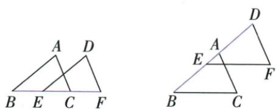
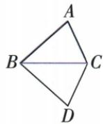
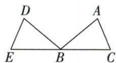
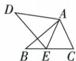
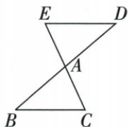
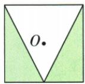
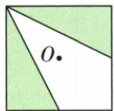
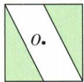
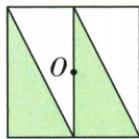

## 讲解

### 是什么

能完全重合的两个图形全等，不限三角形。形状与大小都相同，位置可以不同，边界长度与面积也相同。整体平移、翻折、旋转只改位置不改大小，均能产生全等图形；只有面积相等或周长相等不足以保证形状相同。

### 怎么来的

平移给每一点同一位移，两点差位置不变；旋转以同一中心和角度整体转，两点的相对长度与夹角不变；翻折使每点与像点连线被折线垂直平分，反向后仍能完全重合。原三种几何示图按对应A-D或固定顶点A/B记录，不以朝向不同否认全等。图中相同大小也要对应全部结构；原警示“勿将等积混全等”说明区域面积数值相等并不能唯一固定边角。全等比面积等强，不能倒推。

### 什么时候能用

全图采用同一动作才可按保持关系使用，不能只移动某点其余固定仍叫全图平移。缩放虽然保持形状但改变大小，通常相似而不全等；缩放比1退回原大小。反射翻折可改变左右手朝向，不影响全等，因为允许翻折重合。

第25章将三类变换的识别条件区分开：平移须每点同向同距，反射须同一轴中垂不同对应点，旋转须同中心同方向同角度。它们都保长度/角/面积，但“全等”不能反推出指定一种变换，更不能保证绕题给O的半转。仪器内线、阴影和连接顺序参与完整图形的重合；原甲骨文与四幅作图例已逐项说明。

## 例题

### 共顶点全等对应及角差四句辨析

> 来源ID Q20-01；第20章全等三角形；201-250/full.md 第2457–2472行。原答案与解析定位：201-250/full.md 第2474–2480行。

例 如图所示, $\triangle ABC\cong\triangle AEF$ ,
AB=AE, $\angle B=\angle E$ ,下列结论正确
的是\_\_\_\_.(填序号)

①AC = AF;   
② $\angle FAB = \angle EAB;$   
③EF=BC;   
④ $\angle EAB = \angle FAC.$

**原资料答案与解析：**

解析 由题意得 AC 与 AF, EF 与 BC 是对应边, 所以 AC = AF, EF = BC, 所以①③正确.

由题意得 $\angle BAC$ 和 $\angle EAF$ 是对应角,所以 $\angle BAC=\angle EAF$ ,所以 $\angle EAB=\angle FAC$ ,所以④正确.

根据已知条件无法确定∠FAB与∠EAB是否相等,所以②不一定正确.

答案 ①③④

**展开解析（依据原详解补足理由与步骤）：**

由△ABC≌△AEF，对应A-A、B-E、C-F。①AC=AF是对应边，真；③BC=EF也真。A处对应角BAC=EAF，原射线依次AE、AB、AF、AC；两个整体都包含BAF，共减BAF得EAB=FAC，④真。②FAB即公共小角BAF，已知并未给它等于EAB，不能从两个整体角等便断每个相邻小块都相等，故不一定真。答①③④。全等字母顺序是主要对应依据，不能只因两线共顶点A就任意匹配。

### 原三种全等变换示图对应和长度保持

> 来源ID Q20-35；第20章全等三角形；201-250/full.md 第2447–2449；2501–2515行。原答案与解析定位：201-250/full.md 第2447–2449行；201-250/full.md 第2501–2515行。

(1) 平移型: 如图, 将 $\triangle ABC$ 沿直线 BC 方向 (或 BA 方向) 平移 BE 的长度, 得到 $\triangle DEF$ , 则 $\triangle ABC \cong \triangle DEF$ .

(2) 翻折型: 如图 1, 将 $\triangle ABC$ 沿直线 $BC$ 翻折, 得到 $\triangle DBC$ , 则 $\triangle ABC \cong \triangle DBC$ ; 如图 2, 将 $\triangle ABC$ 翻折得到 $\triangle DBE$ , 则 $\triangle ABC \cong \triangle DBE$ . ④

  
图1

  
图2

(3)旋转型:如图3,将 $\triangle ABC$ 绕点A顺时针旋转一定的角度得到 $\triangle ADE$ ,则 $\triangle ABC\cong\triangle ADE$ ;如图4,将 $\triangle ABC$ 绕点A旋转180°得到 $\triangle ADE$ ,则 $\triangle ABC\cong\triangle ADE$ .

  
图3

  
图 4

**原资料答案与解析：**

(1) 平移型: 如图, 将 $\triangle ABC$ 沿直线 BC 方向 (或 BA 方向) 平移 BE 的长度, 得到 $\triangle DEF$ , 则 $\triangle ABC \cong \triangle DEF$ .

(2) 翻折型: 如图 1, 将 $\triangle ABC$ 沿直线 $BC$ 翻折, 得到 $\triangle DBC$ , 则 $\triangle ABC \cong \triangle DBC$ ; 如图 2, 将 $\triangle ABC$ 翻折得到 $\triangle DBE$ , 则 $\triangle ABC \cong \triangle DBE$ . ④

  
图1

  
图2

(3)旋转型:如图3,将 $\triangle ABC$ 绕点A顺时针旋转一定的角度得到 $\triangle ADE$ ,则 $\triangle ABC\cong\triangle ADE$ ;如图4,将 $\triangle ABC$ 绕点A旋转180°得到 $\triangle ADE$ ,则 $\triangle ABC\cong\triangle ADE$ .

  
图3

  
图 4

**展开解析（依据原详解补足理由与步骤）：**

平移所有点同方向同距离移动，任何两点间长度与边夹角不变；原ABC移到DEF，A-D、B-E、C-F。沿BC翻折则B、C在轴上固定，A移到D，ABC与DBC全等；另一翻折图B固定、A-D、C-E。绕A转图A固定、B-D、C-E，旋转180°也是同规则。角边关系由整体变换保持，不把图上某一点移动却其余不動当同一种变换；周长、面积也不变。原段中不相关装饰已排除，只用真正变换几何图。

### 化学仪器全图折叠重合逐项识别广口瓶

> 来源ID Q25-08；第25章图形的轴对称平移与旋转；301-350/full.md 第155–168行。原答案与解析定位：301-350/full.md 第116–118行。

例1（2024 重庆 A）下列四种化学仪器的示意图中, 是轴对称图形的是
()

  
A

  
B

  
C

  
D

**原资料答案与解析：**

例1 解析 如果一个平面图形沿着一条直线折叠, 直线两旁的部分能够互相重合, 那么这个图形是轴对称图形. 由此定义可知, C 选项符合题意.

答案 C

**展开解析（依据原详解补足理由与步骤）：**

A酒精灯外壳近似对称，但题图灯芯等内线偏向一侧，整个图不能沿同轴重合；B烧杯一侧有嘴，另一侧没有对应凸起；C广口瓶沿中央竖直线折叠，外轮廓和内部线条都成对重合；D导管弯向一侧，无相应另一侧结构。因此C正确。判断对象是提供的示意图全部线条，不是只看器具外形，也不声称现实所有同名器具都有同样对称性。

### 四句成轴对称辨析区分全等与对应线中垂

> 来源ID Q25-46；第25章图形的轴对称平移与旋转；251-300/full.md 第4791–4795行。原答案与解析定位：251-300/full.md 第4791–4795行。

1. 若两个图形全等，则它们成轴对称. (×)   
2. 两个成轴对称的图形面积相等.
(√)  
3. 轴对称图形的对称轴将这个图形分为全等的两部分. (√)  
4. 连接两个成轴对称的图形的一对对应点，作这条线段的垂线，就可以得到这两个图形的对称轴. (×)

**原资料答案与解析：**

1. 若两个图形全等，则它们成轴对称. (×)   
2. 两个成轴对称的图形面积相等.
(√)  
3. 轴对称图形的对称轴将这个图形分为全等的两部分. (√)  
4. 连接两个成轴对称的图形的一对对应点，作这条线段的垂线，就可以得到这两个图形的对称轴. (×)

**展开解析（依据原详解补足理由与步骤）：**

①错误：成轴对称能推出全等，但两图全等未必由一次轴反射互相对应；②正确：轴反射保长度及全等，因此面积相等；③正确：沿自身对称轴分开的两侧在折叠后重合，形状大小相同；④错误：对不同对应点，轴必须既垂直连接线又经过其中点，只垂直可能距两点不等。轴上的固定点对应自身，此时连接线退化，不能再谈零线段的中垂线。

### 四幅平移作图对应方向不变排除第三幅

> 来源ID Q25-13；第25章图形的轴对称平移与旋转；301-350/full.md 第312–325行。原答案与解析定位：301-350/full.md 第327–327行。

例2 下列平移作图中,错误的是
.

  
①

  
②

  
③

  
④

**原资料答案与解析：**

答案 ③

**展开解析（依据原详解补足理由与步骤）：**

①②④均能把各对应顶点用同一方向、同一长度的有向线段连接，三角形各边方向保持，符合平移。③的三角形斜边方向翻转，若把一个顶点移到对应位置，其余顶点不能用同样位移到位，它呈镜像而不是整体滑动，所以错误的是③。平移保全等只是必要结果；反射/旋转也保全等，要再查统一位移和方向。

### 六种甲骨文按滑动转动翻折分类

> 来源ID Q25-22；第25章图形的轴对称平移与旋转；301-350/full.md 第639–652行。原答案与解析定位：301-350/full.md 第654–654行。

例3 甲骨文是我国古代的一种文字,下列甲骨文中,能看作用其中一部分进行平移变换得到的是\_\_\_\_;能看作用其中一部分进行旋转变换得到的是\_\_\_\_;能看作用其中一部分进行轴对称变换得到的是\_\_\_\_.

**原资料答案与解析：**

答案 ③④;①⑤;②⑥

**展开解析（依据原详解补足理由与步骤）：**

③④的一部分只改变位置，边的朝向保持，且各点位移统一，属于平移；①⑤可以绕共同位置转动重合，用同中心同角度同方向移动各点，属于旋转；②⑥的左右部件按一条线翻折互相重合，属于轴对称。故平移③④、旋转①⑤、轴对称②⑥。观察对象是图案中的相应部件，不是说整体只能拥有一种对称；若一个图案同时允许几种解释，需按提供的对应部件和原图关系判断。

### 正方四种阴影三角对O半转逐项选C

> 来源ID Q25-41；第25章图形的轴对称平移与旋转；301-350/full.md 第1310–1322行。原答案与解析定位：301-350/full.md 第1271–1273行。

例1（2024 广东广州）下列图案中,点 O 为正方形的中心,阴影部分的两个三角形全等,则阴影部分的两个三角形关于点 O 对称的是()

  
A

  
B

  
C

  
D

**原资料答案与解析：**

例1 解析 把一个图形绕着某一点旋转 $180^{\circ}$ , 如果它能够与另一个图形重合, 那么就说这两个图形关于这个点对称.

答案 C

**展开解析（依据原详解补足理由与步骤）：**

A两块虽左右镜像全等，但都邻近下部，绕O半转会移到上部空白处，故不是；B对应顶点需转另一角度，180°不能逐点落到另一块；C左下与右上两块对应顶点相连均被O平分，半转重合，正确；D两块同处下部，半转像在上部而非给定另一块，不正确。因此选C。全等仅保证大小形状相同，不能保证题目指定中心O的180°转动把它们对应。

## 易错

原ABC与AEF共顶点图角差可成立，但不是把每个A处小角都对应相等；位置变化保持的是对应整角与整边。原大小不能由纸面面积观感决定。
