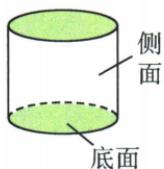
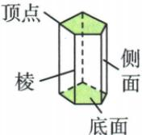
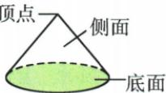
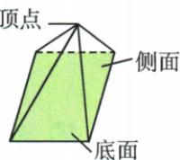
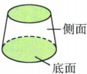
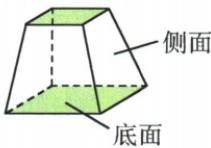
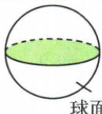

## 讲解

### 是什么

各部分都在同一平面的图形是平面图形，如线段、角、三角形、长方形、圆；各部分不都在同一平面的是立体图形，如正方体、圆柱、棱锥、球。立体再看底面与侧面：柱有两相同且平行的底面，锥有一底与汇聚的顶点，台由锥截去顶部而留两平行底，球表面为球面。

### 怎么来的

分类依据是几何组成，不是名字是否含“圆”。圆柱底是圆、侧是曲面；棱柱底多边形、侧为平行四边形，常见直棱柱侧是长方形。圆锥底圆、曲侧汇到顶点；棱锥的三角侧面共享同一锥顶。圆台上下圆一般大小不同，棱台底多边形、侧为梯形，这些台体是本书附带辨认范围，本文不额外添加体积考法。球没有把平面圆当外表面的底或侧分区。原分类六项中，三角形、长方形、圆可全共面，正方体、四棱锥、圆柱需空间，得到③⑤⑥。画立体时虚线常表示被遮住的边或轮廓，仍属于该立体，不能只数实线可见部分判断类型。

原书各类立体示意，虚线表示遮挡边界或轮廓，认底与侧时不要漏掉它们：

**圆柱**

**棱柱**

**圆锥**

**棱锥**

**圆台**

**棱台**

**球**

### 什么时候能用

用完整结构判断：某一视图看似圆不自动是球，圆柱从某个方向也能看到圆。仅有圆弧外轮廓不能决定整个体。棱柱命名的“几”取底边数，不是面数或总棱数；锥、台同理。教材常见直立图用于认形，推广到斜棱柱时侧面未必长方形，但仍为平行四边形，避免把常见画法写成全部类型的定义。

## 例题

### 六种图形按是否同一平面分类

> 来源ID Q16-01；第16章图形的初步认识；151-200/full.md 第2779–2785行。原答案与解析定位：151-200/full.md 第2787–2787行。

例1 下列几何图形中,属于立体图形的是\_\_\_\_.(填序号)

①三角形；②长方形；

③正方体；④圆；

⑤四棱锥；⑥圆柱.

**原资料答案与解析：**

答案 ③⑤⑥

**展开解析（依据原详解补足理由与步骤）：**

①三角形各部分可在同一平面，平面图；②长方形也是平面图；③正方体的六面不共一个平面，是立体图；④圆在同一平面，不要与球混同；⑤四棱锥含底与向空间顶点汇聚的侧面，是立体；⑥圆柱两底及曲侧不在同一平面，是立体。故③⑤⑥。纸上所画立体图的示意线在纸面，不等于它所表示的几何体本身在一个平面。

### n棱柱与n棱锥按底侧分组计数

> 来源ID Q16-02；第16章图形的初步认识；151-200/full.md 第2789–2789行。原答案与解析定位：151-200/full.md 第2791–2791行。

例2 n 棱柱共有 \_\_\_\_ 个顶点，\_\_\_\_ 条棱，\_\_\_\_ 个面；n 棱锥共有 \_\_\_\_ 个顶点，\_\_\_\_ 条棱，\_\_\_\_ 个面.

**原资料答案与解析：**

答案 2n;3n;(n+2); (n+1);2n; $(n+1)$

**展开解析（依据原详解补足理由与步骤）：**

n指底面边数，通常n≥3且为整数。n棱柱：上下两个n边形各n顶点，共2n；两底边各n，加连接对应顶点的n条侧棱，共3n；两个底面加n侧面，共n+2。n棱锥：底n顶点加共同锥顶1，共n+1；底n边加锥顶连每个底顶点的n条侧棱，共2n；底1面加n三角侧面，共n+1。题六空依次2n、3n、n+2、n+1、2n、n+1，三者计数对象勿串位。

### 有盖圆柱展开图逐项核底面与曲侧

> 来源ID Q16-03；第16章图形的初步认识；151-200/full.md 第2815–2826行。原答案与解析定位：151-200/full.md 第2828–2828行。

例3 小红想设计制作一个圆柱形的有盖礼品盒,下列展开图中设计正确的是 ( )

**原资料答案与解析：**

答案 C

**展开解析（依据原详解补足理由与步骤）：**

原有盖盒按完整圆柱表面：侧面沿一条母线剪开展成长方形，须配上下两张相同圆底。A是扇形加一圆，对应圆锥而非柱，错；B长方形只配一圆，少盖或底，非原有盖完整盒；C长方形配相对长边两侧的两圆，可分别封上下底，正确；D两端图形是小长方形，不能封圆底，错。选C。还须侧长匹配底圆周、两圆同半径；本题按图给定设计选类型，不凭示意比例猜精确半径。

### 六张完整展开图按底侧匹配还原

> 来源ID Q16-06；第16章图形的初步认识；151-200/full.md 第2989–3007行。原答案与解析定位：151-200/full.md 第3009–3011行。

例2 某些立体图形的平面展开图如图所示,请写出各平面图形所对应的立体图形的名称.

  
(1)

  
(2)

  
(3)

  
(4)

  
(5)

  
(6)

**原资料答案与解析：**

解析 (1) 正方体. (2) 圆柱. (3) 三棱柱. (4) 圆锥. (5) 五棱柱. (6) 四棱锥.

提示:可以想象让某个面不动,其他各面都向该面折叠,看能折叠成什么几何体.

**展开解析（依据原详解补足理由与步骤）：**

（1）六个等大正方形按图形成两排错位连接，折成六个不同面，是正方体。（2）长方形作曲侧展开、两相同圆封上下底，是圆柱。（3）三个长方形围侧面，两全等三角形封底，是三棱柱，三角底每边对应一个侧长方形。（4）扇形两半径边合拢，弧成为底圆周，再配一圆底，是圆锥。（5）两五边形底加五侧面，是五棱柱，“五”数底边，非数所有棱。（6）一个四边形底、四个共锥顶的三角侧面，是四棱锥。先核各面种类、数量，再核连接能闭合且不重叠；随便凑同数量碎片未必是展开图。

### 四棱锥只问侧面展开与完整表面区分

> 来源ID Q16-09；第16章图形的初步认识；151-200/full.md 第3081–3093行。原答案与解析定位：151-200/full.md 第3049–3051行。

例2 (2024 江苏常州)下列图形中,为四棱锥的侧面展开图的是 ( )

  
A

  
B

  
C

  
D

**原资料答案与解析：**

例2 解析 A 选项中的图形是四棱柱的侧面展开图; B 选项中的图形是四棱锥的侧面展开图; C 选项中的图形是圆锥的侧面展开图; D 选项中的图形是正方体的表面展开图.

答案B

**展开解析（依据原详解补足理由与步骤）：**

四棱锥底是四边形，侧面有四个三角形共锥顶；问侧面展开，不要求把四边形底也画入。A四个长方形侧片围成四棱柱侧面，非锥；B四个三角形共一个顶点扇状连接，合拢可成四棱锥四侧，正确；C单扇形是圆锥曲侧面展开，非多片三角面；D六个方片是正方体完整表面展开，不是棱锥侧面。选B。少底面不自动错，先看原问完整表面还是仅侧面。

## 易错

原有盖圆柱需要两个圆底，少一个底不是完整有盖盒；四棱锥侧面四个三角片，不能按总棱条数叫八棱锥。
