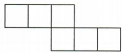
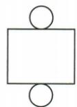
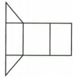
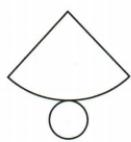
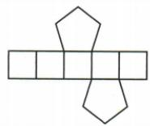
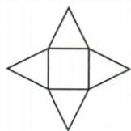
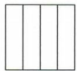
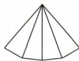
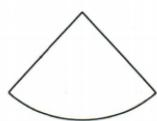
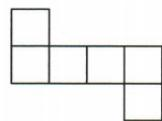

## 讲解

### 是什么

棱锥由一个多边形底面和若干三角侧面围成，各侧面共享底面以外的同一锥顶。底n边的n棱锥有n个侧面；顶点n+1，棱2n，面n+1，n≥3整数。四棱锥“4”是底边数、侧面数，非所有棱数。

### 怎么来的

每条底边与锥顶决定一个三角侧面，绕底一圈正好n面。顶点分底n个加独立锥顶1；棱分底n条加锥顶连每个底顶点的n条侧棱；面分底1加侧n，所以三项分别n+1、2n、n+1。相邻侧面共享一条锥顶到底顶点的边，不因被两片面使用就多计。原四棱锥侧面展开B含四个共顶三角片，侧边合拢后围在四边形底周围。原完整展开图另画中央四边形底，区别“侧面展开”和“完整表面展开”不在它是不是同一个棱锥，而在展示的面范围。

底、侧、锥顶分组：

$$V=n+1,\quad E=n+n=2n,\quad F=1+n,\qquad n\ge3.$$

### 什么时候能用

一底加n三角侧面还须连接能围闭同一锥顶，并满足匹配边长；任意拼n三角碎片不自动成棱锥。圆锥侧为曲面，不是有限三角面组合，不能套2n棱计数。三棱锥四面都三角仍有一个选定底和三个侧，展开图未注明底时可先任选一面固定再跟踪折叠。

## 例题

### n棱柱与n棱锥按底侧分组计数

> 来源ID Q16-02；第16章图形的初步认识；151-200/full.md 第2789–2789行。原答案与解析定位：151-200/full.md 第2791–2791行。

例2 n 棱柱共有 \_\_\_\_ 个顶点，\_\_\_\_ 条棱，\_\_\_\_ 个面；n 棱锥共有 \_\_\_\_ 个顶点，\_\_\_\_ 条棱，\_\_\_\_ 个面.

**原资料答案与解析：**

答案 2n;3n;(n+2); (n+1);2n; $(n+1)$

**展开解析（依据原详解补足理由与步骤）：**

n指底面边数，通常n≥3且为整数。n棱柱：上下两个n边形各n顶点，共2n；两底边各n，加连接对应顶点的n条侧棱，共3n；两个底面加n侧面，共n+2。n棱锥：底n顶点加共同锥顶1，共n+1；底n边加锥顶连每个底顶点的n条侧棱，共2n；底1面加n三角侧面，共n+1。题六空依次2n、3n、n+2、n+1、2n、n+1，三者计数对象勿串位。

### 六张完整展开图按底侧匹配还原

> 来源ID Q16-06；第16章图形的初步认识；151-200/full.md 第2989–3007行。原答案与解析定位：151-200/full.md 第3009–3011行。

例2 某些立体图形的平面展开图如图所示,请写出各平面图形所对应的立体图形的名称.

  
(1)

  
(2)

  
(3)

  
(4)

  
(5)

  
(6)

**原资料答案与解析：**

解析 (1) 正方体. (2) 圆柱. (3) 三棱柱. (4) 圆锥. (5) 五棱柱. (6) 四棱锥.

提示:可以想象让某个面不动,其他各面都向该面折叠,看能折叠成什么几何体.

**展开解析（依据原详解补足理由与步骤）：**

（1）六个等大正方形按图形成两排错位连接，折成六个不同面，是正方体。（2）长方形作曲侧展开、两相同圆封上下底，是圆柱。（3）三个长方形围侧面，两全等三角形封底，是三棱柱，三角底每边对应一个侧长方形。（4）扇形两半径边合拢，弧成为底圆周，再配一圆底，是圆锥。（5）两五边形底加五侧面，是五棱柱，“五”数底边，非数所有棱。（6）一个四边形底、四个共锥顶的三角侧面，是四棱锥。先核各面种类、数量，再核连接能闭合且不重叠；随便凑同数量碎片未必是展开图。

### 四棱锥只问侧面展开与完整表面区分

> 来源ID Q16-09；第16章图形的初步认识；151-200/full.md 第3081–3093行。原答案与解析定位：151-200/full.md 第3049–3051行。

例2 (2024 江苏常州)下列图形中,为四棱锥的侧面展开图的是 ( )

  
A

  
B

  
C

  
D

**原资料答案与解析：**

例2 解析 A 选项中的图形是四棱柱的侧面展开图; B 选项中的图形是四棱锥的侧面展开图; C 选项中的图形是圆锥的侧面展开图; D 选项中的图形是正方体的表面展开图.

答案B

**展开解析（依据原详解补足理由与步骤）：**

四棱锥底是四边形，侧面有四个三角形共锥顶；问侧面展开，不要求把四边形底也画入。A四个长方形侧片围成四棱柱侧面，非锥；B四个三角形共一个顶点扇状连接，合拢可成四棱锥四侧，正确；C单扇形是圆锥曲侧面展开，非多片三角面；D六个方片是正方体完整表面展开，不是棱锥侧面。选B。少底面不自动错，先看原问完整表面还是仅侧面。

## 易错

柱与锥顶点差来自柱有两组底顶点、锥只有一组加锥顶；原六空若机械套棱柱2n、3n会将锥算错。侧面题不要求补底片。
