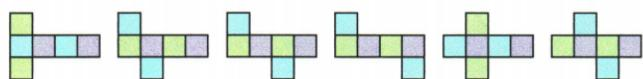
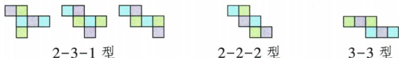

## 讲解

### 是什么

正方体的六面可分前后、左右、上下三对相对面。相邻面共享一条棱；相对面折后没有公共边和公共顶点。展开图把原面摊开，纸上相邻、隔开或转折关系只是折叠线索，判断对面最终须看折后的空间方向。

### 怎么来的

先固定一方片作底或正面，邻片沿公共边转90°，逐片跟踪六个方向。连续一排四片会绕成四个侧面，第一与第三相对，第二与第四相对；但遇行列转折，不能只数纸上距离。原六畜弯链以牛正面，猪左、羊右，羊下的马折底，马右的鸡折背，鸡右狗折顶，得到牛鸡、猪羊、马狗三对。若折叠途中两个不同方片落到同一面方向，会重叠，展开图无效；六片都落不同方向才闭成六面。原11种有效展开类型是原书图给的形状归纳，图形旋转或镜像不应重复算新基本类型；不必靠口诀替代每次有效折叠。

原11种展开图：1–4–1型六种，2–3–1型三种，2–2–2和3–3型各一种。示例按原面片位置保留，折后六方向仍须逐个核：

### 什么时候能用

同一排或列方片过多会绕回重叠，原含田、凹的六片布局亦不能按图闭成六不同面。但排除规则只能在准确布局中用，不能推广成任意看似“凹”的图就必无效。“隔一片”“Z两端”需处于原给的有效六面布局，最稳是固定面转折核方向。相对的是面，不是任何两个纸上顶点；顶点最远问题还需折后认点。

## 例题

### 六畜展开图跟踪转折确定牛的相对面

> 来源ID Q16-07；第16章图形的初步认识；151-200/full.md 第3017–3027行。原答案与解析定位：151-200/full.md 第3029–3031行。

例3 中国讲究五谷丰登,六畜兴旺.一个正方体的展开图如图所示,六个正方形内分别标有六畜:“猪” “牛”“羊”“马”“鸡”“狗”.将其围成正方体后,与“牛”相对的是 ( ) 猪 牛 羊

A.羊

B. 马

C.鸡

D.狗

| 猪 | 牛 | 羊 |  |  |
| --- | --- | --- | --- | --- |
|  |  | 马 | 鸡 | 狗 |

**原资料答案与解析：**

解析 易知与“猪”相对的是“羊”，与“马”相对的是“狗”，与“牛”相对的是“鸡”.

答案 C

**展开解析（依据原详解补足理由与步骤）：**

原表位置经PDF实际第40页核对：上排猪、牛、羊，下排从羊下面开始马、鸡、狗，是弯折六面链。把牛固定为正面，猪与羊沿左右边折成左、右侧；马从羊下边折到底面；鸡再从马右边折到背面；狗接鸡右边最终为顶面。于是牛对鸡、猪对羊、马对狗。A羊与牛相邻，非对面；B马是底面，与牛相邻；C鸡是背面，正对牛，正确；D狗顶面与牛相邻。选C。跟踪每次转折的实际面方向，不能只看平面纸上哪个字离牛远。

### 折叠正方体以顶点相对关系比较直线距离

> 来源ID Q16-10；第16章图形的初步认识；151-200/full.md 第3097–3107行。原答案与解析定位：151-200/full.md 第3053–3059行。

例3（2024四川宜宾）如图是正方体表面展开图.将其折叠成正方体后,距顶点A最远的点是()

A.B点

B.C点

C.D 点

D.E点

**原资料答案与解析：**

例3 解析 将展开图折叠成正方体,如图所示.

观察可知 B、C、D、E 四点中距顶点 A 最远的是 C 点.

答案B

**展开解析（依据原详解补足理由与步骤）：**

按展开图折起后原辅助图标明A为后上右顶点，B后下左、C前下左、D后下右、E前下右。设公共棱长s>0，只作表示原图大小不添加数值。A至D是一条棱，长s；A至B、A至E各是某方形面的对角线，平方距离2s²；A至C连相对顶点，是体对角线，两次勾股得平方距离3s²。故C距A最远。A选B点，仅面对角线；B选C点，体对角线，正确；C选D点，一棱；D选E点，面对角线。选B。比较的是折后空间直线距离，不是纸上两点的平面距离，也不是沿表面走的最短路线。

## 易错

原羊与牛虽然在纸上两侧部分，折后共享棱而非相对；距牛纸面最远的狗也非对面。看字的位置须跟踪整张面片折到哪里。
