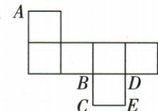
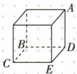

## 讲解

### 是什么

正方体同一顶点到另七顶点的直线距离，按仅跨一条棱、跨同一面的对角、跨相对顶点体对角分三类。棱长s>0，三类分别s、√2s、√3s，平方分别s²、2s²、3s²。这是用两次勾股定理补充本题空间长度理解，不要求空间向量或高中公式。

### 怎么来的

同一面是边长s的正方形，它的对角线与两相邻边成直角三角形，平方距离s²+s²=2s²。连接相对顶点，可取该顶点在底面上的投影：竖直棱长s，底面对角长√2s；它们位于由竖棱与底面对角组成的垂直截面、相互垂直，截面内再次用勾股，体对角平方s²+(√2s)²=3s²。因为s正，平方越大正长度越大，故体对角最大。原折后图A到D一棱、到B和E各一面对角、到C一体对角，逐选项得到C点最远，对应选项B。判断可先认C与A相对，再用平方长度解释为何最远。

先面内勾股，再在垂直截面勾股：

$$d_{\mathrm{面}}^2=s^2+s^2=2s^2;\qquad d_{\mathrm{体}}^2=d_{\mathrm{面}}^2+s^2=3s^2,\quad s>0.$$

### 什么时候能用

以上为几何体内部直接连线距离，不是沿表面走的路程、纸上展开图距离或影像投影长度。从展开图先核折后各标点可能重合或成为哪一顶点，再应用类别；不能先把平面最远点当空间最远。s未给数值仍可用同一s比较，不新增原题尺寸。若为长方体而非正方体，三方向长度不同，需用其真实三边，不能沿用√2s统一面对角。

## 例题

### 折叠正方体以顶点相对关系比较直线距离

> 来源ID Q16-10；第16章图形的初步认识；151-200/full.md 第3097–3107行。原答案与解析定位：151-200/full.md 第3053–3059行。

例3（2024四川宜宾）如图是正方体表面展开图.将其折叠成正方体后,距顶点A最远的点是()

A.B点

B.C点

C.D 点

D.E点

**原资料答案与解析：**

例3 解析 将展开图折叠成正方体,如图所示.

观察可知 B、C、D、E 四点中距顶点 A 最远的是 C 点.

答案B

**展开解析（依据原详解补足理由与步骤）：**

按展开图折起后原辅助图标明A为后上右顶点，B后下左、C前下左、D后下右、E前下右。设公共棱长s>0，只作表示原图大小不添加数值。A至D是一条棱，长s；A至B、A至E各是某方形面的对角线，平方距离2s²；A至C连相对顶点，是体对角线，两次勾股得平方距离3s²。故C距A最远。A选B点，仅面对角线；B选C点，体对角线，正确；C选D点，一棱；D选E点，面对角线。选B。比较的是折后空间直线距离，不是纸上两点的平面距离，也不是沿表面走的最短路线。

## 易错

原A选B点只是面对角，B选C点才体对角；选项字母与几何点字母同时出现时，答案应写“选B，即C点”，避免互换。
