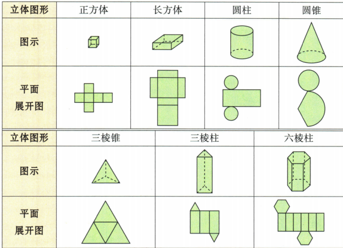
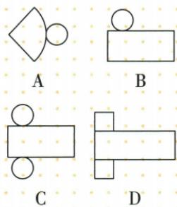

## 讲解

### 是什么

沿表面适当剪开、不拉伸各片而铺到平面，得到立体表面展开图。完整展开须保留每个面，面片连接和匹配边长允许折回、合拢且不重叠。侧面展开只含侧面，可按题要求不画底。不是凡数量和类型相似的拼图都能还原指定立体。

### 怎么来的

棱柱逐侧剪开会成为由侧面排成的带，另两相同多边形封底，底每边与侧片对应边匹配；棱锥三角侧片边逐步收拢共顶，另配多边形底。圆柱侧面沿母线展开为长方形，卷绕方向的长等于底圆周、另一边为高，两相同圆分别接上下边。圆锥侧为扇形，扇形半径是原母线、弧长是底圆周，另有一圆底。球面一般不能靠有限剪口无拉伸铺成这些平面面片，这里按原书球不能普通展开理解。原有盖礼盒C正好长方形加两圆，A是扇形圆锥、B少一底、D底形不对；原六展开逐一按底和侧匹配还原。原总表OCR丢了多个配图，下图从实际PDF第38页整表恢复，不以空单元格猜形状。

### 什么时候能用

只用面种类和数量可提出候选，还须真折叠核连接、尺寸、是否重叠。原图均作为给定可折形状使用，不自行测示意图认圆周数值。正方体需六等大方片落六不同面；有盖圆柱两个底都需，题只问侧面则少底无妨。曲面展开和多边面折叠机制不同，不说所有体都由平面多边形围成。

## 例题

### 有盖圆柱展开图逐项核底面与曲侧

> 来源ID Q16-03；第16章图形的初步认识；151-200/full.md 第2815–2826行。原答案与解析定位：151-200/full.md 第2828–2828行。

例3 小红想设计制作一个圆柱形的有盖礼品盒,下列展开图中设计正确的是 ( )

**原资料答案与解析：**

答案 C

**展开解析（依据原详解补足理由与步骤）：**

原有盖盒按完整圆柱表面：侧面沿一条母线剪开展成长方形，须配上下两张相同圆底。A是扇形加一圆，对应圆锥而非柱，错；B长方形只配一圆，少盖或底，非原有盖完整盒；C长方形配相对长边两侧的两圆，可分别封上下底，正确；D两端图形是小长方形，不能封圆底，错。选C。还须侧长匹配底圆周、两圆同半径；本题按图给定设计选类型，不凭示意比例猜精确半径。

### 六张完整展开图按底侧匹配还原

> 来源ID Q16-06；第16章图形的初步认识；151-200/full.md 第2989–3007行。原答案与解析定位：151-200/full.md 第3009–3011行。

例2 某些立体图形的平面展开图如图所示,请写出各平面图形所对应的立体图形的名称.

  
(1)

  
(2)

  
(3)

  
(4)

  
(5)

  
(6)

**原资料答案与解析：**

解析 (1) 正方体. (2) 圆柱. (3) 三棱柱. (4) 圆锥. (5) 五棱柱. (6) 四棱锥.

提示:可以想象让某个面不动,其他各面都向该面折叠,看能折叠成什么几何体.

**展开解析（依据原详解补足理由与步骤）：**

（1）六个等大正方形按图形成两排错位连接，折成六个不同面，是正方体。（2）长方形作曲侧展开、两相同圆封上下底，是圆柱。（3）三个长方形围侧面，两全等三角形封底，是三棱柱，三角底每边对应一个侧长方形。（4）扇形两半径边合拢，弧成为底圆周，再配一圆底，是圆锥。（5）两五边形底加五侧面，是五棱柱，“五”数底边，非数所有棱。（6）一个四边形底、四个共锥顶的三角侧面，是四棱锥。先核各面种类、数量，再核连接能闭合且不重叠；随便凑同数量碎片未必是展开图。

### 四棱锥只问侧面展开与完整表面区分

> 来源ID Q16-09；第16章图形的初步认识；151-200/full.md 第3081–3093行。原答案与解析定位：151-200/full.md 第3049–3051行。

例2 (2024 江苏常州)下列图形中,为四棱锥的侧面展开图的是 ( )

  
A

  
B

  
C

  
D

**原资料答案与解析：**

例2 解析 A 选项中的图形是四棱柱的侧面展开图; B 选项中的图形是四棱锥的侧面展开图; C 选项中的图形是圆锥的侧面展开图; D 选项中的图形是正方体的表面展开图.

答案B

**展开解析（依据原详解补足理由与步骤）：**

四棱锥底是四边形，侧面有四个三角形共锥顶；问侧面展开，不要求把四边形底也画入。A四个长方形侧片围成四棱柱侧面，非锥；B四个三角形共一个顶点扇状连接，合拢可成四棱锥四侧，正确；C单扇形是圆锥曲侧面展开，非多片三角面；D六个方片是正方体完整表面展开，不是棱锥侧面。选B。少底面不自动错，先看原问完整表面还是仅侧面。

## 易错

原四棱锥侧面B没底仍正确；原礼盒B少圆底因问有盖完整表面而错，判断必须带原问题范围。
