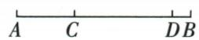

## 讲解

### 是什么

在线段AB上将它分为两段相等的点M叫中点，AM=MB=AB/2；“在线段上”和“相等”两项缺一不可。三等分有两个内部等分点，四等分有三个，一般n等分有n−1个内部点，各小段长原段的1/n。

### 怎么来的

M在A、B之间给AB=AM+MB，再结合AM=MB得到AB=2AM=2MB，除2得半长；不是先从一个半长距离就反推位置。原8cm段中点BC4，结合D在CB内、BD3相减CD1。原AP=PB只能说明离两个端点等距，原等腰三角顶点P虽满足却离开AB；单AP=AB/2也留别方向。三条AP=PB=AB/2同时给折路AP+PB=AB，按两点直连的最短性质及离线折路严格更长，强迫P在线段上，才可中点。原靠A三等分C使AC是1份、CB是2份，所以CB=2AC；17:2的CD、DB分了这两份的整段CB，不能把AC看CB/3。

位置使整段等于两部分之和，再用等长：

$$M\in\overline{AB},\quad AM=MB\quad\Rightarrow\quad AB=AM+MB=2AM=2MB\quad\Rightarrow\quad AM=MB=\frac{AB}{2}.$$

### 什么时候能用

定义只谈有限非退化线段，AB>0才两端不同、内部点有意义。中点唯一，n等分点顺序与所在大段要明确，别把一个段的中点套到另一段。已知点在线段上时等长或半长可作充分判据；若未给位置，单项距离等式不足。坐标法先给两端坐标取平均，再用差的绝对值求中点间距，与几何同侧减异侧加应一致。

## 例题

### 中点四个判据补上点在线段上的条件

> 来源ID Q16-13；第16章图形的初步认识；151-200/full.md 第3212–3215行。原答案与解析定位：151-200/full.md 第3217–3228行。

例3 下列说法中, 正确的是
(填序号)

①若 $AP=\frac{1}{2}AB$ ，则点 P 为线段 AB 的中点；②若 AP=PB，则点 P 为线段 AB 的中点；③若 AB=2PB，则点 P 为线段 AB 的中点；④若 $AP=PB=\frac{1}{2}AB$ ，则点 P 为线段 AB 的中点.

**原资料答案与解析：**

解析 下列反例图形可分别说明
①②③均不正确.

答案 ④

**展开解析（依据原详解补足理由与步骤）：**

①只AP=AB/2未说明P在线段上，P可能偏离AB，不能断言中点。②只AP=PB，P可能在AB的垂直平分位置之外的平面点，原等腰三角示图即反例。③AB=2PB只限定到B的距离，P可在别方向，未限定共线，亦不够。④AP=PB=AB/2同时给AP+PB=AB，沿A到P再到B的路径长等于直接线段；若P离开线段形成三角绕路，和必严格更大，所以这些等式迫使P在AB上，并且两段相等，确为中点，选④。最直接定义判据是P在线段AB上且AP=PB；不能只从一条距离等式推点的空间位置。

### 八厘米中点与内点按实际顺序相减

> 来源ID Q16-20；第16章图形的初步认识；151-200/full.md 第3396–3398行。原答案与解析定位：151-200/full.md 第3400–3404行。

例4 如图,已知 AB=8 cm,BD=3 cm,C 为 AB 的中点,则线段 CD 的长为 \_\_\_\_ cm.

**原资料答案与解析：**

解析 因为 C 为 AB 的中点, AB = 8 cm, 所以 $BC = \frac{1}{2} AB = \frac{1}{2} \times 8 = 4 \, (\text{cm})$ ,

又因为 BD=3 cm, 所以 CD=BC-BD=4-3=1(cm), 即 CD 的长为 1 cm.

答案 1

**展开解析（依据原详解补足理由与步骤）：**

图顺序A、C、D、B。C为AB中点且AB8cm，BC=AB/2=4cm。D在CB内，BC=CD+DB，DB3cm，所以CD=BC−BD=4−3=1cm。若D位置未定，减法未必成立；本题实际图已给在CB内。先把图的包含关系写成整段=部分+部分，再移项，不凭“两个已知数应该相减”猜算式。

### 延长与反向延长定四点顺序再求中点长度

> 来源ID Q16-21；第16章图形的初步认识；151-200/full.md 第3410–3414行。原答案与解析定位：151-200/full.md 第3416–3424行。

例5 已知线段 AB=2 cm, 延长线段 AB 至点 C, 使得 $BC=\frac{1}{2}AB$ , 再反向延长 AC 至点 D, 使得 AD=AC.

(1) 准确地画出图形, 并标出相应的字母.   
(2)哪个点是线段 $DC$ 的中点？线段 $AB$ 的长是线段 $DC$ 长的几分之几？  
(3) 求线段 BD 的长度.

**原资料答案与解析：**

解析 (1) 如图.

(2) 点 A 是线段 DC 的中点, $AB = \frac{1}{3} DC$ .

(3) 因为 $BC=\frac{1}{2}AB=\frac{1}{2}\times2=1(\text{cm})$ ，所以 $AC=AB+BC=2+1=3(\text{cm})$ .

所以 $AD = AC = 3\mathrm{cm}$ ，所以 $BD = AD + AB = 3 + 2 = 5(\mathrm{cm})$

**展开解析（依据原详解补足理由与步骤）：**

（1）延长AB到C使A、B、C按序，BC=AB/2=1cm，AC2+1=3cm。反向延长AC到D越过A，顺序D、A、B、C，AD=AC=3cm。（2）A在线段DC内部且AD=AC，故A为DC中点。DC3+3=6cm，AB/DC=2/6=1/3，所以AB是DC的1/3。（3）D与B分处A两边，BD=DA+AB=3+2=5cm。不是反向把D放在C外；A是中点不仅因为等长，还因A在DC内。

### 直线上未定方向的两中点距离分两类

> 来源ID Q16-22；第16章图形的初步认识；151-200/full.md 第3430–3430行。原答案与解析定位：151-200/full.md 第3432–3446行。

例6 已知线段 $AB = 10 \mathrm{~cm}$ , 直线 $AB$ 上有一点 $C, BC = 6 \mathrm{~cm}, M$ 为线段 $AB$ 的中点, $N$ 为线段 $BC$ 的中点, 求线段 $MN$ 的长.

**原资料答案与解析：**

解析 当点 C 在线段 AB 上时, 如图 1, ∵ M 为 AB 的中点, AB = 10 cm, ∴ $MB = \frac{1}{2} AB = 5 \, cm$ ,

∵ N 为 BC 的中点, BC = 6 cm, ∴ $NB = \frac{1}{2} BC = 3 \, cm$ , ∴ MN = MB - NB = 2 cm.

  
图1  
图2

当点 C 在线段 AB 的延长线上时, 如图 2, ∵ M 为 AB 的中点, AB = 10 cm, ∴ $MB = \frac{1}{2} AB = 5 \, cm$ ,

∵ N 为 BC 的中点, BC = 6 cm, ∴ $NB = \frac{1}{2} BC = 3 \, cm$ , ∴ $MN = MB + NB = 8 \, cm$ .

当点 C 在线段 BA 的延长线上时,应该有 AB<BC,但由已知得 AB>BC,所以这种情况不存在.

综上,线段 MN 的长为 2 cm 或 8 cm.

**展开解析（依据原详解补足理由与步骤）：**

AB10cm，取A横0、B横10，仅作为同一原题的数轴表示。BC6cm使C横10−6=4或10+6=16。AB中点M横5；C4时BC中点N横(10+4)/2=7，MN|7−5|=2cm；C16时N横13，MN|13−5|=8cm。几何法同样M离B5、N离B3，同侧相减2、异侧相加8。C在线段BA越过A的位置若成立需BC>BA=10，但原BC6<10，不能发生。因此仅2或8两解。分类基于BC的两方向，不能先按自己画的一个位置排另一解。

### 三等分与十七比二以比例份数列线段方程

> 来源ID Q16-23；第16章图形的初步认识；151-200/full.md 第3452–3454行。原答案与解析定位：151-200/full.md 第3456–3460行。

例7 如图, 点 C 是线段 AB 上靠近 A 的三等分点, 点 D 在线段 CB 上, CD:DB=17:2, 且 CD-AC=3 cm, 求线段 AB 的长.

**原资料答案与解析：**

解析 设 $CD = 17x\mathrm{cm}$ , 则 $BD = 2x\mathrm{cm}$ , 所以 $CB = 19x\mathrm{cm}$ ,

因为点 C 是线段 AB 上靠近 A 的三等分点, 所以 $AC = \frac{1}{2} CB = \frac{19}{2} x \, cm$ , 又因为 CD - AC = 3 cm,

所以 $17x - \frac{19}{2}x = 3$ ，解得 x = 0.4，所以 $AC = \frac{19}{2} \times 0.4 = 3.8 \, (\text{cm})$ 。所以 AB = 3AC = 11.4 cm。

**展开解析（依据原详解补足理由与步骤）：**

图A、C、D、B按序，C是靠A三等分点，所以AC=AB/3、CB=2AB/3=2AC。设每份xcm>0，CD17x、DB2x，因此CB19x、AC=CB/2=19x/2。条件CD−AC3给17x−19x/2=3，乘2得34x−19x=6，15x6，x2/5=0.4。AC19×0.4/2=3.8cm，AB3AC=11.4cm。回CD6.8、DB0.8、CB7.6、AC3.8，差6.8−3.8=3、比6.8:0.8=17:2，两条件都合。不要把靠A三等分点误当AC=CB/3。

比例方程逐步变形及所求大段：

$$17x-\frac{19}{2}x=3\Rightarrow34x-19x=6\Rightarrow15x=6\Rightarrow x=\frac25;\qquad AB=3AC=3\cdot\frac{19}{2}\cdot\frac25=\frac{57}{5}=11.4\ \mathrm{cm}.$$

## 易错

原线段DC中点为A有AD=AC和D、A、C顺序两证据；原11.4cm三等分题AC=CB/2，非CB/3。
