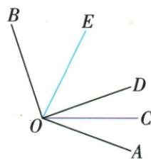
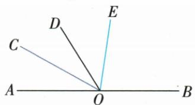
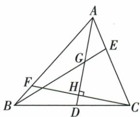
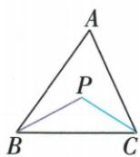
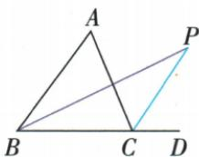
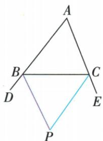

## 讲解

### 是什么

从角顶点出发、在所分角内部将它分成两个相等角的射线，叫该角的角平分线。若OC在∠AOB内部且平分，∠AOC=∠COB=∠AOB/2；反过来内部两子角相等也可判平分。射线、共同顶点、内部位置和等角都是定义条件。

### 怎么来的

内部划分先有AOB=AOC+COB，再结合两部分相等，将整角看两相同份得到每份一半；只写某一角等总角一半若未给内部位置，另一侧外部也可能与一边夹这个半角，未将原角分成相等两份。原OC平分AOD、OE平分BOD，COD=AOD/2、DOE=BOD/2；D位于总角AOB内部，故COE=一半(AOD+BOD)=AOB/2，整体使用已给130得65。不需分别求AOD和BOD。原平角方程题又可把AOC、COD都写70−x，因为COE70先去DOE的x，再依据平分令两小角相等。

内部相加及两等份给半角：

$$\angle AOB=\angle AOC+\angle COB=2\angle AOC,\quad \angle AOC=\angle COB=\frac12\angle AOB.$$

### 什么时候能用

本章通常讨论选定的内角；0<角<180°时有唯一内平分射线，特殊平角、周角先明确所分转动区域或所取半平面，不仅靠终边位置谈唯一。只使用角度的平分定义，不无依据引入点到两边等距，那个性质及条件将在原对应几何章处理。三等分、四等分也须同顶在内部，用相等子角数决定分母，不是随手画几条线便等分。

本章区分无限角平分射线与三角形有限角平分段。原ABE中AD虽方向正确却超出BE，AG才为该小三角平分线。原尺规图AF由两次等半径与SSS确保半角，不依测量，F在三角形外也可在角内部；截到对边才得三角平分段。原双内、一内一外、双外交角三分支分别先核平分的哪一个角，不自动套同一数式。

## 例题

### 三句平分线辨析核射线和内部位置

> 来源ID Q16-27；第16章图形的初步认识；151-200/full.md 第3670–3675行。原答案与解析定位：151-200/full.md 第3670–3675行。

1.从一个角的顶点出发，把这个角分成两个相等的角的直线，叫作这个角的平分线。（×）

2.角的平分线一定在角的内部.
(√)

3. 若 $\angle BOC = \frac{1}{2} \angle BOA$ ，则 $OC$ 是 $\angle BOA$ 的平分线。（×）

**原资料答案与解析：**

1.从一个角的顶点出发，把这个角分成两个相等的角的直线，叫作这个角的平分线。（×）

2.角的平分线一定在角的内部.
(√)

3. 若 $\angle BOC = \frac{1}{2} \angle BOA$ ，则 $OC$ 是 $\angle BOA$ 的平分线。（×）

**展开解析（依据原详解补足理由与步骤）：**

①原定义用了“直线”，错；角平分线从顶点朝角内部伸出，是射线，反向另一半直线不属于它。②按本章小于180°的通常角及平角内部选定的一半，平分射线在所分角内部，原√；特殊动态角需先指定所分角的转动区域，不能只凭边重合。③仅∠BOC是∠BOA一半未给OC在角内，OC可能在OB另一侧外部同样与OB成该半角，未能把原角分两相等部分，故×。正确需OC在∠BOA内部，并有∠BOC=∠COA；或结合内部与一半关系推出另一半。

### 两内角平分线半角和整体代入原一百三十

> 来源ID Q16-31；第16章图形的初步认识；151-200/full.md 第3815–3819行。原答案与解析定位：151-200/full.md 第3821–3833行。

例3 如图, $OC$ 是 $\angle AOD$ 的平分线, $OE$ 是 $\angle BOD$ 的平分线.

(1) 如果 $\angle AOB = 130^{\circ}$ ，那么 $\angle COE$ 是多少度？

(2) 在 (1) 的条件下, 如果 $\angle DOC = 20^{\circ}$ , 那么 $\angle BOE$ 是多少度?

**原资料答案与解析：**

解析（1）因为 OC 是 $\angle AOD$ 的平分线，所以 $\angle DOC = \frac{1}{2} \angle AOD$ .

因为 OE 是 $\angle BOD$ 的平分线, 所以 $\angle DOE = \frac{1}{2} \angle BOD$ .

$$
\text { 又 } \angle C O E = \angle D O C + \angle D O E = \frac {1}{2} \angle A O D + \frac {1}{2} \angle B O D = \frac {1}{2} (\angle A O D + \angle B O D) = \frac {1}{2} \angle A O B, \angle A O B = 1 3 0 ^ {\circ},
$$

所以 $\angle COE = 65^{\circ}$ .

(2) 因为 $\angle COE = 65^{\circ}, \angle DOC = 20^{\circ}$ ，所以 $\angle DOE = \angle COE - \angle DOC = 45^{\circ}$ .

又因为 OE 平分 $\angle BOD$ ，所以 $\angle BOE = \angle DOE = 45^{\circ}$ .

**展开解析（依据原详解补足理由与步骤）：**

原图从OA朝OB依次为OA、OC、OD、OE、OB，D在AOB内部。OC平分AOD给DOC=AOD/2；OE平分BOD给DOE=BOD/2。COE=COD+DOE=(AOD+BOD)/2=AOB/2=130°/2=65°。无须分别知道AOD、BOD多少，二者原总和已给。（2）COE65、DOC20，因为D在C与E之间，DOE=COE−COD=65−20=45°，而OE平分BOD，BOE=DOE=45°。每个和差依据原射线内部位置，不能把无关相邻字母直接相加。

### 平角内三分关系与平分关系列角度方程

> 来源ID Q16-34；第16章图形的初步认识；151-200/full.md 第3880–3895行。原答案与解析定位：151-200/full.md 第3897–3899行。

例6 如图, $AB$ 为一条直线, 点 $O$ 在 $AB$ 上, $OC$ 是 $\angle AOD$ 的平分线, $OE$ 在

$\angle BOD$ 内， $\angle DOE = \frac{1}{3}\angle BOD,\angle COE = 70^{\circ}$ ，求 $\angle EOB$ 的度数

**原资料答案与解析：**

解析 设 $\angle DOE = x, \because \angle DOE = \frac{1}{3} \angle BOD, \therefore \angle EOB = 2x,$

$\because OC$ 是 $\angle AOD$ 的平分线, $\angle COE = 70^{\circ}$ , $\therefore \angle AOC = \angle COD = 70^{\circ} - x$ , $\therefore 2(70^{\circ} - x) + x + 2x = 180^{\circ}$ , 解得 $x = 40^{\circ}$ , $\therefore \angle EOB = 2x = 80^{\circ}$ .

**展开解析（依据原详解补足理由与步骤）：**

沿原上半平角射线顺序OA、OC、OD、OE、OB。设DOE=x°，它是BOD的1/3，所以BOD3x、EOB=BOD−DOE=2x。COE70且D在C、E之间，COD=70−x；OC平分AOD，AOC=COD=70−x。OA到OB平角总180，四小角相加：2(70−x)+x+2x=180。展开140−2x+3x=180，140+x180，x40；EOB2x80°。回AOC、COD各30，DOE40、EOB80，合180，且COE30+40=70。x40使70−x正、各射线顺序合法。

四小角总平角的等式：

$$2(70-x)+x+2x=180\Rightarrow140+x=180\Rightarrow x=40;\qquad\angle EOB=2x=80^\circ.$$

### 四条重要线段分别检查三角形与真实端点

> 来源ID Q19-04；第19章三角形；201-250/full.md 第1844–1844行。原答案与解析定位：201-250/full.md 第1846–1862行。

例1 如图, 在 $\triangle ABC$ 中, $\angle BAD=\angle CAD$ , $G$ 为 $AD$ 的中点, $BG$ 的延长线交 $AC$ 于点 $E$ , $F$ 为 $AB$ 上的一点, $CF$ 与 $AD$ 垂直, 交 $AD$ 于点 $H$ , 则下面结论: ① $AD$ 是 $\triangle ABE$ 的角平分线; ② $BE$ 是 $\triangle ABD$ 的边 $AD$ 上的中线; ③ $CH$ 是 $\triangle ACD$ 的边 $AD$ 上的高; ④ $AH$ 是 $\triangle ACF$ 的角平分线和高. 其中正确的有\_\_\_\_.(填序号)

**原资料答案与解析：**

解析 由 $\angle BAD = \angle CAD$ ，可知 $AD$ 平分 $\angle BAE$ ，但 $AD$ 不是 $\triangle ABE$ 内的线段，故①错误；

BE 经过 $\triangle ABD$ 的边 AD 的中点 G, 但 BE 不是 $\triangle ABD$ 内的线段, 故②错误;

$CH \perp AD$ 于 H, 由三角形的高的定义可知, CH 是 $\triangle ACD$ 的边 AD 上的高, 故③正确;

因为 $AH$ 平分 $\angle FAC$ 且 $H$ 在 $CF$ 上, 所以 $AH$ 是 $\triangle ACF$ 的角平分线, 又因为 $AH \perp CF$ , 所以 $AH$ 也是 $\triangle ACF$ 的高, 故④正确.

答案 ③④

**展开解析（依据原详解补足理由与步骤）：**

①AD方向确平分BAE，但△ABE角平分线应从A止于BE上的G，所以是AG，AD超出该三角形，错。②BE经过AD中点G，但△ABD以AD为底的中线应从B止于G，所以BG才是中线，BE超出原三角形，错。③C是△ACD顶点，H在AD所在直线且CH⊥AD，所以CH是AD上的高，对。④F在AB、H在CF，AH平分FAC且AH⊥CF，故AH同时是△ACF内部角平分线与高，对。答③④。角平分线和中线的终点须在相应有限对边上；高的垂足允许在对边延长线上。

### 原尺规角平分作图结合高求10度

> 来源ID Q19-08；第19章三角形；201-250/full.md 第1938–1946行。原答案与解析定位：201-250/full.md 第1960–1967行。

例1 (2024 江苏宿迁) 如图, 在 $\triangle ABC$ 中, $\angle B = 50^{\circ}$ , $\angle C = 30^{\circ}$ , $AD$ 是高, 以点 $A$ 为圆心, $AB$ 长为半径画弧, 交 $AC$ 于点 $E$ , 再分别以 $B, E$ 为圆心, 大于 $\frac{1}{2} BE$ 的长为半径画弧, 两弧在 $\angle BAC$ 的内部交于点 $F$ , 作射线 $AF$ , 则 $\angle DAF =$ \_\_\_\_°.

**原资料答案与解析：**

例1 解析∵AD是△ABC的高，
∴∠BDA=90°，又∵∠B=50°，
∠C=30°，∴∠BAD=40°，∠BAC
=100°.由作图可知AF是∠BAC
的平分线，∴∠BAF=50°，
∴∠DAF=10°.

答案 10

**展开解析（依据原详解补足理由与步骤）：**

以A圆心AB长取AC上的E，保证AB=AE；以B、E作两段同半径弧，内部交点F满足BF=EF；AF共同，△ABF与△AEF三边对应相等，SSS全等给BAF=FAE。因此AF是BAC内部平分射线。原B50°、C30°给BAC=180°−50°−30°=100°，BAF50°。AD高给BAD=90°−B50°=40°。原AF在BAC内且位于AD右侧，DAF=BAF−BAD=50°−40°=10°。作图并非量出50°；角平分来源是等半径与全等。F画在三角形外仍在角的内部区域，射线AF的三角形内部段需另止于BC。

### 三种原内外角平分线交角模型

> 来源ID Q19-22；第19章三角形；201-250/full.md 第2147–2187行。原答案与解析定位：201-250/full.md 第2147–2187行。

(1)“双内”模型(图3)

结论: $\angle P=90^{\circ}+\frac{1}{2}\angle A.$

(2)“一内一外”模型(图4)

结论： $\angle P = \frac{1}{2}\angle A.$

(3)“双外”模型(图5)

结论: $\angle P=90^{\circ}-\frac{1}{2}\angle A.$

  
图 3

图 4

图 5

**原资料答案与解析：**

(1)“双内”模型(图3)

结论: $\angle P=90^{\circ}+\frac{1}{2}\angle A.$

(2)“一内一外”模型(图4)

结论： $\angle P = \frac{1}{2}\angle A.$

(3)“双外”模型(图5)

结论: $\angle P=90^{\circ}-\frac{1}{2}\angle A.$

  
图 3

图 4

图 5

**展开解析（依据原详解补足理由与步骤）：**

设原三角形内角A、B、C，和180°。

双内：BP、CP分别内部平分，△BCP在B、C处为B/2、C/2，所以P=180°−(B+C)/2=90°+A/2。

一内一外：BP平分B内角，CP平分C外角180°−C。原P在C外侧，△BCP的C处内角=180°−(180°−C)/2=90°+C/2，故P=180°−B/2−(90°+C/2)=A/2。

双外：BP、CP分别平分两个外角，△BCP在B、C处为(180°−B)/2、(180°−C)/2，所以P=180°−[180°−(B+C)/2]=(B+C)/2=90°−A/2。每次明确△BCP使用的是哪个内角，不能把三种公式混在同一个图。原模型是书中给的无数字示意，不新增自编角值。

## 易错

原辨析①直线一词错，③只有BOC半角却未给OC在内部也错；两边距离性质不能由角度相等一句直接跳过理由。
