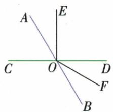

## 讲解

### 是什么

用三个大写字母写∠AOB时，顶点O在中间，OA、OB给两边。顶点处只有一个无歧义角才可简写∠O；多条射线时须写全名或按图标的弧用∠1、α。角和差依据一个较大角被内部射线分成不重叠的子角，非字母出现相邻就能相加。

### 怎么来的

若OC位于选定∠AOB内部，从OA转到OB先到OC后到OB，转动幅度分两段，所以∠AOB=∠AOC+∠COB；已知整角与一部分，可移项求另一部分。原两平分线题OA、OC、OD、OE、OB按序，COE=COD+DOE，AOD+BOD=AOB，才可整体提一半算65°。原平角题OA、OC、OD、OE、OB顺序使四小角总180°，设DOE=x后COD=70−x有内部位置依据。若OC在另一侧外部，同一字母式可能要差或另计转动，原AOC就能从45改135。图标一个小弧通常只指被它圈住的那一片，不能拿∠1替代包含多片的大角。

### 什么时候能用

从边上的第二个点换成同一射线另一点不改角，但若越过顶点落反向，则边变了。一个顶点多角不简称该顶点，数字或希腊符号是否代表组合角按原弧线明确位置，不靠自己编号。三点角命名首尾可互换表示同一通常角，动态有向角的始终顺序则可能改变，应按题给定义区别。

## 例题

### 按叠合与工具比较原六射线中的三个角对

> 来源ID Q16-29；第16章图形的初步认识；151-200/full.md 第3773–3776行。原答案与解析定位：151-200/full.md 第3778–3795行。

例1 如图,回答下列问题:(1) 比较∠FOD与∠FOE的大小.

(2)借助三角尺比较 $\angle DOE$ 与 $\angle BOF$ 的大小.  
(3)借助量角器比较 $\angle AOE$ 与 $\angle DOF$ 的大小.

**原资料答案与解析：**

解析（1）由叠合法可知， $\angle FOD<\angle FOE.$

(2) 用含 $45^{\circ}$ 角的三角尺比较, 可得 $\angle DOE > 45^{\circ}, \angle BOF < 45^{\circ}$ , 所以 $\angle DOE > \angle BOF$ .  
(3) 用量角器量得 $\angle AOE = 30^{\circ}, \angle DOF = 30^{\circ}$ , 所以 $\angle AOE = \angle DOF$ .

**展开解析（依据原详解补足理由与步骤）：**

（1）原∠FOD与∠FOE共顶点O、共边OF，OD在从OF转到OE的较大角内部，所以FOD<FOE。（2）以45°三角尺角叠合原图：DOE张开超过45°，BOF未达45°，故DOE>BOF；这里只需分居同一比较基准两侧，不必分别求精确度数。（3）按原题要求量角器，AOE与DOF都量得30°，所以相等。图没有将30°印作已知条件，测量是本题的原规定依据，本文不将示意位置推广成所有相似图都必30°。量时顶点对量角器中心、一边对零线、选同侧起点的刻度。

### 两内角平分线半角和整体代入原一百三十

> 来源ID Q16-31；第16章图形的初步认识；151-200/full.md 第3815–3819行。原答案与解析定位：151-200/full.md 第3821–3833行。

例3 如图, $OC$ 是 $\angle AOD$ 的平分线, $OE$ 是 $\angle BOD$ 的平分线.

(1) 如果 $\angle AOB = 130^{\circ}$ ，那么 $\angle COE$ 是多少度？

(2) 在 (1) 的条件下, 如果 $\angle DOC = 20^{\circ}$ , 那么 $\angle BOE$ 是多少度?

**原资料答案与解析：**

解析（1）因为 OC 是 $\angle AOD$ 的平分线，所以 $\angle DOC = \frac{1}{2} \angle AOD$ .

因为 OE 是 $\angle BOD$ 的平分线, 所以 $\angle DOE = \frac{1}{2} \angle BOD$ .

$$
\text { 又 } \angle C O E = \angle D O C + \angle D O E = \frac {1}{2} \angle A O D + \frac {1}{2} \angle B O D = \frac {1}{2} (\angle A O D + \angle B O D) = \frac {1}{2} \angle A O B, \angle A O B = 1 3 0 ^ {\circ},
$$

所以 $\angle COE = 65^{\circ}$ .

(2) 因为 $\angle COE = 65^{\circ}, \angle DOC = 20^{\circ}$ ，所以 $\angle DOE = \angle COE - \angle DOC = 45^{\circ}$ .

又因为 OE 平分 $\angle BOD$ ，所以 $\angle BOE = \angle DOE = 45^{\circ}$ .

**展开解析（依据原详解补足理由与步骤）：**

原图从OA朝OB依次为OA、OC、OD、OE、OB，D在AOB内部。OC平分AOD给DOC=AOD/2；OE平分BOD给DOE=BOD/2。COE=COD+DOE=(AOD+BOD)/2=AOB/2=130°/2=65°。无须分别知道AOD、BOD多少，二者原总和已给。（2）COE65、DOC20，因为D在C与E之间，DOE=COE−COD=65−20=45°，而OE平分BOD，BOE=DOE=45°。每个和差依据原射线内部位置，不能把无关相邻字母直接相加。

### 未定OC内外位置的角度分类两解

> 来源ID Q16-33；第16章图形的初步认识；151-200/full.md 第3860–3860行。原答案与解析定位：151-200/full.md 第3862–3874行。

例5 已知 $\angle AOB = 90^{\circ}$ , OC 是从 $\angle AOB$ 的顶点 O 引出的一条射线, 若 $\angle AOB = 2\angle BOC$ , 求 $\angle AOC$ 的度数.

**原资料答案与解析：**

解析 因为 $\angle AOB = 90^{\circ}, \angle AOB = 2\angle BOC$ ，所以 $\angle BOC = 45^{\circ}$ .

分以下两种情况:(1)当 OC 在 $\angle AOB$ 的内部时(如图 1), $\angle AOC = \angle AOB - \angle BOC = 90^{\circ} - 45^{\circ} = 45^{\circ}$ ;

(2) 当 OC 在 $\angle AOB$ 的外部时 (如图 2), $\angle AOC = \angle AOB + \angle BOC = 90^{\circ} + 45^{\circ} = 135^{\circ}$ .

综上, $\angle AOC$ 的度数为 $45^{\circ}$ 或 $135^{\circ}$ .

  
图1

  
图 2

**展开解析（依据原详解补足理由与步骤）：**

AOB90°又为BOC两倍，BOC=90/2=45°。OC可在OB朝OA的一侧，位于AOB内部，AOC=AOB−BOC=45°；也可在OB背离OA一侧，位于外部，AOC=AOB+BOC=135°。固定OB与它夹45°的射线在平面两侧各一条，正好这两种，不再漏第三类。原未说OC在AOB内部，不能只画内侧答45。两结果都是通常小于180°的角，若题另指定有向旋转角则要按其定义重新读。

### 平角内三分关系与平分关系列角度方程

> 来源ID Q16-34；第16章图形的初步认识；151-200/full.md 第3880–3895行。原答案与解析定位：151-200/full.md 第3897–3899行。

例6 如图, $AB$ 为一条直线, 点 $O$ 在 $AB$ 上, $OC$ 是 $\angle AOD$ 的平分线, $OE$ 在

$\angle BOD$ 内， $\angle DOE = \frac{1}{3}\angle BOD,\angle COE = 70^{\circ}$ ，求 $\angle EOB$ 的度数

**原资料答案与解析：**

解析 设 $\angle DOE = x, \because \angle DOE = \frac{1}{3} \angle BOD, \therefore \angle EOB = 2x,$

$\because OC$ 是 $\angle AOD$ 的平分线, $\angle COE = 70^{\circ}$ , $\therefore \angle AOC = \angle COD = 70^{\circ} - x$ , $\therefore 2(70^{\circ} - x) + x + 2x = 180^{\circ}$ , 解得 $x = 40^{\circ}$ , $\therefore \angle EOB = 2x = 80^{\circ}$ .

**展开解析（依据原详解补足理由与步骤）：**

沿原上半平角射线顺序OA、OC、OD、OE、OB。设DOE=x°，它是BOD的1/3，所以BOD3x、EOB=BOD−DOE=2x。COE70且D在C、E之间，COD=70−x；OC平分AOD，AOC=COD=70−x。OA到OB平角总180，四小角相加：2(70−x)+x+2x=180。展开140−2x+3x=180，140+x180，x40；EOB2x80°。回AOC、COD各30，DOE40、EOB80，合180，且COE30+40=70。x40使70−x正、各射线顺序合法。

四小角总平角的等式：

$$2(70-x)+x+2x=180\Rightarrow140+x=180\Rightarrow x=40;\qquad\angle EOB=2x=80^\circ.$$

## 易错

原∠COE不是任意两角相加，D确在C与E之间才可COD+DOE。角边上的点不是角顶点，三字母中间位置错误会改题。
