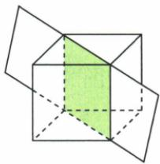
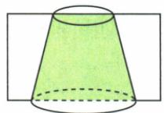
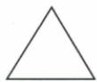
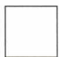
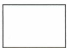
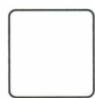
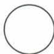
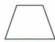

## 讲解

### 判据

题给切体平面的实际图，问截面形状，先追边界在各面怎样相交，回答指定切法，不列任意可能图形充当答案。

### 流程

1. 原正方体切面沿竖向并跨上下底斜线，四个交边构成上下平行、两竖边平行且与横边垂直的矩形。
2. 横边为底面对角、竖边为一棱，长宽不同，排正方形B、三角A，选长方形C。
3. 圆台沿轴竖切，上下底给平行且不等长的两直径，两侧母线接成梯形F；水平切圆E并非原所示方向。
4. 多面体的切边应为直段，圆角闭曲D不合正方体指定四直边；曲面体不一律曲线截面，轴切恰可有直侧。
5. 核原问题是填两个字母，分别C、F，不把立体透视图的斜形当真实截面角不直。

## 例题

### 指定切面在正方体与圆台中的真实截面

> 来源ID Q16-05；第16章图形的初步认识；151-200/full.md 第2948–2976行。原答案与解析定位：151-200/full.md 第2978–2980行。

例1 如图所示的正方体和圆台的截面分别为 \_\_\_\_ 和 \_\_\_\_. (填字母)

  
A

  
B

  
C

  
D

  
E

  
F

**原资料答案与解析：**

解析 观察可知正方体的截面是长、宽不相等的长方形,圆台的截面是梯形.

答案 C;F

**展开解析（依据原详解补足理由与步骤）：**

原正方体切面通过上下底对应的对角方向，且沿竖直方向贯穿：截面上下两边平行，另两边竖直并与它们垂直，故长方形。横边是面内对角线，比一条竖棱长，所以非正方形，选C。圆台用经过轴的竖直平面切，两圆底各给一段直线且平行，上底短、下底长，两侧为母线，截面梯形，选F。A三角形与B正方形不符第一图，D带圆角的闭合线、E圆不符这两个指定切面；E可以来自另一个水平切法，但题并非该切法。不是问任何可能截面，要按实际切面选。

## 易错

切面位置不同可改边数与边长，不能按体名字背唯一截面；原无尺度数据只判形，未求尺寸或面积。
