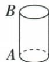
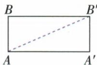

## 讲解

### 判据

路线必须沿圆柱侧壁，从一个点绕一周到其正上方。侧面展开能保持表面路线长度，但同一个终点会出现在展开图的不同复制边上，必须用“绕一周”选择正确终点，而不是只选平面中最近的同侧点。

### 流程

1. 沿原AB所在母线剪开侧面并展开，得到长方形。宽等于底面周长12 m，高等于$AB=5$ m；没有把底面半径或直径当作展开宽度。
2. 将起点A放在左下角。到左上角B的竖直路径没有绕圈，到右上角复制点B′的路径才跨过一个完整周长，卷回后符合绕一周条件。
3. 平面两点之间线段最短，所以取AB′。这条对角线完全位于展开长方形内部，卷回后沿侧壁连续行走，且横向恰跨一个周长，因此最短候选实际合规。
4. 用勾股定理求$AB′^{2}=12^{2}+5^{2}=144+25=169$。路线长度为正，$AB′=13$ m；结论要同时写清路线位置和长度。
5. 原$AB=5$ m虽更短，却只走0周；穿过空间内部的直线也不沿侧壁。若圈数或可走表面改了，必须重新确定展开宽度与终点，不能无条件套13或同一张展开图。

## 例题

### 油罐侧壁一周展开12乘5直线最短13米

> 来源ID Q22-11；第22章勾股定理；251-300/full.md 第17–19行。原答案与解析定位：251-300/full.md 第21–27行。

例7 有一个圆柱形油罐,如图所示,计划从点 A 起环绕油罐建盘梯,正好到点 A 正上方的点 B 处.现要先沿该油罐外壁画一条指示线,再沿指示线进行建造,问指示线最短是多少米?（已知油罐的底面周长是 12 m,高 AB 是 5 m）

**原资料答案与解析：**

解析 将圆柱的侧面沿 $AB$ 剪开铺平（如图所示），则四边形 $AA'B'B$ 为长方形， $A'B' = AB = 5\mathrm{m}, AA' = BB' = 12\mathrm{m}, \angle BAA' = \angle A' = \angle A'B'B = \angle B = 90^\circ$ .

沿 $AB'$ 画指示线，指示线最短.在 $\mathrm{Rt}\triangle AA'B'$ 中， $AB' = \sqrt{AA'^2 + A'B'^2} = \sqrt{12^2 + 5^2} = 13(\mathrm{m})$

答:指示线最短是13 m.

**展开解析（依据原详解补足理由与步骤）：**

题要求沿外壁环绕一周从A到正上方B，沿同一母线剪开，侧面展开为宽12高5矩形。走一周的终点是另一条复制边上的B′，并非原同侧B；平面两点间线段AB′最短，它在矩形内，卷回恰一周合规。AB′²=12²+5²=169，最短13 m。竖直AB5只走0周，不符合环绕；连接空间A/B的内部弦也非表面路线。若圈数另变宽变，不擅加题干圈数。

## 易错

展开后同一物理点可有多复制位置，必须由绕圈要求选；长方体多面另需比较所有允许展开，本原题仅圆柱一周。
