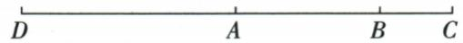

## 讲解

### 判据

题用延长、反向延长描述多点，先按字母方向排全体点，再翻译倍数，不能一边猜位置一边算长度。

### 流程

1. 原延长AB到C沿A到B越B，顺序A、B、C；AB2、BC半AB，BC1，AC3。
2. 反向延长AC到D从A向背离C方向越A，排D、A、B、C，AD=AC3。
3. A在DC内且AD=AC，按中点定义A为DC中点；DC3+3=6，AB/DC=2/6=1/3。
4. B、D分处A两侧，BD=DA+AB=3+2=5cm，不能用两段相减。
5. 回条件AD3与AC3相等、BC1为AB2一半，点顺序与每等式一致。原问题三小问都回应，不只给长度。

## 例题

### 延长与反向延长定四点顺序再求中点长度

> 来源ID Q16-21；第16章图形的初步认识；151-200/full.md 第3410–3414行。原答案与解析定位：151-200/full.md 第3416–3424行。

例5 已知线段 AB=2 cm, 延长线段 AB 至点 C, 使得 $BC=\frac{1}{2}AB$ , 再反向延长 AC 至点 D, 使得 AD=AC.

(1) 准确地画出图形, 并标出相应的字母.   
(2)哪个点是线段 $DC$ 的中点？线段 $AB$ 的长是线段 $DC$ 长的几分之几？  
(3) 求线段 BD 的长度.

**原资料答案与解析：**

解析 (1) 如图.

(2) 点 A 是线段 DC 的中点, $AB = \frac{1}{3} DC$ .

(3) 因为 $BC=\frac{1}{2}AB=\frac{1}{2}\times2=1(\text{cm})$ ，所以 $AC=AB+BC=2+1=3(\text{cm})$ .

所以 $AD = AC = 3\mathrm{cm}$ ，所以 $BD = AD + AB = 3 + 2 = 5(\mathrm{cm})$

**展开解析（依据原详解补足理由与步骤）：**

（1）延长AB到C使A、B、C按序，BC=AB/2=1cm，AC2+1=3cm。反向延长AC到D越过A，顺序D、A、B、C，AD=AC=3cm。（2）A在线段DC内部且AD=AC，故A为DC中点。DC3+3=6cm，AB/DC=2/6=1/3，所以AB是DC的1/3。（3）D与B分处A两边，BD=DA+AB=3+2=5cm。不是反向把D放在C外；A是中点不仅因为等长，还因A在DC内。

## 易错

“反向”相对于有向叙述AC，不把D放C外；线段图形本身无方向，延长操作的命名字母却指定哪一端。
