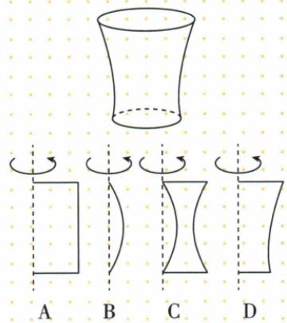
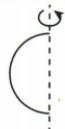
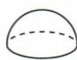
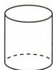
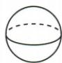
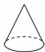

## 讲解

### 判据

平面图带明确虚线轴，转一周与目标立体匹配，先看轴到区域边界的距离怎样随高度变，别以整体轮廓相似猜选项。

### 流程

1. 确认原虚线所在直线为轴，并且转满一周。
2. 取各高度横向距离作转后圆半径，矩形距离固定成柱，直斜边线性变成锥侧，弧边成曲侧。
3. 原腰形上、下半径大，中间小，A恒定、B鼓出、C尖接、D曲线收腰，逐项只有D合。
4. 半圆绕原直径，弧半径先增后减、整周扫满球，A半球少一半，B柱恒半径、D锥直母线皆不合，C球正确。
5. 说明若只取弧线所得球面、若取半圆区域所得球；按原题立体范围，不自挪轴改变答案。

## 例题

### 绕轴旋转由半径随高度变化辨腰形

> 来源ID Q16-04；第16章图形的初步认识；151-200/full.md 第2922–2933行。原答案与解析定位：151-200/full.md 第2935–2935行。

例4 将下列平面图形绕轴旋转一周,可得到如图所示的立体图形的是 ( )

**原资料答案与解析：**

答案D

**展开解析（依据原详解补足理由与步骤）：**

固定旋转轴，把每个高度的水平线段绕轴转成圆，圆半径就是该高度边界到轴的距离。目标上、下较宽，中部曲线收窄。A矩形边到轴距离不变，得圆柱，错；B边曲线中间向外鼓，得中间更宽的鼓形，与目标反；C两斜直线在中间相交，转后侧面是两段直母线锥面，有尖锐腰接，不是目标曲侧；D曲边中间向轴靠近、两端远，转后形成图示平滑收腰形，正确。选D。观察轴与边界距离，而不是只看平面图哪一个形状像立体轮廓。

### 半圆绕直径旋转逐项认球

> 来源ID Q16-08；第16章图形的初步认识；151-200/full.md 第3063–3077行。原答案与解析定位：151-200/full.md 第3045–3047行。

例1 (2024 陕西)如图,将半圆绕直径所在的虚线旋转一周,得到的立体图形是 ( )

  
A

  
B

  
C

  
D

**原资料答案与解析：**

例1 解析 将半圆绕直径所在的虚线旋转一周,得到的立体图形是球.

答案 C

**展开解析（依据原详解补足理由与步骤）：**

旋转轴为半圆的直径。半圆区域中每一高度的半径随圆弧先增后减，旋转扫过整个球；若只取边界圆弧，其轨迹是球面，本题按半圆区域的立体图理解。A是半球，只有半边空间，转满一周并不会剩一半，错；B圆柱要求边到轴处处等距而圆弧不等距，错；C球有上下对称弧面，正确；D圆锥来自斜直线围出的直角三角形，侧面与原圆弧不符。选C。旋转轴换到别处结果会变，不能省掉原“绕直径”条件。

## 易错

平面形状相同但轴变会改变结果；旋转角度不满一周也不能回答完整体。左右两幅字母选项的形状必须核实际载体，OCR文字无图不足以判断。
