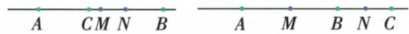

## 讲解

### 判据

点只说在直线上且距某点定长，没有指在段内或延长线，先列参照点两侧候选，按原大段长度排不可能位置。

### 流程

1. 原AB10、BC6，取A0、B10，C可10−6=4或10+6=16；这是原BC两方向，未增新长度。
2. M中点横5，N是BC中点，分别横7、13，距MN取|7−5|2或|13−5|8cm。
3. 几何法M离B5、N离B3；在B同侧相减2，异侧相加8，双法一致。
4. C若越过A位于BA延长需BC>10，但原6，排此额外图形，不重复列不可能类。
5. 最终答2或8并保两支理由。若后来另给“C在线段AB内”，只留前支；原未给就不能自行收窄。

## 例题

### 直线上未定方向的两中点距离分两类

> 来源ID Q16-22；第16章图形的初步认识；151-200/full.md 第3430–3430行。原答案与解析定位：151-200/full.md 第3432–3446行。

例6 已知线段 $AB = 10 \mathrm{~cm}$ , 直线 $AB$ 上有一点 $C, BC = 6 \mathrm{~cm}, M$ 为线段 $AB$ 的中点, $N$ 为线段 $BC$ 的中点, 求线段 $MN$ 的长.

**原资料答案与解析：**

解析 当点 C 在线段 AB 上时, 如图 1, ∵ M 为 AB 的中点, AB = 10 cm, ∴ $MB = \frac{1}{2} AB = 5 \, cm$ ,

∵ N 为 BC 的中点, BC = 6 cm, ∴ $NB = \frac{1}{2} BC = 3 \, cm$ , ∴ MN = MB - NB = 2 cm.

  
图1  
图2

当点 C 在线段 AB 的延长线上时, 如图 2, ∵ M 为 AB 的中点, AB = 10 cm, ∴ $MB = \frac{1}{2} AB = 5 \, cm$ ,

∵ N 为 BC 的中点, BC = 6 cm, ∴ $NB = \frac{1}{2} BC = 3 \, cm$ , ∴ $MN = MB + NB = 8 \, cm$ .

当点 C 在线段 BA 的延长线上时,应该有 AB<BC,但由已知得 AB>BC,所以这种情况不存在.

综上,线段 MN 的长为 2 cm 或 8 cm.

**展开解析（依据原详解补足理由与步骤）：**

AB10cm，取A横0、B横10，仅作为同一原题的数轴表示。BC6cm使C横10−6=4或10+6=16。AB中点M横5；C4时BC中点N横(10+4)/2=7，MN|7−5|=2cm；C16时N横13，MN|13−5|=8cm。几何法同样M离B5、N离B3，同侧相减2、异侧相加8。C在线段BA越过A的位置若成立需BC>BA=10，但原BC6<10，不能发生。因此仅2或8两解。分类基于BC的两方向，不能先按自己画的一个位置排另一解。

## 易错

没有具体图不等于不能解，通常需分支；自己画一图只展示一可能，不能据它排其他候选。坐标差可能有号，求几何距离最后取绝对值。
