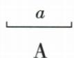
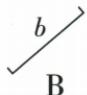
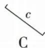
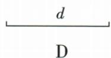

## 讲解

### 判据

题明确按图比较线段长短，使用同一尺度尺沿每条线段方向量端点间距，或把它们一端同位同向叠放，不从倾斜程度猜。

### 流程

1. 确认原题允许度量，图无数值时不将示意直观当其他代数题的精确已知。
2. 每条沿端点连线量，原b、c虽倾斜，横投影不是其真正线段长。
3. 叠合时一端重合、第二端都在起点同侧；平移转动不改长度，较远端代表更长。
4. 原a、b、c均比d短，d端点间距最大，逐选项只有D最长。
5. 保各原图实际像素尺寸，同尺度比较；不把每图单独拉成同宽缩略图后再量。原未标具体cm，不编四个长度。

## 例题

### 四条线段同尺度量端点间距而非看倾斜

> 来源ID Q16-19；第16章图形的初步认识；151-200/full.md 第3376–3386行。原答案与解析定位：151-200/full.md 第3388–3390行。

例3 下列线段中,最长的是

( )

**原资料答案与解析：**

解析 通过度量可知线段 d 最长.

答案 D

**展开解析（依据原详解补足理由与步骤）：**

原题四条线段的实际图示端点核看，d最长，选D。A水平a比d短；B斜b按沿线段方向的两端间距量，也比d短；C斜c同样比d短；D水平d的端点间距最大。不能只比较横向投影或因斜线看起来偏长就断言B、C。原资料未标具体厘米数，本文保留度量比较结果，不自造各长度数值。四图应保持原尺度，软件预览把不同图缩放成同宽后不能据此比长。

## 易错

压缩保持原尺寸与像素才能保留原图比较载体；若载体自行缩放不统一，需回原页图核，不能凭缩略图确认长短。
