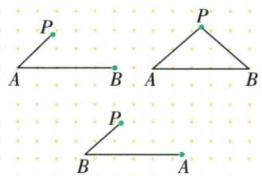
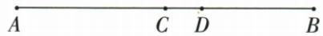

## 讲解

### 判据

给中点与另一点距离求局部线段，先把中点转半长，再看该点在小段内还是外，写整段分解才求和差。

### 流程

1. 原C中点、AB8，先BC=AB/2=4cm，半长来自AB=AC+CB且AC=CB。
2. 图A、C、D、B顺序使D在CB内，BC=CD+DB；因此CD=4−3=1cm。
3. 判中点题还核在线段上；原AP半长、AP=PB或AB两倍PB单独都缺位置，原反例图说明非中点。
4. 原第四项全部AP=PB=AB/2使AP+PB=AB，离线折路不可能等直连，才可推内部中点。
5. 回求的余段应正、单位同；若题没给D位置则另分类，不借原这张图的顺序套所有题。

## 例题

### 中点四个判据补上点在线段上的条件

> 来源ID Q16-13；第16章图形的初步认识；151-200/full.md 第3212–3215行。原答案与解析定位：151-200/full.md 第3217–3228行。

例3 下列说法中, 正确的是
(填序号)

①若 $AP=\frac{1}{2}AB$ ，则点 P 为线段 AB 的中点；②若 AP=PB，则点 P 为线段 AB 的中点；③若 AB=2PB，则点 P 为线段 AB 的中点；④若 $AP=PB=\frac{1}{2}AB$ ，则点 P 为线段 AB 的中点.

**原资料答案与解析：**

解析 下列反例图形可分别说明
①②③均不正确.

答案 ④

**展开解析（依据原详解补足理由与步骤）：**

①只AP=AB/2未说明P在线段上，P可能偏离AB，不能断言中点。②只AP=PB，P可能在AB的垂直平分位置之外的平面点，原等腰三角示图即反例。③AB=2PB只限定到B的距离，P可在别方向，未限定共线，亦不够。④AP=PB=AB/2同时给AP+PB=AB，沿A到P再到B的路径长等于直接线段；若P离开线段形成三角绕路，和必严格更大，所以这些等式迫使P在AB上，并且两段相等，确为中点，选④。最直接定义判据是P在线段AB上且AP=PB；不能只从一条距离等式推点的空间位置。

### 八厘米中点与内点按实际顺序相减

> 来源ID Q16-20；第16章图形的初步认识；151-200/full.md 第3396–3398行。原答案与解析定位：151-200/full.md 第3400–3404行。

例4 如图,已知 AB=8 cm,BD=3 cm,C 为 AB 的中点,则线段 CD 的长为 \_\_\_\_ cm.

**原资料答案与解析：**

解析 因为 C 为 AB 的中点, AB = 8 cm, 所以 $BC = \frac{1}{2} AB = \frac{1}{2} \times 8 = 4 \, (\text{cm})$ ,

又因为 BD=3 cm, 所以 CD=BC-BD=4-3=1(cm), 即 CD 的长为 1 cm.

答案 1

**展开解析（依据原详解补足理由与步骤）：**

图顺序A、C、D、B。C为AB中点且AB8cm，BC=AB/2=4cm。D在CB内，BC=CD+DB，DB3cm，所以CD=BC−BD=4−3=1cm。若D位置未定，减法未必成立；本题实际图已给在CB内。先把图的包含关系写成整段=部分+部分，再移项，不凭“两个已知数应该相减”猜算式。

## 易错

一条半长式不能证明点在线上；中点等长用的是同一大段的两部分，别把不相连等距段当两半。
