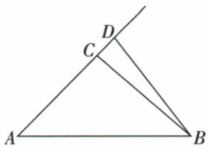

## 讲解

### 判据

题问图中多少线段、射线、直线或某端点相关段，先确定原图哪处真的延伸，线段按端点对、射线按端点方向分别去重。

### 流程

1. 原三角图A、C、D共线上延伸，B连接它们；列AB、AC、AD、BC、BD、CD六段，反写BA等不另计。
2. A向C与D同方向只一射线，再C向D、D向延伸方向各一，总3，B处无无限延伸不加。
3. 原图无两向无限的线，直线0；筛以B为端点段AB、BC、BD。
4. 原一整直线四点则全部两点段存在，从左端只配右端数3+2+1=6，或4×3除2。
5. 原n点射线因直线提供两向、每已给端点2条，2n。说明不同问题的给定对象范围，不能把整直线公式硬套有限三角图。

## 例题

### 直线上n点各为两向射线端点

> 来源ID Q16-11；第16章图形的初步认识；151-200/full.md 第3170–3170行。原答案与解析定位：151-200/full.md 第3172–3174行。

例1 若一条直线上有 n (n 为正整数) 个点, 则有 \_\_\_\_ 条射线. (用含 n 的代数式表示)

**原资料答案与解析：**

解析 1 个点对应 2 条射线, 则 n 个点对应 2n 条射线.

答案 $2n$

**展开解析（依据原详解补足理由与步骤）：**

每个已给点作端点，在已给直线上分别向左与向右无限延伸，是两条不同射线；n个不同点各给2条，总2n。不同端点的射线即使同方向也不是同一条，因包含的起始部分不同。这个结论凭直线本身提供无限两向，若只有有限线段的图示不能擅自把两端都延伸来数射线。n正整数，计的是端点取给定点的这些射线，不是直线上任意端点的无限多条。

### 射线图按有限两点段及端点方向去重

> 来源ID Q16-17；第16章图形的初步认识；151-200/full.md 第3338–3346行。原答案与解析定位：151-200/full.md 第3348–3350行。

例1 下图中共有 \_\_\_\_ 条线段, \_\_\_\_ 条射线, \_\_\_\_ 条直线, 其中以 B 为端点的线段是 \_\_\_\_.

**原资料答案与解析：**

解析 题图中的线段有 $AB, AC, AD, BC, BD, CD$ , 共 6 条; 题图中以 $A$ 为端点的射线有 1 条, 以 $C$ 为端点的射线有 1 条, 以 $D$ 为端点的射线有 1 条, 共 3 条; 题图中无直线.

答案 6;3;0;AB,BC,BD

**展开解析（依据原详解补足理由与步骤）：**

原图A、C、D共线按序，越过D向右上延伸，是同一支射线；B与A、C、D各有有限连段。两点端组合得到AB、AC、AD、BC、BD、CD，六段，其中AC+CD=AD但组合不同段仍各计一次。以A为端点向C、D同方向表示的射线AC、AD是同一条；以C向D及远方一条；以D沿原延伸方向一条，总3条射线。B未画无限延伸，不添以B为端点的射线；原图没有两端无限延伸的整条直线，0条。B为端点的有限段是BA（即AB）、BC、BD。不能把同一几何对象的不同名称重复计数。

### 四共线点不重复数端点对得六线段

> 来源ID Q16-18；第16章图形的初步认识；151-200/full.md 第3352–3354行。原答案与解析定位：151-200/full.md 第3356–3358行。

例2 如图, $A, B, C, D$ 是直线 $l$ 上的四个点, 则图中共有几条线段?

**原资料答案与解析：**

解析 解法一(端点确定法):以点A为左端点的线段有3条(线段AB,线段AC,线段AD),以点B为左端点的线段有2条(线段BC和线段BD),以点C为左端点的线段有1条(线段CD),因此共有 $3+2+1=6$ 条线段.

解法二(公式法):由公式可得题图中共有 $\frac{4\times(4-1)}{2}=6$ 条线段.

**展开解析（依据原详解补足理由与步骤）：**

原点依次A、B、C、D。先以A为最左端数AB、AC、AD3条；再以B为最左端数BC、BD2条；再以C数CD1条，总3+2+1=6。反向BA、CA等与已计段相同，不再加。公式法四点每点可配其他三点给4×3次有向选择，每条无向线段被两端各数一次，因此除2得4×3/2=6。原画直线l意味着四点所有两点间的线段都包含在原直线上，非只数三个相邻短段。

## 易错

相邻短段不是全部线段，包含多个小段的长段也计；名称不同未必对象不同，先核同端同向。
