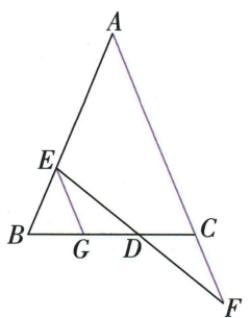

## 讲解

### 是什么

从给定信息中按要求选择若干条件，其余作为结论，并写出真命题。选出的条件必须足够推出结论，不是句子语法通顺就算成立；公共已知背景始终保留。答案不唯一时至少给出一个已证明的选择，声称任意两条都可须逐种核实。

### 怎么来的

原EG∥AF题有三种等长关系。把BE、EG、CF看作三量：AB=AC通过平行角和等腰性质对应BE=EG；DE=DF通过两组三角对应角和全等对应EG=CF；第三条BE=CF直接是首末量相等。因此任何两个等量可传递推出第三，三种选择均有依据。将几何句还原成相同中间量，是此题开放选择的理由，不能因为三句都写“等于”就说任两足够。

### 什么时候能用

需保留原图点的所属线与点序，选定条件后证明不能偷用剩下的待证条件。使用全等时注明对应顺序及夹角或夹边，不把两个独立等长无条件变成全等。原题只需一种情况，正文给原①②⇒③完整证明，再解释其他选择的依赖路线。

## 例题

### 开放三条件任选两条构成真命题并核三种

> 来源ID Q18-13；第18章命题的证明；201-250/full.md 第1263–1274行。原答案与解析定位：201-250/full.md 第1275–1283行。

例2 如图, $EG//AF$ ,请你从下面的三个条件中选出两个作为已知条件,剩下的一个作为结论,构成一个真命题(只需写出一种情况),并证明.①AB=AC;②DE=DF;③BE=CF.

已知: $EG \parallel AF$ , \_\_\_\_.求证: \_\_\_\_.

**原资料答案与解析：**

解析 ①②;③.(答案不唯一,任选两个作为条件,剩下的一个作为结论即为真命题)

证明：∵ $EG \parallel AF, \therefore \angle GED = \angle F, \angle BGE = \angle BCA.$ ∵ AB = AC, ∴ $\angle B = \angle BCA.$

$\therefore \angle B = \angle BGE.\therefore BE = EG.$ 在 $\triangle DEG$ 和 $\triangle DFC$ 中， $\angle GED = \angle F,DE = DF,\angle EDG = \angle FDC,$

$$
\therefore \triangle D E G \cong \triangle D F C, \therefore E G = C F. \therefore B E = C F.
$$

**展开解析（依据原详解补足理由与步骤）：**

原图E在AB、G与D在BC、F在AC的延长线上，D在EF上，EG∥AF。记x=BE、y=EG、z=CF。由EG∥AF，用BC作截线得BGE=BCA，AB=AC等价于B=BCA；由于原△ABC与△BEG都非退化，这进一步等价于BE=EG，即x=y。另EG∥CF，EF与BC交于D，GED=CFD，EDG=FDC对顶，所以△DEG与△DFC在已有两角对应相等时，DE=DF等价于EG=CF，即y=z（分别用ASA或AAS及对应边）。③就是x=z。三等量中的任意两条推出第三条：①②推出③、①③推出②、②③推出①，说明原“答案不唯一”。

按原详解正式写①②⇒③：AB=AC⇒B=BCA=BGE⇒BE=EG；两三角形中GED=CFD、EDG=FDC、DE=DF，由ASA全等（DE、DF夹在两给定角之间），得EG=CF；等量代换得BE=CF。其他两种也须利用相同三线角关系与等腰判定，不能只凭三个原句长得对称就断任两都行。

## 易错

把①③当已知时若又用DE=DF去证BE=CF，就循环使用目标；应从BE=EG及BE=CF先得EG=CF，再由对应角+AAS得DE=DF。
