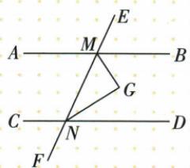
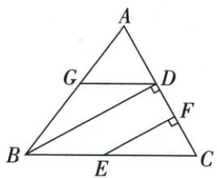

## 讲解

### 判据

命题需要一般证明，先画不擅加特殊条件的图并写已知、求证，选能连接它们的定义定理。

### 流程

1.把文字条件译成具体线角对象；同旁角、内部平分线和交点均写出。2.每次用性质前列本步前提。3.等量替换写来自哪两式，相加写哪几个相邻角，避免一个“所以”跨多个理由。4.得到90°后才由定义判垂直，终点是原求证对象。5.检查全程没有把图上看似直角或对称当已知，没有用待证结论。

## 例题

### 同旁内角内部平分线互相垂直

> 来源ID Q18-09；第18章命题的证明；201-250/full.md 第1072–1092行。原答案与解析定位：201-250/full.md 第1144–1168行。

例1 求证:如果两条平行线被第三条直线所截,那么同旁内角的平分线互相垂直.

证明 已知: 如图, 直线 AB、CD 被直线 EF 所截, 交点分别为 M、N, $AB \parallel CD$ , MG 平分 $\angle BMN$ , NG 平分 $\angle DNM$ .

求证: $MG \perp NG.$

**原资料答案与解析：**

证明：AB∥CD，所以∠BMN+∠DNM=180°（两直线平行，同旁内角互补）。MG平分∠BMN，NG平分∠DNM，所以

$$\angle GMN=\frac12\angle BMN,\qquad\angle GNM=\frac12\angle DNM.$$

因此

$$\angle GMN+\angle GNM=\frac12(\angle BMN+\angle DNM)=90^\circ.$$

由三角形内角和定理，∠G=180°−(∠GMN+∠GNM)=90°，所以MG⊥NG（垂直的定义）。原拆行公式合并恢复，原文本仍存证据CSV。

**展开解析（依据原详解补足理由与步骤）：**

题设为AB∥CD，EF在M、N分别截两线，MG和NG是相应同旁内角内部平分线。结论MG⊥NG。由同旁内角性质BMN+DNM=180°；半角定义给GMN=BMN/2、GNM=DNM/2，所以GMN+GNM=180°/2=90°。两内部平分线在所示同侧相交于G，△MNG内角和180°，故MGN=180°−90°=90°，于是MG⊥NG。

$$\angle GMN+\angle GNM=\frac12(\angle BMN+\angle DNM)=90^\circ,\qquad\angle MGN=180^\circ-90^\circ=90^\circ.$$

使用内部平分线和两角互补，而不是任意两角的平分线；若把一条内部平分线换成其反向延长，需先核实际两条所在直线关系，不把角图中的射线方向省掉。

### 分析逆推与综合顺写同一平行证明

> 来源ID Q18-12；第18章命题的证明；201-250/full.md 第1231–1231行。原答案与解析定位：201-250/full.md 第1233–1257行。

例1 如图, 已知 $BD \perp AC$ , $EF \perp AC$ , $D$ 、 $F$ 为垂足, $G$ 是 $AB$ 上一点, 且 $\angle FEC = \angle GDB$ . 求证: $\angle AGD = \angle ABC$ .

**原资料答案与解析：**

证明 证法一(分析法): 要证 $\angle AGD = \angle ABC$ , 需证 $GD \parallel BC$ .

要证 $GD \parallel BC$ ，需证 $\angle DBC = \angle GDB$ .

因为 $\angle FEC = \angle GDB$ ，所以要证 $\angle DBC = \angle GDB$ ，需证 $\angle DBC = \angle FEC.$

要证 $\angle DBC = \angle FEC$ ，需证 $BD / / EF.$

因为 $BD \perp AC, EF \perp AC$ ，所以 $BD \parallel EF$ ，所以 $\angle AGD = \angle ABC$ .

证法二(综合法):∵ $BD \perp AC, EF \perp AC, \therefore BD \parallel EF, \therefore \angle FEC = \angle DBC,$

又∵ $\angle FEC = \angle GDB, \therefore \angle DBC = \angle GDB,$

$$
\therefore G D \parallel B C, \therefore \angle A G D = \angle A B C.
$$

**展开解析（依据原详解补足理由与步骤）：**

逆推找路：要证明AGD=ABC，可选择先证GD∥BC（AB作截线）；要证GD∥BC，可证GDB=DBC（BD作截线的一对内错）；已知GDB=FEC，所以只需从原条件推出FEC=DBC。BD、EF都⊥AC，于是BD∥EF，BC作截线给DBC=FEC。这就接上已知。

正式顺写：BD⊥AC、EF⊥AC⇒BD∥EF；BC截它们，FEC=DBC；与已知FEC=GDB等量代换，得GDB=DBC；用BD截GD、BC，内错相等⇒GD∥BC；最后AB截GD、BC，同位角AGD=ABC。原图G在AB、D和F在AC、E在BC，对应角边逐一核。倒推中的“需证”是本题选择的充分路线，不是声称等角只有平行一种可能；证明时不能先把目标当已知。

## 易错

原同旁平分线垂直由角和180→半角和90→第三角90四步，每步都不可直接跳过。
