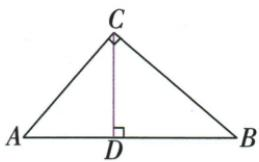

## 讲解

### 判据

直角三角形已给斜边和一条直角边，要求斜边上的高。两条直角边可直接作底、高，斜边和它对应的垂线也可作底、高；同一个三角形面积不变，把这两种表达相等即可求高。

### 流程

1. 先由直角位置辨明斜边。原$\angle ACB=90^{\circ}$，$AB=5$是斜边，$BC=4$是直角边，勾股给$AC^{2}=AB^{2}-BC^{2}=25-16=9$，长度取正，$AC=3$ cm。
2. 以AC为底、BC为高。因为两条直角边互相垂直，面积为$AC\times BC/2=3\times 4/2=6$ cm²；不能把斜边5与直角边4当作一组垂直底高。
3. 再以AB为底，CD垂直AB，CD才是这个底所配的高。同一面积可写为$AB\times CD/2=5CD/2$，所以$5CD/2=6$。
4. 两边乘2去掉面积公式中的一半，得到$5CD=12$；再除正的斜边长5，$CD=12/5$ cm。一般情况下，同样推出斜边高=两直角边的乘积/斜边，式子的来源是两次面积表达。
5. 检查答案为正，单位是厘米而非平方厘米，并把CD代回$5CD/2$验证面积仍为6 cm²。求的只是高线段，不需要额外假设垂足平分斜边。

## 例题

### 直角三角形同面积换底求斜边高

> 来源ID Q18-15；第18章命题的证明；201-250/full.md 第1302–1311行。原答案与解析定位：201-250/full.md 第1313–1315行。

例4 如图, 在 $\triangle ABC$ 中, $\angle ACB = 90^{\circ}$ , AB = 5 cm, BC = 4 cm, CD ⊥ AB 于 D, 求 CD 的长.

**原资料答案与解析：**

解析 在 Rt△ABC 中, 由勾股定理得 $AC=\sqrt{AB^{2}-BC^{2}}=3\ cm$ .

由三角形的面积公式得 $S_{\triangle ABC}=\frac{1}{2}AC\cdot BC=\frac{1}{2}AB\cdot CD,\therefore CD=\frac{AC\cdot BC}{AB}=\frac{12}{5}\mathrm{~cm}.$

**展开解析（依据原详解补足理由与步骤）：**

ACB为直角，AB=5是斜边，BC=4是一条直角边。勾股AC²=AB²−BC²=25−16=9，长度取正，AC=3 cm。以AC为底，BC为高，面积=3×4/2=6 cm²；以AB为底，CD为对应垂高，面积=5CD/2。同一个三角形面积相等，5CD/2=6，两边乘2得5CD=12，再除5，CD=12/5 cm。

$$AC=\sqrt{5^2-4^2}=3\ \mathrm{cm},\qquad\frac12\cdot3\cdot4=\frac12\cdot5\cdot CD\Rightarrow CD=\frac{12}5\ \mathrm{cm}.$$

两种算法底高配对不同，不能把AB与BC当作相互垂直。

## 易错

原5为斜边，4不是配它的高；求得3后3×4才是同三角形合法底高积。
