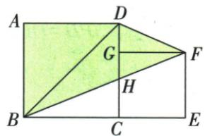
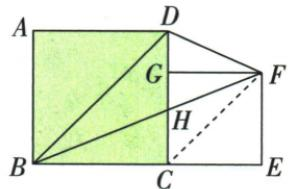

## 讲解

### 判据

图有两正方形但小边未知，目标跨图四边形可沿共同对角线分块，连接另一对角线寻找等高。

### 流程

1.按边界顺序分目标，找与已知大图共用的部分。2.连CF，利用两正方形各自的45°及底线共线证明CF∥BD。3.以BD为同一底，顶点F/C在共同平行线上，说明等垂高而非等斜边。4.用△BDC替换△BDF，保留△ABD，拼回大正方形。5.只用原大边10计算100 cm²，不设小图尺寸。

## 例题

### 两正方形连接CF同底平行顶点换面积

> 来源ID Q18-16；第18章命题的证明；201-250/full.md 第1317–1332行。原答案与解析定位：201-250/full.md 第1334–1342行。

例5 如图, 四边形 ABCD 和四边形 CEFG 都是正方形, G 在 CD 上, BC = 10 cm, 求 $S_{四边形ABFD}$ .

**原资料答案与解析：**

解析 连接 CF, 易得 $CF \parallel BD, \therefore S_{\triangle BDF} = S_{\triangle BDC}, \therefore S_{四边形ABFD} = S_{正方形ABCD} = 10 \times 10 = 100 \, (\text{cm}^2)$ .

**展开解析（依据原详解补足理由与步骤）：**

连CF。正方形ABCD的对角线BD与BC成45°，因为△BCD两直角边BC=CD、C角90°，其另两角各45°。正方形CEFG的对角线CF与CE也成45°。原B、C、E共线，两个相等方向角给CF∥BD。因此点F、C到直线BD的垂直距离相等，△BDF、△BDC共底BD、等高，面积相等。原四边形ABFD按边界依次A-B-F-D，BD分为△ABD、△BDF，前一块保留，后一块替换成△BDC，就等于正方形ABCD面积10²=100 cm²。没有要求两个正方形边长相等；G只在CD上，不能把小正方形也当边长10。

## 易错

原小正方形不必与大图全等，面积相等来自三角形同底等高；若不证CF∥BD便换块，理由缺失。
