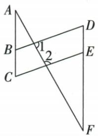

## 讲解

### 判据

有一组原平行及80°、100°一对同旁角，先判另一组平行，再让两个目标角都等于CEF。

### 流程

1.核80°与100°是同一截线的一对同旁内角，和180°推出BD∥CE。2.用DF截BD、CE，得到D=CEF。3.用CE截AC、DF，原AC∥DF给C=CEF。4.等量代换C=D；每个角的边与截线明确，不因线组方向近似而跳步。

## 例题

### 80与100判第二组平行再用共同角

> 来源ID Q18-20；第18章命题的证明；201-250/full.md 第1480–1480行。原答案与解析定位：201-250/full.md 第1482–1505行。

例9 如图, $AC \parallel DF$ , 点 $B 、 E$ 分别是 $AC 、 DF$ 上的点, 连接 $BD 、 CE$ , 若 $\angle 1 = 80^{\circ}, \angle 2 = 100^{\circ}$ , 求证: $\angle C = \angle D$ .

**原资料答案与解析：**

证明 $\because \angle 1 = 80^{\circ},\angle 2 = 100^{\circ},\therefore \angle 1 + \angle 2 = 180^{\circ},$

$$
\therefore B D \parallel C E, \therefore \angle D = \angle C E F,
$$

$$
\because A C \parallel D F, \therefore \angle C = \angle C E F, \therefore \angle C = \angle D.
$$

**展开解析（依据原详解补足理由与步骤）：**

原AC与DF已平行；EF所在直线在两个交点形成1、2同旁内角，80°+100°=180°，由同旁互补判定BD∥CE。用DF作截线得D=CEF；用CE作截线，AC∥DF给C=CEF；二者等于同一个角，得C=D。前一个结论来自角判线，后两步由两组平行分别用性质；不能只因两组相对边看似同向就跳到结论。

## 易错

两次性质来自不同平行对，只有先证明第二组才可把D移到CEF。
