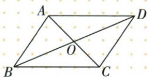

## 错法

原“平行四边一定不是轴对称”判断真，或四等面积便全部全等。

## 正解

特殊矩形/菱形/正方都是平行四边可有轴，“一般不保证”不能说“绝无”。一般平行四边对角半长不同，四块面积都等但仅两两相对SSS全等，相邻未必；全等与等积不同。

## 例题

### 原平行四边三句及四边从属六句辨析

> 来源ID Q23-60；第23章平行四边形；251-300/full.md 第656–661；2049–2056行。原答案与解析定位：251-300/full.md 第656–661行；251-300/full.md 第2049–2056行。

# ③ 易错辨析

1. 平行四边形是轴对称图形.
(×)  
2. 平行四边形的邻角互补. (√)  
3. 平行四边形被两条对角线分割而成的 4 个三角形全等. (×)

# ③ 易错辨析

1. 只有正方形既具有菱形的性质又具有矩形的性质. （√）  
2. 平行四边形一定不是轴对称图形. (×)  
3. 正方形的中点四边形依然是正方形. (√)  
4. 矩形的对角线可能互相垂直，菱形的对角线可能相等。（√）  
5. 特殊平行四边形中，正方形的对称轴条数最多，为4。（√）  
6. 正方形和菱形的面积都等于对角线长的乘积的一半。（√）

**原资料答案与解析：**

# ③ 易错辨析

1. 平行四边形是轴对称图形.
(×)  
2. 平行四边形的邻角互补. (√)  
3. 平行四边形被两条对角线分割而成的 4 个三角形全等. (×)

# ③ 易错辨析

1. 只有正方形既具有菱形的性质又具有矩形的性质. （√）  
2. 平行四边形一定不是轴对称图形. (×)  
3. 正方形的中点四边形依然是正方形. (√)  
4. 矩形的对角线可能互相垂直，菱形的对角线可能相等。（√）  
5. 特殊平行四边形中，正方形的对称轴条数最多，为4。（√）  
6. 正方形和菱形的面积都等于对角线长的乘积的一半。（√）

**展开解析（依据原详解补足理由与步骤）：**

原平行三句×√×：一般只中心对称、不保轴，但特殊矩形菱形有轴；邻角互补由平行同旁；对角两两相对三角全等而四块只等面积、不都全等。原特殊六句√×√√√√：正方为矩形与菱形交类；“平行四边一定不轴”排除特殊成员，错误；正方中点四边由原对角等且垂直仍正方；矩形可垂直或菱形可等是正方特例；正方4轴最多；菱形/正方垂直对角面积积半。量词“可能”“一定”要分开，不能误把一般不保证写成绝不。

### 平行四边对角8和10边5小周长14

> 来源ID Q23-12；第23章平行四边形；251-300/full.md 第646–648行。原答案与解析定位：251-300/full.md 第650–654行。

例1 如图, 已知 $\square ABCD$ 的对角线 AC, BD 交于点 O, 且 AC = 8, BD = 10, AB = 5, 则 $\triangle OCD$ 的周长为 \_\_\_\_.

**原资料答案与解析：**

解析 $\because$ 四边形 $ABCD$ 是平行四边形， $\therefore CD = AB = 5, OC = \frac{1}{2} AC = 4, OD = \frac{1}{2} BD = 5,$

∴ $\triangle OCD$ 的周长 = 5 + 4 + 5 = 14.

答案 14

**展开解析（依据原详解补足理由与步骤）：**

对边CD=AB5；互平分OC=AC/2=4、OD=BD/2=5。OCD三边相加4+5+5=14。原两对角可不等，不能取OC=OD；所给AB5不是OA5。
