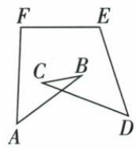

## 错法

原交叉六角看六字母便720，或七边把四外角220从900扣。

## 正解

原交叉角先AD和对顶角转简单四边内和360；七边标外角属于新五边，剩外140再补40。角组所在图与角内外先识，公式才有对象。

## 例题

### 七边图四外角220转五边第五外角再补40

> 来源ID Q23-03；第23章平行四边形；251-300/full.md 第433–452行。原答案与解析定位：251-300/full.md 第454–456行。

例3 七边形 ABCDEFG 如图所示, AB、ED 的延长线相交于点 O. 若图中 $\angle1$ 、 $\angle2$ 、 $\angle3$ 、 $\angle4$ 的度数和为 $220^{\circ}$ ，则 $\angle BOD$ 的度数为

**原资料答案与解析：**

解析 在 BO 的延长线上取一点 M, 则 $\angle DOM$ 为五边形 OAGFE 的一个外角, 根据多边形的外角和为 $360^{\circ}$ , $\angle 1$ 、 $\angle 2$ 、 $\angle 3$ 、 $\angle 4$ 的度数和为 $220^{\circ}$ , 可得 $\angle DOM = 360^{\circ} - 220^{\circ} = 140^{\circ}$ , 所以 $\angle BOD = 180^{\circ} - 140^{\circ} = 40^{\circ}$ .

答案 $40^{\circ}$

**展开解析（依据原详解补足理由与步骤）：**

沿实际A-G-F-E-O组成凸五边（B落AO直线、D落EO直线），原1/2/3/4恰为其四外角。O剩余外角DOM=360−220=140，其中M在BO反向延长。BOD与DOM邻补，目标180−140=40°。不是七边全部内角和扣220，须先定位原四标角所属新五边。

### 交叉六角加AD换成简单四边角和360

> 来源ID Q23-08；第23章平行四边形；251-300/full.md 第542–544行。原答案与解析定位：251-300/full.md 第546–558行。

例5 如图, 求 $\angle A + \angle B + \angle C + \angle D + \angle E + \angle F$ 的度数.

**原资料答案与解析：**

解析 连接 AD, 设 AB, CD 相交于点 G.

由三角形的内角和定理得 $\angle B+\angle C+\angle BGC=180^{\circ},\angle BAD+\angle CDA+\angle AGD=180^{\circ}$ ,

又 $\angle BGC = \angle AGD, \therefore \angle B + \angle C = \angle BAD + \angle CDA,$

$\therefore \angle BAF + \angle B + \angle C + \angle CDE + \angle E + \angle F = \angle BAF + \angle BAD + \angle CDA + \angle CDE + \angle E + \angle F,$

即四边形 ADEF 的内角和, ∵ 四边形的内角和为 $360^{\circ}$ ,

$\therefore \angle BAF + \angle B + \angle C + \angle CDE + \angle E + \angle F = 360^{\circ}.$

**展开解析（依据原详解补足理由与步骤）：**

原AB与CD交G，连AD。BGC与AGD对顶相等；各小三角内角和写B+C+BGC180和BAD+CDA+AGD180，同减公共等角，B+C=BAD+CDA。原目标A的BAF与D的CDE再分别加相应分角BAD/CDA，按原射线拼成FAD/ADE，四角组成简单ADEF内部角，总360。不能直接把自交6边按(6−2)180套720。原4c681...是核对勾装饰，排除。

### 原多边形五句及正多边两句辨析

> 来源ID Q23-59；第23章平行四边形；251-300/full.md 第282–289；414–417行。原答案与解析定位：251-300/full.md 第282–289行；251-300/full.md 第414–417行。

# 1 易错辨析

1. 三角形是最简单的多边形.  
(√)   
2. 多边形的边数、顶点数及角的个数相等. (√)  
3.三角形没有对角线. (√)  
4. 多边形的任一内角是与其相邻的外角的邻补角. （√）  
5.一个 n 边形，截去一个角后，形成的新多边形的边数一定为 n-1. (×)

# 3 易错辨析

1. 每个内角都相等的多边形是正多边形. (×)   
2. 每条边都相等的多边形是正多边形. (×)

**原资料答案与解析：**

# 1 易错辨析

1. 三角形是最简单的多边形.  
(√)   
2. 多边形的边数、顶点数及角的个数相等. (√)  
3.三角形没有对角线. (√)  
4. 多边形的任一内角是与其相邻的外角的邻补角. （√）  
5.一个 n 边形，截去一个角后，形成的新多边形的边数一定为 n-1. (×)

# 3 易错辨析

1. 每个内角都相等的多边形是正多边形. (×)   
2. 每条边都相等的多边形是正多边形. (×)

**展开解析（依据原详解补足理由与步骤）：**

前四句真：三角最少3边；一边邻一顶点对应循环数量；三角任两点都相邻没有对角；凸内角与其邻外角180。第五截一角边数恒n−1假：切线交两邻边内部，删旧顶点增加两个新顶点，边数n+1；切线过一个邻顶点只增加一个新点，边数n；两邻顶点都连接删旧顶点，边数n−1，但需保剩余有效多边形。原正多边辨析两句都假：仅等角未给等边（普通非正方矩形）、仅等边未给等角（非直角菱形）不足，原后续分类提供这种结构证据。
