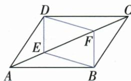
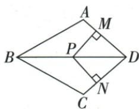
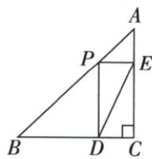

## 错法

原E=F=O仍当DEBF平行四边或P=D四零段叫正方；端点小矩形照套。

## 正解

四边需四个有效顶点。E/F重合、P/D重合只能退化，原常规结论需要排除并明示，不暗补原已知。最短DE题端点原距6可直接回验，最小在内部3√2，不依退化全等。

## 例题

### 原对角两等截点共中心判新四边互平分

> 来源ID Q23-16；第23章平行四边形；251-300/full.md 第820–820行。原答案与解析定位：251-300/full.md 第822–841行。

例3 如图, 在 $\square ABCD$ 中, 点 $E, F$ 在对角线 $AC$ 上, 且 $AE = CF$ . 求证: 四边形 DEBF 是平行四边形.

**原资料答案与解析：**

证明 连接 BD 交 AC 于点 O,

∵ 四边形 ABCD 为平行四边形, ∴ OB = OD, OA = OC.

∵ AE = CF, ∴ OA - AE = OC - CF, 即 OE = OF,

∴ 四边形 DEBF 是平行四边形.

**展开解析（依据原详解补足理由与步骤）：**

连BD交AC于O，原平行四边给OA=OC、OB=OD。原图A-E-O-F-C按序，OA−AE=OC−CF，给AE=CF故OE=OF，EF/DB在共同O互平分，DEBF为平行四边。若E/F在O另一侧，仍由关于O对称坐标得到OE=OF，但减式要按点序更换。原仅“点E/F在AC且AE=CF”允许E=F=O，此时DEBF退化不是四边形，原结论需要E≠F；正文保原题并标这一非退化缺口，不暗补原已知。

### 两邻边等和平分先SAS判D平分再矩形加等腿正方

> 来源ID Q23-52；第23章平行四边形；251-300/full.md 第2246–2263行。原答案与解析定位：251-300/full.md 第2265–2283行。

例3 如图,在四边形 ABCD 中,AB=BC,对角线 BD 平分 $\angle ABC$ ,P 是 BD 上一点,过点 P 作 $PM \perp AD$ , $PN \perp CD$ , 垂足分别为 M;N.

(1) 求证: $\angle ADB = \angle CDB$ .   
(2) 若 $\angle ADC = 90^{\circ}$ ，求证：四边形 MPND 是正方形.

**原资料答案与解析：**

证明 (1)∵ BD 平分 ∠ABC, ∴ ∠ABD = ∠CBD.

$$
\text { 又 } \because B A = B C, B D = B D, \therefore \triangle A B D \cong \triangle C B D (\mathrm{SAS}),
$$

$$
\therefore \angle A D B = \angle C D B.
$$

(2) $\because PM \perp AD, PN \perp CD, \therefore \angle PMD = \angle PND = 90^{\circ},$

又∵ $\angle ADC = 90^{\circ}$ , ∴ 四边形 MPND 是矩形.

$$
\because \angle A D B = \angle C D B, P M \perp A D, P N \perp C D, \therefore P M = P N,
$$

∴ 四边形 MPND 是正方形.

**展开解析（依据原详解补足理由与步骤）：**

(1)AB=BC、BD公共、ABD=CBD原平分，两边夹角SAS ABD≌CBD，ADB=CDB。(2)ADC90，P在BD的角内部、PM⊥AD与PN⊥CD，使MPND三个直角先矩形；由D处角平分距离性质PM=PN，为矩形一组邻边相等，判正方。若P=D，两腿0四点退化，原“BD上一点”需排除D，该非退化边界明确登记。

### 直角等腰腿6小矩形对角转CP最短3根号2

> 来源ID Q23-32；第23章平行四边形；251-300/full.md 第1429–1429行。原答案与解析定位：251-300/full.md 第1431–1449行。

例3 如图, 在 $\triangle ABC$ 中, $\angle C = 90^{\circ}, AC = BC = 6, P$ 为边 $AB$ 上一动点, 作 $PD \perp BC$ 于点 $D$ , $PE \perp AC$ 于点 $E$ , 求 $DE$ 的最小值.

**原资料答案与解析：**

解析 连接 CP.

$$
\because \angle A C B = 9 0 ^ {\circ}, A C = B C = 6, \therefore A B = \sqrt {A C ^ {2} + B C ^ {2}} = \sqrt {6 ^ {2} + 6 ^ {2}} = 6 \sqrt {2},
$$

∵ $PD \perp BC, PE \perp AC, \therefore \angle PDC = \angle PEC = 90^{\circ}, \therefore$ 四边形 CDPE 是矩形, ∴ DE = CP.

由垂线段最短可得, 当 $CP \perp AB$ 时, 线段 CP 最短, 即 DE 的值最小,

此时 $AP = BP = CP = \frac{1}{2} AB = 3\sqrt{2}$ , $\therefore DE$ 的最小值为 $3\sqrt{2}$ .

**展开解析（依据原详解补足理由与步骤）：**

C90，PD⊥BC、PE⊥AC，三个直角判CDPE矩形，其对角DE=CP。因此求DE最小转点C到有限AB点P最短，垂足在AB中点（原等腰三线合一），所以P该中点。AB=√(36+36)=6√2，CP为斜边中线=AB/2=3√2。端点P=A或B小矩形退化，但直接DE=CA/CB6仍大此最小，不把端点也当普通四点矩形。
